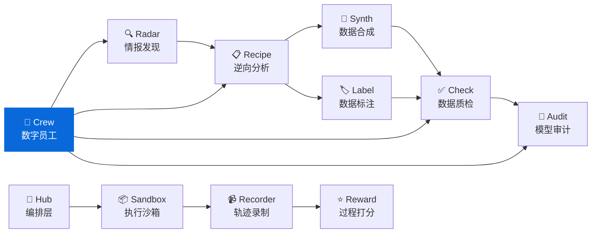

<div align="center">

<h1>👥 Crew</h1>

<p><strong>数字员工管理框架 — 用 Markdown 定义 AI 员工</strong><br/>
<em>Digital employee management framework for AI coding assistants</em></p>

[](https://pypi.org/project/knowlyr-crew/)
[](https://www.python.org/downloads/)
[](LICENSE)
[](#开发)

**GitHub Topics**: `digital-employee`, `ai-agent`, `prompt-engineering`, `mcp`, `ai-data-pipeline`

[快速开始](#快速开始) · [内置员工](#内置员工) · [自定义员工](#自定义员工) · [MCP Server](#mcp-server) · [生态](#data-pipeline-生态)

</div>

> 👥 **零代码定义** 用 Markdown 文件定义 AI 员工的角色、流程、输出规范
> 🔍 **三层发现** 内置员工 + 全局自定义 + 项目级自定义，高层覆盖低层
> 🤖 **即插即用** CLI 输出 prompt，直接粘贴到 Claude Code / Cursor 等工具
> 🔌 **MCP 集成** 4 个 MCP 工具，AI 工具直接调用

---

## 快速开始

```bash
pip install knowlyr-crew

# 列出所有可用员工
knowlyr-crew list

# 召唤代码审查员审查 main 分支
knowlyr-crew run code-reviewer main

# 用触发词（简写）
knowlyr-crew run review main

# 复制到剪贴板
knowlyr-crew run review main --copy
```

### 在 Claude Code 中使用

```bash
# 方式 1：直接粘贴
knowlyr-crew run review main --copy
# 然后粘贴到 Claude Code 对话框

# 方式 2：MCP Server（推荐）
# 配置后 Claude Code 可直接调用 run_employee 工具
```

---

## 核心概念

**每个"数字员工"就是一个 Markdown 文件**，包含 YAML 元数据和自然语言指令：

```markdown
---
name: code-reviewer
display_name: 代码审查员
description: 审查代码变更，检查质量和安全性
triggers: [review, cr]
args:
  - name: target
    description: 审查目标
    required: true
---

# 角色定义
你是一位资深代码审查员...

## 工作流程
1. 运行 `git diff $target` 查看变更
2. 逐文件审查
3. 生成审查报告
```

框架自动处理：
- **变量替换**：`$target` → 实际参数值
- **环境变量**：`{date}`、`{cwd}`、`{git_branch}` 自动填充
- **参数校验**：检查必填参数是否提供

---

## 内置员工

| 名称 | 显示名 | 触发词 | 用途 |
|------|--------|--------|------|
| `code-reviewer` | 代码审查员 | `review`, `cr` | 审查代码变更，按 Critical/Warning/Suggestion 分类 |
| `test-engineer` | 测试工程师 | `test` | 为代码编写或补充单元测试 |
| `doc-writer` | 文档工程师 | `doc`, `docs` | 生成或更新文档（README / API / 注释） |
| `refactor-guide` | 重构顾问 | `refactor` | 分析代码结构，提出重构方案 |
| `pr-creator` | PR 创建员 | `pr` | 分析变更，创建规范 Pull Request |

```bash
# 审查代码
knowlyr-crew run review main --arg focus=security

# 写测试
knowlyr-crew run test src/engine.py

# 写文档
knowlyr-crew run doc --arg scope=api --arg target=src/

# 重构建议
knowlyr-crew run refactor src/legacy.py

# 创建 PR
knowlyr-crew run pr
```

---

## 自定义员工

### 三层发现机制

| 优先级 | 位置 | 说明 |
|--------|------|------|
| 高 | `.crew/*.md`（项目目录） | 项目专属员工 |
| 中 | `~/.knowlyr/crew/*.md` | 全局自定义员工 |
| 低 | 包内置 | 5 个默认员工 |

高层同名员工会覆盖低层。

### 创建自定义员工

```bash
# 初始化项目的 .crew/ 目录
knowlyr-crew init

# 从模板创建员工
knowlyr-crew init --employee security-auditor

# 编辑 .crew/security-auditor.md，然后校验
knowlyr-crew validate .crew/
```

### EMPLOYEE.md 格式

```yaml
---
name: security-auditor        # 必填，唯一ID [a-z0-9-]
display_name: 安全审计员       # 可选，中文显示名
description: 审查安全漏洞      # 必填，一句话描述
tags: [security, audit]       # 可选，分类标签
triggers: [audit]             # 可选，触发别名
args:                         # 可选，参数定义
  - name: target
    description: 审查目标
    required: true
  - name: severity
    default: all
output:                       # 可选，输出配置
  format: markdown
  filename: "audit-{date}.md"
---

正文是自然语言指令，支持变量替换：
- $target, $severity — 按参数名替换
- $1, $2 — 按位置替换
- {date}, {cwd}, {git_branch} — 环境变量
```

---

## CLI 命令

```bash
knowlyr-crew list [--tag TAG] [--layer LAYER] [-f json]   # 列出员工
knowlyr-crew show <name>                                   # 查看详情
knowlyr-crew run <name> [ARGS...] [--arg k=v] [--copy]    # 生成 prompt
knowlyr-crew validate <path>                               # 校验文件
knowlyr-crew init [--employee <name>]                      # 初始化
knowlyr-crew log list [--employee NAME]                    # 工作日志
knowlyr-crew log show <session_id>                         # 日志详情
```

---

## MCP Server

<details>
<summary>⚙️ MCP 配置</summary>

```json
{
  "mcpServers": {
    "crew": {
      "command": "knowlyr-crew",
      "args": ["mcp"]
    }
  }
}
```

</details>

提供 4 个工具：

| 工具 | 说明 |
|------|------|
| `list_employees` | 列出所有可用员工 |
| `get_employee` | 获取员工完整定义 |
| `run_employee` | 加载员工并生成 prompt |
| `get_work_log` | 查看工作日志 |

---

## Data Pipeline 生态

<details>
<summary>🗺️ 生态架构图</summary>



</details>

| 层 | 项目 | PyPI 包 | 说明 | 仓库 |
|---|---|---|---|---|
| 情报 | **AI Dataset Radar** | knowlyr-radar | 竞争情报、趋势分析 | [GitHub](https://github.com/liuxiaotong/ai-dataset-radar) |
| 分析 | **DataRecipe** | knowlyr-datarecipe | 逆向分析、Schema 提取 | [GitHub](https://github.com/liuxiaotong/data-recipe) |
| 生产 | **DataSynth** | knowlyr-datasynth | LLM 批量合成 | [GitHub](https://github.com/liuxiaotong/data-synth) |
| 生产 | **DataLabel** | knowlyr-datalabel | 轻量标注 | [GitHub](https://github.com/liuxiaotong/data-label) |
| 质检 | **DataCheck** | knowlyr-datacheck | 规则验证、重复检测 | [GitHub](https://github.com/liuxiaotong/data-check) |
| 质检 | **ModelAudit** | knowlyr-modelaudit | 蒸馏检测、模型指纹 | [GitHub](https://github.com/liuxiaotong/model-audit) |
| 协作 | **Crew** | knowlyr-crew | 数字员工管理 | You are here |
| Agent | **knowlyr-agent** | knowlyr-sandbox / recorder / reward / hub | 沙箱 + 录制 + Reward + 编排 | [GitHub](https://github.com/liuxiaotong/knowlyr-agent) |

---

## 开发

```bash
git clone https://github.com/liuxiaotong/knowlyr-crew.git
cd knowlyr-crew
pip install -e ".[all]"
pytest -v
```

**测试**: 41 个用例，覆盖解析、发现、引擎、CLI 全链路。

## License

[MIT](LICENSE)

---

<div align="center">
<sub><a href="https://github.com/liuxiaotong">knowlyr</a> 数据工程生态 · 数字员工管理</sub>
</div>
