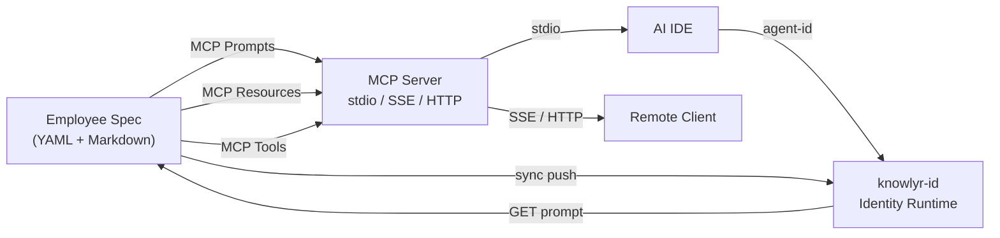
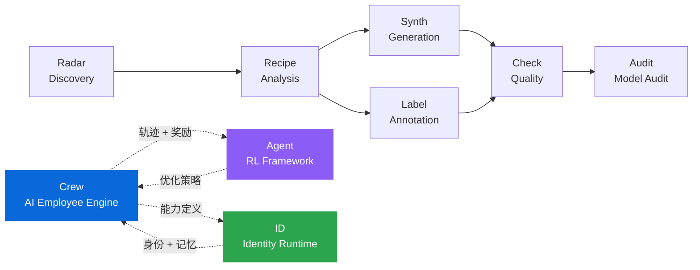

<div align="center">

<h1>knowlyr Crew</h1>

<p><strong>声明式 AI 员工引擎 — Markdown 定义能力，MCP 协议互通，经验持续进化</strong><br/>
<em>Declarative AI employee engine — define capabilities in Markdown, interoperate via MCP, evolve through experience</em></p>

[](https://pypi.org/project/knowlyr-crew/)
[](https://www.python.org/downloads/)
[](LICENSE)
[](https://github.com/liuxiaotong/knowlyr-crew/actions/workflows/test.yml)

[Motivation](#motivation) · [Quick Start](#quick-start) · [Architecture](#architecture) · [Defining Employees](#defining-employees) · [Core Capabilities](#core-capabilities) · [Server Mode](#server-mode) · [Integrations](#integrations) · [CLI Reference](#cli-reference) · [Ecosystem](#ecosystem)

</div>

---

## Overview

Crew 将 AI 员工的能力定义从代码中解耦为 **Markdown + YAML 声明式规范**，通过 [MCP](https://modelcontextprotocol.io/) 协议暴露给任意 AI IDE，同时提供 HTTP API 驱动生产级运行时。

核心设计原则：

- **Markdown 即接口** — 每位员工是一个目录或 `.md` 文件，配置与提示词分离，版本可追踪
- **MCP 协议互通** — Prompts / Resources / Tools 三原语，兼容 Claude Desktop、Cursor、Claude Code 及任何 MCP 客户端
- **多智能体协商** — 结构化讨论会支持对抗性机制（预设立场、交叉盘问、分歧配额），避免"共识回声室"
- **异步编排** — 并行委派、顺序链式委派、流水线执行、定时任务、多人会议，通过任务注册表追踪进度和结果
- **组织架构** — 团队分组、A/B/C 权限级别、协作路由模板，连续失败自动降级
- **成本追踪** — 模型单价表、逐任务成本计算、按员工/模型/时间段汇总，质量预评分
- **经验持续进化** — 持久化记忆 + 决策评估闭环，跨会话积累经验并自动修正认知偏差

---

## Motivation

现有 AI Agent 框架普遍面临三个问题：

| 痛点 | 现状 | Crew 的方法 |
|------|------|-------------|
| **能力散落** | prompt 硬编码在应用代码中，无法复用和版本管理 | 声明式 YAML + Markdown，与代码解耦 |
| **工具锁定** | Agent 定义绑定特定框架或 IDE | MCP 协议原生支持，跨 IDE 互通 |
| **无记忆进化** | 每次对话从零开始，错误反复出现 | 持久化记忆 + 评估闭环，经验自动积累 |

Crew 不是又一个 Agent 编排框架。它专注于 AI 员工的**能力定义层**——"谁做什么、怎么做、学到了什么"，而将身份管理和用户交互交给专门的运行时（如 [knowlyr-id](https://github.com/liuxiaotong/knowlyr-id)）。

---

## Quick Start

```bash
pip install knowlyr-crew[mcp]

# 列出所有可用员工
knowlyr-crew list

# 运行代码审查
knowlyr-crew run review main --smart-context

# 或配置 MCP 后由 AI IDE 自动调用
```

**MCP 配置**（Claude Desktop / Claude Code / Cursor）：

```json
{
  "mcpServers": {
    "crew": {
      "command": "knowlyr-crew",
      "args": ["mcp"]
    }
  }
}
```

配置后 AI IDE 可直接调用 `code-reviewer` 审查代码、`test-engineer` 编写测试、`run_pipeline` 串联多员工流水线、`run_discussion` 发起多员工讨论。

---

## Architecture



### MCP 原语映射

| MCP Primitive | 作用 | 数量 |
|---------------|------|------|
| **Prompts** | 每位员工 = 一个可调用的 prompt 模板，带类型化参数 | 1 per employee |
| **Resources** | 原始 Markdown 定义，AI IDE 可直接读取 | 1 per employee |
| **Tools** | 列出/查看/运行员工、讨论会、流水线、记忆、评估、日志、项目检测、成本查询等 | 18 |

<details>
<summary>18 个 MCP Tools 详情</summary>

| Tool | Description |
|------|-------------|
| `list_employees` | 列出所有员工（可按 tag 过滤） |
| `get_employee` | 获取完整员工定义 |
| `run_employee` | 生成可执行 prompt |
| `get_work_log` | 查看员工工作日志 |
| `detect_project` | 检测项目类型、框架、包管理器 |
| `list_pipelines` | 列出所有流水线 |
| `run_pipeline` | 执行流水线 |
| `list_discussions` | 列出所有讨论会 |
| `run_discussion` | 生成讨论会 prompt |
| `add_memory` | 为员工添加一条持久化记忆 |
| `query_memory` | 查询员工的持久化记忆 |
| `track_decision` | 记录一个待评估的决策 |
| `evaluate_decision` | 评估决策并将经验写入员工记忆 |
| `list_meeting_history` | 查看讨论会历史记录 |
| `get_meeting_detail` | 获取讨论会完整记录 |
| `crew_feedback` | 提交工作反馈到 knowlyr-id |
| `crew_status` | 查询 Agent 状态 |
| `query_cost` | 查询成本汇总（按员工/模型/时间段） |

</details>

### 传输协议

```bash
knowlyr-crew mcp                                # stdio（默认，本地 IDE）
knowlyr-crew mcp -t sse --port 9000             # SSE（远程连接）
knowlyr-crew mcp -t http --port 9001            # Streamable HTTP
knowlyr-crew mcp -t sse --api-token SECRET      # 启用 Bearer 认证
```

---

## Defining Employees

每位 AI 员工是一个**声明式规范**——YAML 定义元数据和参数，Markdown 定义行为指令。

### 目录格式（推荐）

配置与提示词分离，支持工作流拆分和自动版本管理：

```
security-auditor/
├── employee.yaml    # 元数据、参数、工具、输出格式
├── prompt.md        # 角色定义 + 核心指令
├── workflows/       # 按场景拆分的工作流
│   ├── scan.md
│   └── report.md
└── adaptors/        # 按项目类型适配（python / nodejs / ...）
    └── python.md
```

```yaml
# employee.yaml
name: security-auditor
display_name: Security Auditor
character_name: Alex Morgan
version: "1.0"
model: claude-opus-4-6
tags: [security, audit]
triggers: [audit, sec]
tools: [file_read, bash, grep]
context: [pyproject.toml, src/]
args:
  - name: target
    description: 审计目标
    required: true
  - name: severity
    description: 最低严重等级
    default: medium
output:
  format: markdown
  filename: "audit-{date}.md"
```

### 单文件格式

适合简单员工——YAML frontmatter + Markdown 正文，在一个 `.md` 文件内完成定义。

### 发现与优先级

| 优先级 | 位置 | 说明 |
|--------|------|------|
| 最高 | `private/employees/` | 仓库内自定义员工 |
| 中 | `.claude/skills/` | Claude Code Skills 兼容层 |
| 低 | 包内置 | 默认员工 |

同名时高优先级覆盖低优先级。

### 内置员工

| 员工 | 触发词 | 用途 |
|------|--------|------|
| `product-manager` | `pm` | 需求分析、用户故事、路线图 |
| `code-reviewer` | `review` | 代码审查：质量、安全、性能 |
| `test-engineer` | `test` | 编写或补充单元测试 |
| `refactor-guide` | `refactor` | 代码结构分析、重构建议 |
| `doc-writer` | `doc` | 文档生成（README / API / CHANGELOG） |
| `pr-creator` | `pr` | 分析变更、创建 Pull Request |
| `employee-generator` | `scaffold` | 将需求转化为 employee 定义草稿 |

### 智能上下文

`--smart-context` 自动检测项目类型（Python / Node.js / Go / Rust / Java）、框架（FastAPI / React / Express ...）、包管理器和测试框架，注入适配信息到 prompt 中。

<details>
<summary>Prompt 变量替换</summary>

| 变量 | 说明 |
|------|------|
| `$target`, `$severity` | 命名参数值 |
| `$1`, `$2` | 位置参数 |
| `{date}`, `{datetime}` | 当前日期/时间 |
| `{cwd}`, `{git_branch}` | 工作目录 / Git 分支 |
| `{project_type}`, `{framework}` | 项目类型 / 框架 |
| `{test_framework}`, `{package_manager}` | 测试框架 / 包管理器 |

</details>

---

## Core Capabilities

### 1. Multi-Agent Deliberation

结构化讨论会让多位 AI 员工围绕议题进行多轮对抗性协商，避免单一模型推理的"共识回声室"效应。

```bash
# 预定义讨论
knowlyr-crew discuss run architecture-review --arg target=auth.py

# 即席讨论（无需 YAML）
knowlyr-crew discuss adhoc -e "code-reviewer,test-engineer" -t "auth 模块质量"

# 编排模式：每位参会者独立推理
knowlyr-crew discuss run architecture-review --orchestrated
```

**对抗性机制：** Crew 提供多层机制强制产生有价值的分歧——`stance`（预设立场）、`must_challenge`（必须质疑指定参会者）、`max_agree_ratio`（分歧配额）、`tension_seeds`（争议种子注入）。交互模式包括 `round-robin`、`cross-examine`（交叉盘问）、`steelman-then-attack`（先强化后攻击）、`debate`、`vote` 等。

**讨论→执行衔接：** 设置 `action_output: true` 后自动生成结构化 ActionPlan JSON，通过 `pipeline_from_action_plan()` 按依赖拓扑排序转为可执行 Pipeline。

<details>
<summary>讨论会 YAML 示例</summary>

```yaml
name: architecture-review
topic: Review $target design
goal: Produce improvement decisions
mode: auto
participants:
  - employee: product-manager
    role: moderator
    focus: 需求完整性
    stance: 偏用户体验
  - employee: code-reviewer
    role: speaker
    focus: 安全性
    must_challenge: [product-manager]
    max_agree_ratio: 0.6
tension_seeds:
  - 安全性 vs 开发效率
rounds:
  - name: 各抒己见
    interaction: round-robin
  - name: 交叉盘问
    interaction: cross-examine
    require_direct_reply: true
    min_disagreements: 2
  - name: Decision
    interaction: vote
output_format: decision
```

</details>

### 2. Pipeline Orchestration

多员工按顺序/并行串联执行，支持步骤间输出传递、多模型路由、断点恢复：

```bash
# 生成各步骤 prompt
knowlyr-crew pipeline run review-test-pr --arg target=main

# Execute 模式：自动调用 LLM 串联执行
knowlyr-crew pipeline run full-review --execute --model claude-opus-4-6
```

| 特性 | 说明 |
|------|------|
| **输出传递** | `{prev}`（上一步）、`{steps.<id>.output}`（按 ID 引用） |
| **并行组** | YAML 中 `parallel:` 标记，Execute 模式下 `asyncio.gather` 并发 |
| **多模型** | Anthropic / OpenAI / DeepSeek / Moonshot / Gemini / 智谱 / 通义千问，按模型名前缀自动路由 |
| **断点恢复** | 中途失败从最后完成的步骤恢复（`pipeline checkpoint resume`） |
| **Fallback** | 主模型重试耗尽后自动切换备选模型 |

### 3. Persistent Memory

每位员工拥有独立的经验记忆库，跨会话积累——不再每次从零开始。

```bash
knowlyr-crew memory add code-reviewer finding "main.css 有 2057 行，超出维护阈值"
knowlyr-crew memory show code-reviewer
knowlyr-crew memory correct code-reviewer <old_id> "CSS 拆分实际花了 5 天"
```

| 特性 | 说明 |
|------|------|
| **自动注入** | `run_employee` 和讨论会 prompt 自动包含该员工的历史记忆 |
| **语义搜索** | 向量余弦相似度 (0.7) + 关键词匹配 (0.3) 加权排序 |
| **多 Embedding** | OpenAI → Gemini → TF-IDF 逐级降级，无 API key 也可用 |
| **四种类别** | `decision` / `estimate` / `finding` / `correction` |
| **纠正机制** | `correct` 标记旧记忆为 superseded，创建新条目 |

存储：`.crew/memory/{employee}.jsonl`（记忆）+ `.crew/memory/embeddings.db`（向量索引）

### 4. Async Delegation & Meeting Orchestration

AI 员工可以**并行委派**多位同事执行任务，或**组织多人会议**异步讨论议题——不再串行等待。

```
用户 → 姜墨言: "让 code-reviewer 审查 PR，同时让 test-engineer 写测试"

姜墨言:
  ① delegate_async → code-reviewer (task_id: 20260216-143022-a3f5b8c2)
  ② delegate_async → test-engineer (task_id: 20260216-143022-b7d4e9f1)
  ③ "两个任务已并行执行中"
  ④ check_task → 查看进度/结果
```

| 工具 | 说明 |
|------|------|
| `delegate_async` | 异步委派，立即返回 task_id，不阻塞 |
| `check_task` | 查询任务状态和结果 |
| `list_tasks` | 列出最近任务（按状态/类型筛选） |
| `organize_meeting` | 组织多员工异步讨论会，各参会者每轮并行推理后综合结论 |
| `check_meeting` | 查询会议进展和结果 |

会议编排复用讨论引擎（`create_adhoc_discussion` + `render_discussion_plan`），每轮参会者通过 `asyncio.gather` 并行执行，最终自动生成综合结论。任务状态通过 `TaskRegistry` 持久化到 `.crew/tasks.jsonl`。

### 5. Advanced Orchestration

在异步委派之上，Crew 提供更高级的编排能力——链式委派、流水线触发、定时任务、文件操作、数据分析、智能日程。

| 工具 | 说明 |
|------|------|
| `run_pipeline` | 触发预定义流水线（异步执行，返回 task_id） |
| `delegate_chain` | 顺序委派链——先让 A 做 X，做完把结果自动传给 B 做 Y（`{prev}` 引用上一步输出） |
| `schedule_task` | 动态创建定时任务（cron 表达式 + 员工 + 任务描述） |
| `list_schedules` | 列出所有定时任务及下次触发时间 |
| `cancel_schedule` | 取消定时任务 |
| `agent_file_read` | 读取项目目录内文件（路径安全校验，防穿越） |
| `agent_file_grep` | 搜索项目代码（grep -rn，结果自动截断） |
| `query_data` | 细粒度业务数据查询（metric × period × group_by） |
| `find_free_time` | 飞书忙闲查询，计算多人共同空闲时段 |

```
用户 → 姜墨言: "先让 code-reviewer 审查 auth.py，再让 doc-writer 根据结果写文档"

姜墨言:
  delegate_chain(steps=[
    {employee: "code-reviewer", task: "审查 auth.py"},
    {employee: "doc-writer", task: "根据审查结果写文档: {prev}"}
  ])
  → 任务 ID: 20260216-180000-c3d5e7f9（异步执行中）
```

**主动巡检 & 周复盘：** 通过 `.crew/cron.yaml` 配置定时触发——每天 9:00 自动巡检业务数据、待办、日程、系统状态并推送简报；每周五 18:00 自动汇总本周任务完成情况、反思记录和数据趋势，生成周报。

### 6. Evaluation Loop

追踪决策质量，回溯评估后自动将经验教训写入员工记忆——形成"决策→执行→复盘→改进"闭环：

```bash
# 记录决策
knowlyr-crew eval track pm estimate "CSS 拆分需要 2 天"

# 评估（结论自动写入员工记忆）
knowlyr-crew eval run <id> "实际花了 5 天" \
  --evaluation "低估了跨模块依赖的复杂度，未来 ×2.5"
```

三种决策类别：`estimate`（估算）/ `recommendation`（建议）/ `commitment`（承诺）。评估结论自动作为 `correction` 类型写入该员工的持久化记忆。

### 7. Organization & Authority

声明式组织架构定义团队分组、权限级别、协作路由模板——让委派决策有据可依，而非全凭 AI 猜测。

```yaml
# private/organization.yaml
teams:
  engineering:
    label: 工程组
    members: [code-reviewer, test-engineer, backend-engineer, ...]
  data:
    label: 数据组
    members: [data-engineer, dba, mlops-engineer, ...]

authority:
  A:
    label: 自主执行
    members: [code-reviewer, test-engineer, doc-writer, ...]
  B:
    label: 需确认
    members: [product-manager, solutions-architect, ...]
  C:
    label: 看场景
    members: [backend-engineer, devops-engineer, ...]

routing_templates:
  code_change:
    steps:
      - role: implement
        team: engineering
      - role: review
        employee: code-reviewer
      - role: test
        employees: [test-engineer, e2e-tester]
```

| 特性 | 说明 |
|------|------|
| **权限级别** | A（自主执行）/ B（需确认）/ C（看场景），委派名单自动标注 |
| **路由模板** | `route` 工具按模板展开为 `delegate_chain`，比手动编排更快 |
| **自动降级** | 连续 3 次任务失败 → 权限从 A/B 降至 C，持久化到 JSON |
| **手动恢复** | 降级后通过 API 或管理后台恢复原始权限 |

### 8. Cost Tracking

内置模型单价表（Anthropic / OpenAI / Moonshot / Google / DeepSeek），逐任务计算成本，支持按员工、模型、时间段汇总。

```bash
# 通过 MCP / agent 工具查询
query_cost(days=7)                    # 7 日汇总
query_cost(days=30, employee="code-reviewer")  # 指定员工 30 日

# 通过 HTTP API 查询
curl /api/cost/summary?days=7
```

| 特性 | 说明 |
|------|------|
| **逐任务计量** | 每次员工执行自动记录 input/output tokens + cost_usd |
| **质量预评分** | 解析员工输出末尾的 `{"score": N}` JSON，关联到任务结果 |
| **多维汇总** | 按员工 / 按模型 / 按时间段聚合，支持 API 和管理后台查看 |
| **A/B 测试** | 同一员工可配置主模型 + fallback 模型，对比成本与质量 |

---

## Server Mode

Crew 可作为 HTTP 服务器运行，接收外部事件并自动触发 pipeline / 员工执行：

```bash
pip install knowlyr-crew[webhook]
knowlyr-crew serve --port 8765 --token YOUR_SECRET
```

### API 端点

| 路径 | 方法 | 说明 |
|------|------|------|
| `/health` | GET | 健康检查（免认证） |
| `/webhook/github` | POST | GitHub webhook，按配置路由到 pipeline/员工 |
| `/webhook/openclaw` | POST | OpenClaw 消息事件 |
| `/run/pipeline/{name}` | POST | 触发 pipeline（支持异步/同步/SSE 流式） |
| `/run/employee/{name}` | POST | 触发员工（支持 SSE 流式） |
| `/api/employees/{id}/prompt` | GET | 获取员工能力定义（含团队、权限、7日成本） |
| `/api/employees/{id}/state` | GET | 员工运行时状态（性格、记忆、笔记） |
| `/api/employees/{id}` | PUT | 更新员工配置（model/temperature/max_tokens） |
| `/api/employees/{id}/authority/restore` | POST | 恢复被自动降级的权限 |
| `/api/cost/summary` | GET | 成本汇总（按员工/模型/时间段） |
| `/api/project/status` | GET | 项目状态概览（团队、权限、成本、员工列表） |
| `/api/memory/ingest` | POST | 外部讨论数据导入员工记忆 |
| `/tasks/{task_id}` | GET | 查询任务状态和结果 |
| `/metrics` | GET | 调用/延迟/token/错误统计 |
| `/cron/status` | GET | Cron 调度器状态 |

<details>
<summary>服务端生产特性</summary>

| 特性 | 说明 |
|------|------|
| Bearer 认证 | `--api-token`，timing-safe 比较 |
| CORS 跨域 | `--cors-origin`，多 origin 支持 |
| 速率限制 | 60 请求/分钟/IP |
| 请求大小限制 | 默认 1MB |
| 断路器 | knowlyr-id 连续 3 次失败后暂停 30 秒 |
| 成本追踪 | 逐任务 token 计量 + 模型单价，API 可查 |
| 自动降级 | 连续失败自动降低员工权限，持久化到 JSON |
| 链路追踪 | 每个任务唯一 trace_id |
| 并发安全 | `fcntl.flock` 文件锁 + SQLite WAL |
| 任务持久化 | `.crew/tasks.jsonl`，重启恢复 |
| 周期心跳 | 每 60s 向 knowlyr-id 发送心跳 |

</details>

### Webhook 配置

`.crew/webhook.yaml` 定义事件路由规则（GitHub HMAC-SHA256 签名验证），`.crew/cron.yaml` 定义定时任务（croniter 解析）。

---

## Integrations

### knowlyr-id — 身份与运行时

Crew 定义"谁做什么"，[knowlyr-id](https://github.com/liuxiaotong/knowlyr-id) 管理身份、对话和运行时。两者协作但各自可独立使用。

```
┌──────────────────────────────────────┐
│        Crew（能力权威）                │
│  prompt · model · tools · avatar     │
│  temperature · bio · tags            │
└──────────────┬───────────────────────┘
     API 获取 prompt │ sync 推送全字段
┌──────────────┴───────────────────────┐
│      knowlyr-id（身份 + 运行时）       │
│  用户账号 · 对话 · 记忆 · 心跳        │
│  调度 · 触达 · API Key · 工作日志     │
└──────────────────────────────────────┘
```

knowlyr-id 通过 `CREW_API_URL` 获取员工的 prompt / model / temperature / 团队 / 权限 / 成本（5 分钟缓存），不可用时回退到 DB 缓存。连接是**可选的**——不配置时 Crew 独立运行。管理后台实时展示每位员工的权限徽章、团队归属、7 日成本，并支持一键恢复被自动降级的权限。

```bash
# 一键部署（rsync → 重启 → 同步 knowlyr-id）
make push
```

<details>
<summary>字段映射</summary>

| Crew Employee | knowlyr-id | 方向 |
|---|---|---|
| `name` | `crew_name` | push → |
| `character_name` | `nickname` | push → |
| `display_name` | `title` | push → |
| `bio` | `bio` | push → |
| `description` | `capabilities` | push → |
| `tags` | `domains` | push → |
| rendered prompt | `system_prompt` | push → |
| `avatar.webp` | `avatar_base64` | push → |
| `model` | `model` | push → |
| `temperature` | `temperature` | ↔ |
| `max_tokens` | `max_tokens` | push → |
| `memory-id.md` | `memory` | ← pull |

</details>

### Claude Code Skills 互通

Crew 员工与 Claude Code 原生 Skills 双向转换：`tools` ↔ `allowed-tools`、`args` ↔ `argument-hint`、元数据通过 HTML 注释往返保持。

```bash
knowlyr-crew export code-reviewer    # → .claude/skills/code-reviewer/SKILL.md
knowlyr-crew sync --clean            # 同步 + 清理孤立目录
```

### Avatar 生成

通义万相（DashScope）生成写实职业照头像，768×768 → 256×256 webp：

```bash
pip install knowlyr-crew[avatar]
knowlyr-crew avatar security-auditor
```

---

## CLI Reference

<details>
<summary>完整 CLI 命令列表</summary>

### Core

```bash
knowlyr-crew list [--tag TAG] [--layer LAYER] [-f json]  # 列出员工
knowlyr-crew show <name>                                  # 查看详情
knowlyr-crew run <name> [ARGS] [--smart-context] [--agent-id ID] [--copy] [-o FILE]
knowlyr-crew init [--employee NAME] [--dir-format] [--avatar]
knowlyr-crew validate <path>
knowlyr-crew check --json                                 # 质量雷达
```

### Discussions

```bash
knowlyr-crew discuss list
knowlyr-crew discuss run <name> [--orchestrated] [--arg key=val]
knowlyr-crew discuss adhoc -e "员工1,员工2" -t "议题"
knowlyr-crew discuss history [-n 20]
knowlyr-crew discuss view <meeting_id>
```

### Memory

```bash
knowlyr-crew memory list
knowlyr-crew memory show <employee> [--category ...]
knowlyr-crew memory add <employee> <category> <text>
knowlyr-crew memory correct <employee> <old_id> <text>
```

### Evaluation

```bash
knowlyr-crew eval track <employee> <category> <text>
knowlyr-crew eval list [--status pending]
knowlyr-crew eval run <decision_id> <outcome> [--evaluation TEXT]
knowlyr-crew eval prompt <decision_id>
```

### Pipeline

```bash
knowlyr-crew pipeline list
knowlyr-crew pipeline run <name> [--execute] [--model MODEL] [--arg key=val]
knowlyr-crew pipeline checkpoint list
knowlyr-crew pipeline checkpoint resume <task_id>
```

### Server & MCP

```bash
knowlyr-crew serve --port 8765 --token SECRET [--no-cron] [--cors-origin URL]
knowlyr-crew mcp [-t stdio|sse|http] [--port PORT] [--api-token TOKEN]
```

### Agent Management

```bash
knowlyr-crew register <name> [--dry-run]
knowlyr-crew agents list
knowlyr-crew agents status <id>
knowlyr-crew agents sync <name>
knowlyr-crew agents sync-all [--push-only|--pull-only] [--force] [--dry-run]
```

### Templates & Export

```bash
knowlyr-crew template list
knowlyr-crew template apply <template> --employee <name> [--var key=val]
knowlyr-crew export <name>                                # → SKILL.md
knowlyr-crew export-all
knowlyr-crew sync [--clean]                               # → .claude/skills/
```

### Other

```bash
knowlyr-crew avatar <name>                                # 头像生成
knowlyr-crew log list [--employee NAME] [-n 20]           # 工作日志
knowlyr-crew log show <session_id>
```

</details>

---

## Ecosystem

<details>
<summary>Architecture Diagram</summary>



</details>

| Layer | Project | Description | Repo |
|-------|---------|-------------|------|
| Discovery | **AI Dataset Radar** | 数据集竞争情报、趋势分析 | [GitHub](https://github.com/liuxiaotong/ai-dataset-radar) |
| Analysis | **DataRecipe** | 逆向分析、Schema 提取、成本估算 | [GitHub](https://github.com/liuxiaotong/data-recipe) |
| Production | **DataSynth** / **DataLabel** | LLM 批量合成 / 轻量标注 | [GitHub](https://github.com/liuxiaotong/data-synth) · [GitHub](https://github.com/liuxiaotong/data-label) |
| Quality | **DataCheck** | 规则验证、重复检测、分布分析 | [GitHub](https://github.com/liuxiaotong/data-check) |
| Audit | **ModelAudit** | 蒸馏检测、模型指纹 | [GitHub](https://github.com/liuxiaotong/model-audit) |
| Identity | **knowlyr-id** | 身份系统 + AI 员工运行时 | [GitHub](https://github.com/liuxiaotong/knowlyr-id) |
| 协作 | **Crew** | AI 员工定义 · MCP 互通 · 多智能体协商 · 经验进化 | You are here |
| Agent 训练 | **knowlyr-agent** | Gymnasium 风格 RL 框架 · 过程奖励模型 · SFT/DPO/GRPO 训练 | [GitHub](https://github.com/liuxiaotong/knowlyr-agent) |

---

## Development

```bash
git clone https://github.com/liuxiaotong/knowlyr-crew.git
cd knowlyr-crew
pip install -e ".[all]"
pytest -v    # 1280+ test cases
```

## License

[MIT](LICENSE)

---

<div align="center">
<sub><a href="https://github.com/liuxiaotong">knowlyr</a> — declarative AI employee engine</sub>
</div>
