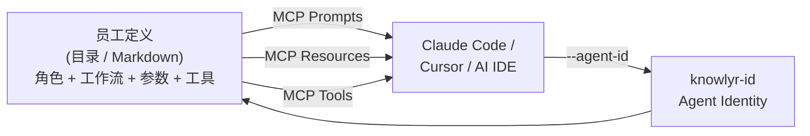
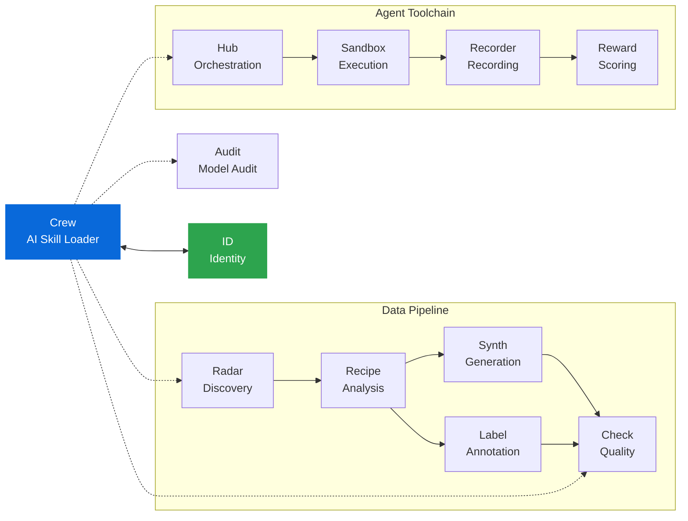

<div align="center">

<h1>Crew — AI Skill Loader</h1>

<p><strong>用 Markdown + YAML 定义专业技能，通过 MCP 加载到 AI IDE</strong><br/>
<em>Define professional AI skills in Markdown + YAML, load into Claude Code / Cursor via MCP</em></p>

[](https://pypi.org/project/knowlyr-crew/)
[](https://www.python.org/downloads/)
[](LICENSE)
[](#开发--development)
[](#头像生成--avatar)

[快速开始](#快速开始--quick-start) · [工作原理](#工作原理--how-it-works) · [MCP 集成](#mcp-集成--mcp-integration) · [CLI](#cli-使用--cli-usage) · [内置技能](#内置技能--builtin-skills) · [自定义技能](#自定义技能--custom-skills) · [流水线](#流水线--pipelines) · [讨论会](#讨论会--discussions) · [持久化记忆](#持久化记忆--persistent-memory) · [评估闭环](#评估闭环--evaluation-loop) · [Skills 互通](#skills-互通--interoperability) · [knowlyr-id](#knowlyr-id-协作--integration) · [头像生成](#头像生成--avatar) · [生态](#生态--ecosystem)

</div>

> **Crew 不是又一个 Agent 框架。**
> 它是 AI IDE 的"人才市场"—— 每个"数字员工"是一个目录或 Markdown 文件，
> 通过 MCP 协议加载为可复用的专业技能。
> AI IDE 自己决定怎么执行，Crew 只负责定义"谁做什么"。

---

## 快速开始 / Quick Start

```bash
pip install knowlyr-crew[mcp]

# 列出所有可用技能
knowlyr-crew list

# 运行代码审查（支持触发词 review）
knowlyr-crew run code-reviewer main
knowlyr-crew run review main --arg focus=security

# 智能上下文：自动检测项目类型并注入适配提示
knowlyr-crew run test-engineer src/auth.py --smart-context

# 或配置 MCP 后由 AI IDE 自动调用（见下方）
```

---

## 工作原理 / How It Works



Crew 通过 MCP 协议暴露三种原语：

| MCP 原语 | 作用 | 数量 |
|----------|------|------|
| **Prompts** | 每个员工 = 一个可调用的 prompt 模板，带类型化参数 | 1 per employee |
| **Resources** | 原始 Markdown 定义，AI IDE 可直接读取 | 1 per employee |
| **Tools** | 列出/查看/运行员工、讨论会、流水线、记忆、评估、日志、项目检测、会议历史 | 15 |

<details>
<summary>15 个 MCP Tools 详情</summary>

| Tool | Description |
|------|-------------|
| `list_employees` | 列出所有员工（可按 tag 过滤） |
| `get_employee` | 获取完整员工定义 |
| `run_employee` | 生成可执行 prompt |
| `get_work_log` | 查看员工工作日志 |
| `detect_project` | 检测项目类型、框架、包管理器 |
| `list_pipelines` | 列出所有流水线 |
| `run_pipeline` | 执行流水线 |
| `list_discussions` | 列出所有讨论会 |
| `run_discussion` | 生成讨论会 prompt（支持预定义/即席/编排模式） |
| `add_memory` | 为员工添加一条持久化记忆 |
| `query_memory` | 查询员工的持久化记忆 |
| `track_decision` | 记录一个待评估的决策 |
| `evaluate_decision` | 评估决策并将经验写入员工记忆 |
| `list_meeting_history` | 查看讨论会历史记录 |
| `get_meeting_detail` | 获取某次讨论会的完整记录 |

</details>

---

## MCP 集成 / MCP Integration

将以下内容添加到 MCP 配置文件：

```json
{
  "mcpServers": {
    "crew": {
      "command": "knowlyr-crew",
      "args": ["mcp"]
    }
  }
}
```

> Claude Desktop: `claude_desktop_config.json` · Claude Code: `.mcp.json`

配置后 AI IDE 可直接：
- 调用 `code-reviewer` prompt 审查代码
- 调用 `test-engineer` prompt 编写测试
- 读取员工定义了解能力范围
- 使用 `run_employee` tool 动态生成 prompt
- 运行 `run_pipeline` 串联多员工流水线
- 运行 `run_discussion` 发起多员工讨论（支持编排模式）
- 使用 `add_memory` / `query_memory` 积累和查询员工经验
- 使用 `track_decision` / `evaluate_decision` 追踪和评估决策

```bash
pip install knowlyr-crew[mcp]
```

---

## CLI 使用 / CLI Usage

```bash
pip install knowlyr-crew

# ── 核心命令 ──
knowlyr-crew list                                     # 列出所有员工
knowlyr-crew list --tag security --layer project      # 按 tag / 层过滤
knowlyr-crew list -f json                             # JSON 输出
knowlyr-crew show <name>                              # 查看员工详情
knowlyr-crew run <name> [ARGS...] [OPTIONS]           # 生成 prompt

# ── run 选项 ──
knowlyr-crew run review main --arg focus=security     # 触发词 + 命名参数
knowlyr-crew run code-reviewer main --smart-context   # 自动检测项目上下文
knowlyr-crew run code-reviewer main --agent-id 3050   # 绑定 knowlyr-id 身份
knowlyr-crew run code-reviewer main --copy            # 复制到剪贴板
knowlyr-crew run code-reviewer main -o review.md      # 输出到文件
knowlyr-crew run code-reviewer main --raw             # 原始渲染（无包装）

# ── 项目初始化 ──
knowlyr-crew init                                     # 初始化 .crew/ 目录
knowlyr-crew init --employee my-skill                 # 创建单文件员工模板
knowlyr-crew init --employee my-skill --dir-format    # 创建目录格式员工模板
knowlyr-crew validate .crew/                          # 校验员工定义
# ── 模板与经验库 ──
knowlyr-crew template list                            # 查看内置 + 自定义模板
knowlyr-crew template apply advanced-employee \
  --employee security-auditor --var "tags=['security']"  # 渲染模板

# ── Skills 互通 ──
knowlyr-crew export <name>                            # 导出为 SKILL.md
knowlyr-crew export-all                               # 导出全部
knowlyr-crew sync [--clean]                           # 同步到 .claude/skills/

# ── 讨论会 ──
knowlyr-crew discuss list                             # 列出讨论会
knowlyr-crew discuss show <name>                      # 查看详情
knowlyr-crew discuss run <name> [--arg key=val]       # 运行讨论
knowlyr-crew discuss run <name> --orchestrated        # 编排模式（每人独立推理）
knowlyr-crew discuss adhoc -e "员工1,员工2" -t "议题"  # 即席讨论（免 YAML）
knowlyr-crew discuss adhoc -e "员工" -t "议题"         # 1v1 会议
knowlyr-crew discuss history [-n 20] [--keyword ...]  # 会议历史
knowlyr-crew discuss view <meeting_id>                # 查看历史会议

# ── 持久化记忆 ──
knowlyr-crew memory list                              # 列出有记忆的员工
knowlyr-crew memory show <employee> [--category ...]  # 查看员工记忆
knowlyr-crew memory add <employee> <category> <text>  # 添加记忆
knowlyr-crew memory correct <employee> <old_id> <text> # 纠正旧记忆

# ── 评估闭环 ──
knowlyr-crew eval track <employee> <category> <text>  # 记录决策
knowlyr-crew eval list [--employee NAME] [--status pending] # 列出决策
knowlyr-crew eval run <decision_id> <actual_outcome>  # 评估决策
knowlyr-crew eval prompt <decision_id>                # 生成评估 prompt

# ── 流水线 ──
knowlyr-crew pipeline list                            # 列出流水线
knowlyr-crew pipeline show <name>                     # 查看详情
knowlyr-crew pipeline run <name> [--arg key=val]      # 运行流水线

# ── 工作日志 ──
knowlyr-crew log list [--employee NAME] [-n 20]       # 查看日志（severity/links）
knowlyr-crew log show <session_id>                    # 查看会话详情

# ── 质量雷达 ──
knowlyr-crew check --json                             # 会输出 lint + 日志质量摘要
knowlyr-crew check --output-file report.json          # 写入 JSON 报告（默认为 .crew/quality-report.json）

# ── 头像生成 ──
knowlyr-crew avatar <name>                             # 为员工生成头像（通义万相）

# ── Agent 管理 ──
knowlyr-crew register <name> [--dry-run]               # 注册员工到 knowlyr-id
knowlyr-crew agents list                               # 列出已注册 Agent
knowlyr-crew agents sync <name>                        # 同步元数据到 knowlyr-id

# ── MCP 服务 ──
knowlyr-crew mcp                                      # 启动 MCP Server
```

---

## 内置技能 / Builtin Skills

6 个通用数字员工，各有专业工作流：

| ID | 显示名 | 触发词 | 用途 |
|----|--------|--------|------|
| `product-manager` | Product Manager | `pm`, `product` | 需求分析、用户故事、优先级排序、路线图、竞品分析 |
| `code-reviewer` | Code Reviewer | `review`, `cr` | 代码审查：质量、安全性、性能、风格 |
| `test-engineer` | Test Engineer | `test`, `tests` | 编写或补充单元测试 |
| `refactor-guide` | Refactor Guide | `refactor` | 分析代码结构，提出重构建议 |
| `doc-writer` | Doc Writer | `doc`, `docs` | 生成或更新文档（README、API、注释、CHANGELOG） |
| `pr-creator` | PR Creator | `pr`, `pull-request` | 分析变更，创建规范的 Pull Request |
| `employee-generator` | 员工生成器 | `gen-employee`, `scaffold` | 将高层需求转化为 EMPLOYEE.md 草稿 |

所有内置员工默认使用 `claude-opus-4-6` 模型，可在 `private/employees/` 中放置同名员工进行覆盖。

---

## 自定义技能 / Custom Skills

### 发现优先级

| 优先级 | 位置 | 说明 |
|--------|------|------|
| 最高 | `private/employees/<name>/` 或 `private/employees/*.md` | 仓库内的自定义员工（目录或单文件） |
| 中 | `.claude/skills/<name>/SKILL.md` | Claude Code Skills 兼容层 |
| 低 | 包内置 | 默认员工 |

- 目录格式与单文件格式可共存，同名时目录优先
- 高优先级会覆盖低优先级的同名员工

### 创建自定义技能

```bash
knowlyr-crew init                                         # 初始化 private/employees/
knowlyr-crew init --employee security-auditor             # 单文件模板
knowlyr-crew init --employee security-auditor --dir-format # 目录格式模板
knowlyr-crew validate private/employees/                  # 校验定义
knowlyr-crew lint .crew/pipelines                        # Lint 流水线 YAML
knowlyr-crew check --json                                 # Lint + 日志质量检查
knowlyr-crew catalog list --format json                 # 查看员工 Catalog 元数据
knowlyr-crew catalog show product-manager --json        # 查看指定员工详情
knowlyr-crew lint .crew/discussions                     # 使用 schemas/*.json 验证讨论会 YAML

> **命名建议**：生成目录格式员工后，请将文件夹命名为 `character_name-agent_id`（未注册的 Agent 用 `0000`），并在 `employee.yaml` 中填入 `character_name` 与 `agent_id`。运行 `bash private/install.sh` 时会自动同步到 `.crew/global/`，确保本地与 knowlyr-id 一致。
```

### 模板与经验库

除基础 init 外，可利用模板系统快速复用成熟骨架：

| 命令 | 说明 |
|------|------|
| `knowlyr-crew template list` | 查看所有模板（内置 / `.crew/global/templates/`〔可由 `KNOWLYR_CREW_GLOBAL_DIR` 指定〕/ `private/templates/`），项目模板会覆盖同名内置 |
| `knowlyr-crew template apply advanced-employee --employee foo` | 使用占位符渲染“高级员工”模板，自动写入 `private/employees/foo.md` |
| `knowlyr-crew template apply meta-prompt -o prompt.md --var name=安全审计师` | 生成参数化 Meta Prompt，交给 Claude/Cursor 填写 |

- 内置模板位于 `src/crew/builtin_templates/`，包含“高级员工骨架”和“员工生成 Meta Prompt”。
- 在 `.crew/templates/` 放置 Markdown 模板即可被自动发现，支持打造团队经验库。
- 模板语法为 `{{var}}`，可通过 `--var key=value` 或 `--employee` 自动填充常用字段。
- 私有目录推荐使用 `character_name-agent_id` 的命名方式（未注册时可用 `0000` 占位），`private/install.sh` 会自动根据 `employee.yaml` 内的 `character_name/agent_id` 同步到 `.crew/global/`。

### 自动化生成

`employee-generator` 是内置的“员工生成器”员工，输入角色定位、参数需求、输出规范即可生成完整 EMPLOYEE.md：

```bash
knowlyr-crew run employee-generator "安全审计师" \
  --arg capabilities="合规检查\n威胁建模" \
  --arg parameters="target(required): 被审计系统; depth(optional, default=轻量): 深度" \
  --arg output_expectation="Markdown, 输出风险矩阵 + 行动项" \
  --arg context_hints="README.md, {project_type}, {framework}"
```

生成的结果可直接保存为 `private/employees/<name>.md`，或结合模板系统继续加工，构建“需求 → 模板 → 上线”的自动化流程。

### 能力提升方法论

为了让一组数字员工真正成为“协作团队”，推荐遵循以下流程：

1. **标准化角色**：每个员工必须补齐 `summary/context/tools/args`，Prompt 中包含“输入参数 + 工作流程 + 输出要求”，并声明需要的上下文（例如 `pyproject.toml`、`README.md`、`{project_type}`）。
2. **协作编排**：通过 `.crew/pipelines/` 与 `.crew/discussions/` 将多角色串联（如安全→性能→DevOps、需求→API→PR），配合 LaneLock/Sessions 自动记录执行轨迹。
3. **记忆与评估闭环**：默认开启 `SessionRecorder`，使用 `SessionMemoryWriter` 写入 `.crew/memory/`，并用 `knowlyr-crew eval track/run` 跟踪关键决策，再将复盘结果同步到 knowlyr-id（`agents sync/status`）。
4. **私有资源命名**：`private/employees/` 与 `.crew/global/` 目录统一使用 `character_name-agent_id`（无 ID 用 `0000`），`private/install.sh` 会自动根据 `employee.yaml` 更新，保证本地与 knowlyr-id 一一对应。
5. **模板/Init 复用**：在 `.crew/templates/` 维护团队模板，新员工通过 `knowlyr-crew init --dir-format` 或模板生成后，立即运行 `bash private/install.sh` 安装到 global 层。

该闭环可确保所有输出都可追溯、协作有序，远端 knowlyr-id 的记忆与本地同步，让数字员工持续进化。

### 运行时沉淀工具

`scripts/` 目录包含几类实用脚本，方便在真实运行时管理记忆与评估：

| 脚本 | 用法 |
|------|------|
| `python scripts/session_digest.py -n 5` | 查看最近 N 次会话/流水线/讨论的简要摘要，便于手动复盘 |
| `python scripts/memory_cleanup.py [--dry-run]` | 对 `.crew/memory/*.jsonl` 去重，保留最新的独特经验，保持记忆干净 |
| `python scripts/eval_reminder.py [--max-age-hours 24]` | 读取 `.crew/evaluations/decisions.jsonl`，提醒仍处于 `pending` 状态的决策，督促尽快 `eval run` |

与 `SessionRecorder`、`SessionMemoryWriter` 和 `knowlyr-crew eval track/run` 搭配，可形成“生成 → 记录 → 复盘”的日常沉淀流程。

### SDK 调用

在 python 项目或 knowlyr-ID 中可直接使用 `crew.sdk`：

```python
from crew import sdk

text = sdk.generate_prompt_by_name(
    "product-manager", args={"target": "ai-roadmap"}, smart_context=True,
)
print(text)
```

`sdk.list_employees()` 可返回所有员工对象，`sdk.generate_prompt()` 则接受 `Employee` 实例，方便批量生成 prompt 或在 ID 服务中直接调用。

### 目录格式（推荐）

配置与提示词分离，支持工作流拆分和自动版本管理：

```
security-auditor/
├── employee.yaml    # 配置（元数据、参数、工具、输出）
├── prompt.md        # 主提示词（角色定义 + 核心指令）
├── workflows/       # 可选：按 scope 拆分的工作流
│   ├── scan.md
│   └── report.md
└── adaptors/        # 可选：按项目类型适配
    ├── python.md
    └── nodejs.md
```

**employee.yaml**:
```yaml
name: security-auditor
display_name: Security Auditor
character_name: Alex Morgan      # 可选，讨论会中的人设名
summary: 安全审计专家...           # 可选，讨论会摘要模式使用
version: "1.0"
description: 审计安全漏洞
model: claude-opus-4-6           # 可选，推荐使用的模型
tags: [security, audit]
triggers: [audit, sec]
tools: [file_read, bash, grep]
context: [pyproject.toml, src/]
args:
  - name: target
    description: 审计目标
    required: true
  - name: severity
    description: 最低严重等级
    default: medium
output:
  format: markdown               # markdown / json / text
  filename: "audit-{date}.md"
  dir: ".crew/logs"
```

`prompt.md` + `workflows/*.md` + `adaptors/*.md` 按字母序拼接为完整提示词。

**自动版本管理**：可写层（global、project）的目录格式员工自动跟踪内容哈希，当提示词文件变更时 patch 版本自动递增（如 `1.0` → `1.0.1`）。

### 单文件格式

适合简单员工，单个 `.md` 文件包含 YAML frontmatter + Markdown 正文：

```yaml
---
name: security-auditor
display_name: Security Auditor
character_name: Alex Morgan
summary: 安全审计专家...
version: "1.0"
description: 审计安全漏洞
model: claude-opus-4-6
tags: [security, audit]
triggers: [audit, sec]
tools: [file_read, bash, grep]
context: [pyproject.toml, src/]
args:
  - name: target
    description: 审计目标
    required: true
  - name: severity
    description: 最低严重等级
    default: medium
output:
  format: markdown
  filename: "audit-{date}.md"
---

正文为自然语言指令，支持变量替换。
```

### 变量替换 / Variable Substitution

Prompt 正文支持以下变量：

| 变量 | 说明 |
|------|------|
| `$target`, `$severity` | 命名参数值 |
| `$1`, `$2` | 位置参数 |
| `$ARGUMENTS`, `$@` | 所有参数拼接 |
| `{date}` | 当前日期（YYYY-MM-DD） |
| `{datetime}` | 当前日期时间 |
| `{cwd}` | 当前工作目录 |
| `{git_branch}` | 当前 Git 分支 |
| `{name}` | 员工名称 |
| `{project_type}` | 项目类型（python / nodejs / go / rust） |
| `{framework}` | 框架（fastapi / react / express...） |
| `{test_framework}` | 测试框架（pytest / jest / vitest...） |
| `{package_manager}` | 包管理器（uv / npm / cargo...） |

`tools` 和 `context` 是声明式提示，由 AI IDE 自行决定如何使用。

### 智能上下文 / Smart Context

`--smart-context` 自动检测项目类型并注入适配信息（无需子进程调用）：

| 检测项 | 示例 |
|--------|------|
| 项目类型 | python, nodejs, go, rust, java |
| 框架 | fastapi, django, flask, express, react, vue, nextjs |
| 包管理器 | uv, pip, poetry, npm, yarn, pnpm, cargo, maven |
| 测试框架 | pytest, unittest, jest, vitest, mocha, go test |
| Lint 工具 | ruff, black, mypy, eslint, prettier, golangci-lint |
| 关键文件 | pyproject.toml, package.json, go.mod, Cargo.toml |

---

## 流水线 / Pipelines

多个员工按顺序串联执行，前一步的参数可传递给后续步骤：

```bash
knowlyr-crew pipeline list
knowlyr-crew pipeline run review-test-pr --arg target=main
```

### 内置流水线

| 名称 | 步骤 | 用途 |
|------|------|------|
| `review-test-pr` | code-reviewer → test-engineer → pr-creator | 审查 + 测试 + 创建 PR |
| `full-review` | code-reviewer → refactor-guide → test-engineer | 完整代码审查 |

### YAML 格式

```yaml
name: review-test-pr
description: 审查代码、补充测试、创建 PR
steps:
  - employee: code-reviewer
    args:
      target: $target
  - employee: test-engineer
    args:
      target: $target
  - employee: pr-creator
    args:
      base: $target
```

发现路径：`builtin < project (.crew/pipelines/)`

---

## 讨论会 / Discussions

多名数字员工围绕议题进行多轮结构化讨论，也支持 1v1 会议和即席讨论：

```bash
# 预定义讨论会
knowlyr-crew discuss list
knowlyr-crew discuss run architecture-review --arg target=auth.py

# 即席讨论（无需 YAML）
knowlyr-crew discuss adhoc -e "code-reviewer,test-engineer" -t "auth 模块质量"
knowlyr-crew discuss adhoc -e "hr-manager" -t "招聘方案"           # 1v1 会议

# 会议历史
knowlyr-crew discuss history
knowlyr-crew discuss view 20260212_143052
```

### 内置讨论会

| 名称 | 参与者 | 轮次 | 用途 |
|------|--------|------|------|
| `architecture-review` | 4 | 3 | 多角色架构评审 |
| `feature-design` | 4 | 3 (custom) | 从需求到方案的功能设计 |
| `full-review` | 6 | 3 (custom) | 全员评审：round-robin → challenge → response |

### YAML 格式

```yaml
name: my-review
topic: Review $target design
goal: Produce improvement decisions
mode: auto                                  # auto / discussion / meeting
background_mode: auto                       # full / summary / minimal / auto
participants:
  - employee: product-manager
    role: moderator                         # moderator / speaker / recorder
    focus: 需求完整性
  - employee: code-reviewer
    role: speaker
    focus: 安全性
rules:                                      # 可选，默认提供 6 条规则
  - Every participant must speak each round
  - Encourage constructive disagreement
round_template: adversarial                 # 可选，使用预定义轮次模板
rounds:                                     # int（自动生成）或 list（自定义）
  - name: Initial Assessment
    instruction: Each role gives initial evaluation
    interaction: round-robin                # free / round-robin / challenge / response
  - name: Cross-Challenge                   #   / brainstorm / vote / debate
    instruction: Challenge each other's conclusions
    interaction: challenge
  - name: Response
    interaction: response
  - name: Decision
    instruction: Summarize action items
output_format: decision                     # decision / transcript / summary
output:                                     # 可选，自动保存
  filename: "{date}-$target.md"
  dir: ~/Desktop/meetings
```

### 核心特性

| 特性 | 说明 |
|------|------|
| **编排模式** | `--orchestrated` 为每位参会者生成独立 prompt，消除单推理回声室效应 |
| **预研轮次** | 有工具或 `research_instructions` 的员工自动获得 round 0，先用工具收集真实数据再发言 |
| **持久化记忆** | 讨论 prompt 自动注入员工历史经验，发言基于真实积累而非临时编造 |
| **1v1 会议** | 单个参与者自动切换为会话式 prompt，无多轮结构 |
| **即席讨论** | CLI `discuss adhoc` 或 MCP `run_discussion(employees=..., topic=...)` 免 YAML |
| **会议记录** | 自动保存到 `.crew/meetings/`，`discuss history` 查看历史 |
| **互动模式** | `free` / `round-robin` / `challenge` / `response` / `brainstorm` / `vote` / `debate` |
| **轮次模板** | `standard` / `brainstorm-to-decision` / `adversarial`，`round_template` 字段一键展开 |
| **background_mode** | `auto` 按参与人数自动选择上下文深度（≤3 full，4-6 summary，>6 minimal） |
| **character_name** | 员工定义 `character_name` 时，讨论中显示人设名（如 `林锐·Code Reviewer`） |
| **三层发现** | `builtin < global (.crew/global/discussions/，可由 KNOWLYR_CREW_GLOBAL_DIR 指定) < project (.crew/discussions/)` |

---

## 持久化记忆 / Persistent Memory

每个员工拥有独立的经验记忆库，跨会话积累——不再每次从零开始：

```bash
# 添加记忆
knowlyr-crew memory add code-reviewer finding "main.css 有 2057 行，超出维护阈值"
knowlyr-crew memory add code-reviewer decision "建议按模块拆分 CSS"

# 查看记忆
knowlyr-crew memory list                          # 列出有记忆的员工
knowlyr-crew memory show code-reviewer            # 查看全部记忆
knowlyr-crew memory show code-reviewer --category finding  # 按类别过滤

# 纠正旧记忆
knowlyr-crew memory correct code-reviewer <old_id> "CSS 拆分实际花了 5 天"
```

### 工作机制

| 特性 | 说明 |
|------|------|
| **自动注入** | `run_employee` 和讨论会 prompt 自动包含该员工的历史记忆 |
| **四种类别** | `decision`（决策）、`estimate`（估算）、`finding`（发现）、`correction`（纠正） |
| **置信度** | 每条记忆带 `confidence` 权重，查询时可按最低置信度过滤 |
| **纠正机制** | `correct` 命令标记旧记忆为 superseded，创建新 correction 条目 |
| **MCP Tools** | `add_memory` / `query_memory`，AI IDE 可在工作中自主积累经验 |

存储路径：`.crew/memory/{employee_name}.jsonl`

---

## 评估闭环 / Evaluation Loop

追踪决策质量，回溯评估后自动将经验教训写入员工记忆——形成"决策→执行→复盘→改进"闭环：

```bash
# 记录决策
knowlyr-crew eval track pm estimate "CSS 拆分需要 2 天" \
  --expected "2 天完成" --meeting-id M001

# 查看待评估决策
knowlyr-crew eval list --status pending

# 评估（实际结果 + 结论自动写入员工记忆）
knowlyr-crew eval run <decision_id> "实际花了 5 天" \
  --evaluation "低估了跨模块依赖的复杂度，未来类似任务 ×2.5"

# 生成评估 prompt（交给 AI 分析偏差原因）
knowlyr-crew eval prompt <decision_id>
```

### 工作机制

| 特性 | 说明 |
|------|------|
| **三种决策类别** | `estimate`（估算）、`recommendation`（建议）、`commitment`（承诺） |
| **自动回写** | 评估结论自动作为 `correction` 类型写入该员工的持久化记忆 |
| **评估 prompt** | `eval prompt` 生成结构化回溯分析模板，输出偏差描述、原因分析、经验教训 |
| **MCP Tools** | `track_decision` / `evaluate_decision`，支持 AI IDE 在会议中自动提取和追踪决策 |

存储路径：`.crew/evaluations/decisions.jsonl`

---

## Skills 互通 / Interoperability

与 Claude Code 原生 Skills 双向转换：

| Crew 格式 | SKILL.md 格式 | 转换方式 |
|-----------|--------------|----------|
| `tools: [file_read, git]` | `allowed-tools: Read Bash(git:*)` | 自动映射 |
| `args`（类型化、必填） | `argument-hint: <target> [mode]` | `<>` = 必填，`[]` = 可选 |
| `$target`, `$focus` | `$0`, `$1` | 位置变量转换 |
| `display_name`, `tags` 等 | HTML 注释 | 元数据往返保持 |

```bash
knowlyr-crew export code-reviewer      # → .claude/skills/code-reviewer/SKILL.md
knowlyr-crew export-all                # 导出全部
knowlyr-crew sync --clean              # 同步 + 清理孤立目录
```

`.claude/skills/<name>/SKILL.md` 会被自动发现，参与四层优先级合并。

---

## knowlyr-id 协作 / Integration

与 [knowlyr-id](https://github.com/liuxiaotong/knowlyr-id) 协作——id 管身份，Crew 管技能：

```
knowlyr-crew run code-reviewer main --agent-id 3050
    │
    ├─ 1. 发现技能定义
    ├─ 2. 从 knowlyr-id 获取 Agent 3050 的身份信息
    │      → nickname, title, domains, memory
    ├─ 3. 生成 prompt（注入 agent 身份）
    ├─ 4. 发送心跳到 knowlyr-id
    └─ 5. 输出 prompt
```

```bash
export KNOWLYR_ID_URL=https://id.knowlyr.com
export AGENT_API_TOKEN=your-token
pip install knowlyr-crew[id]
```

不带 `--agent-id` 时行为完全一致，knowlyr-id 连接是可选的。

### 字段映射 / Field Mapping

| Crew Employee | knowlyr-id | 说明 |
|---|---|---|
| `character_name` | `nickname` | 人名 |
| `display_name` | `title` | 头衔 |
| `description` | `capabilities` | 能力介绍 |
| `tags` | `domains` | 能力领域 |
| `body` | `system_prompt` | 系统提示词 |
| `avatar.webp` | `avatar_url` | 头像 |

---

## 头像生成 / Avatar

通过通义万相（DashScope）API 为数字员工生成写实职业照头像：

```bash
pip install knowlyr-crew[avatar]
export DASHSCOPE_API_KEY=sk-xxx

# 为员工生成头像（768x768 → 256x256 webp）
knowlyr-crew avatar security-auditor

# 创建员工时同时生成头像
knowlyr-crew init --employee my-skill --dir-format --avatar
```

头像流程：
1. 从 `employee.yaml` 的 `avatar_prompt` 构建 prompt（无则自动推断）
2. 调用通义万相 `wanx2.0-t2i-turbo` 生成 768×768 原图
3. Pillow 中心裁剪 + 缩放为 256×256 webp（~5-8 KB）
4. 保存到员工目录 `avatar.webp`
5. `agents sync` 时自动上传到 knowlyr-id

---

## 生态 / Ecosystem

<details>
<summary>Architecture Diagram</summary>



</details>

| Layer | Project | PyPI | Description | Repo |
|-------|---------|------|-------------|------|
| Discovery | **AI Dataset Radar** | knowlyr-radar | Competitive intelligence, trend analysis | [GitHub](https://github.com/liuxiaotong/ai-dataset-radar) |
| Analysis | **DataRecipe** | knowlyr-datarecipe | Reverse engineering, schema extraction | [GitHub](https://github.com/liuxiaotong/data-recipe) |
| Production | **DataSynth** | knowlyr-datasynth | LLM batch generation | [GitHub](https://github.com/liuxiaotong/data-synth) |
| Production | **DataLabel** | knowlyr-datalabel | Lightweight annotation | [GitHub](https://github.com/liuxiaotong/data-label) |
| Quality | **DataCheck** | knowlyr-datacheck | Rule validation, dedup | [GitHub](https://github.com/liuxiaotong/data-check) |
| Audit | **ModelAudit** | knowlyr-modelaudit | Distillation detection, fingerprinting | [GitHub](https://github.com/liuxiaotong/model-audit) |
| Identity | **knowlyr-id** | — | User identity, agent management | [GitHub](https://github.com/liuxiaotong/knowlyr-id) |
| Skills | **Crew** | knowlyr-crew | AI Skill Loader | You are here |
| Agent | **knowlyr-agent** | knowlyr-sandbox / recorder / reward / hub | Sandbox + recording + reward + orchestration | [GitHub](https://github.com/liuxiaotong/knowlyr-agent) |

---

## 开发 / Development

```bash
git clone https://github.com/liuxiaotong/knowlyr-crew.git
cd knowlyr-crew
pip install -e ".[all]"
pytest -v
```

**Tests**: 340 cases covering parsing (single-file + directory format), discovery, engine, CLI, MCP Server, Skills conversion, knowlyr-id client, project detection, pipelines, discussions (1v1 meetings, ad-hoc, round templates, orchestrated mode), persistent memory, evaluation loop, meeting log, SDK, auto versioning, JSON Schema validation, quality report, and changelog draft.

## License

[MIT](LICENSE)

---

<div align="center">
<sub><a href="https://github.com/liuxiaotong">knowlyr</a> data engineering ecosystem · AI Skill Loader</sub>
</div>
