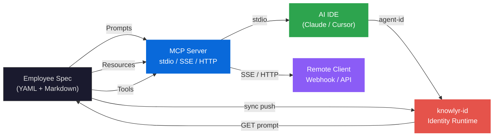
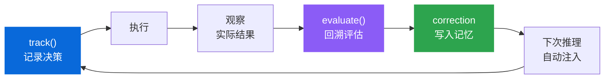
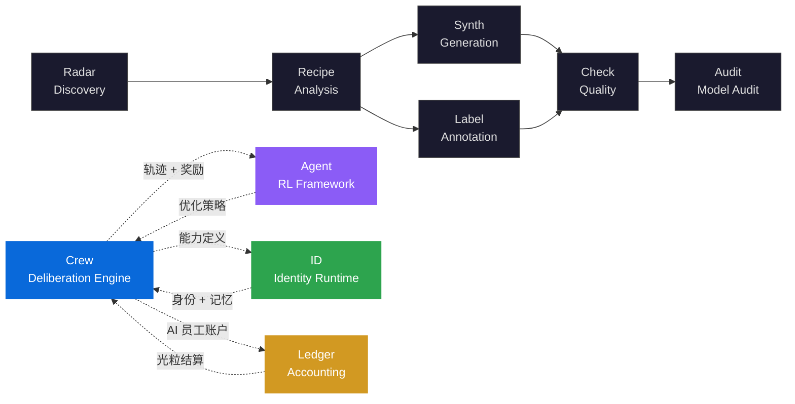

<div align="center">

<h1>knowlyr-crew</h1>

<h3>Adversarial Multi-Agent Deliberation Engine<br/>with Persistent Memory Evolution</h3>

<p><strong>对抗式多智能体协商引擎 — 声明式定义 · MCP 协议原生 · 持续经验进化</strong><br/>
<em>Declarative AI workforce engine — adversarial deliberation, protocol-native interoperability, evolving through experience</em></p>

[](https://pypi.org/project/knowlyr-crew/)
[](https://www.python.org/downloads/)
[](LICENSE)
[](https://github.com/liuxiaotong/knowlyr-crew/actions/workflows/test.yml)
<br/>
[](#development)
[](#mcp-primitive-mapping)
[](#pipeline-orchestration)
[](#adversarial-deliberation-protocol)

[Abstract](#abstract) · [Problem Statement](#problem-statement) · [Formal Framework](#formal-framework) · [Architecture](#architecture) · [Key Innovations](#key-innovations) · [Quick Start](#quick-start) · [Employee Specification](#employee-specification) · [Production Server](#production-server) · [CLI Reference](#cli-reference) · [Ecosystem](#ecosystem) · [References](#references)

</div>

---

## Abstract

现有多智能体系统普遍受限于**共识偏差** (consensus bias)、**无状态推理** (stateless inference) 和**框架耦合** (framework coupling)。knowlyr-crew 提出一种声明式多智能体协商框架：通过**对抗性交互协议** (adversarial interaction protocols) 打破回声室效应，通过**指数衰减持久记忆** (exponentially-decayed persistent memory) 实现经验积累与自然遗忘，通过 **MCP 协议原生集成** (Model Context Protocol) 消除框架锁定。

系统实现「**定义 → 协商 → 决策 → 评估 → 记忆更新**」的自校正闭环 (self-correcting loop)，将 RLHF (Reinforcement Learning from Human Feedback) 思想引入 Agent 运行时——人工评估结果直接反馈为 Agent 的持久化记忆，驱动认知持续进化。

> **knowlyr-crew** formalizes AI workforce capabilities as declarative specifications (YAML + Markdown), implements adversarial multi-agent deliberation with 9 interaction modes and forced-disagreement mechanisms, and provides persistent semantic memory with exponential confidence decay. The system exposes 20 MCP tools across 3 transport protocols, routes across 7 LLM providers, and maintains a complete evaluation-to-memory feedback loop inspired by RLHF.

---

## Problem Statement

多智能体系统 (Multi-Agent Systems, MAS) 的研究表明，Agent 间的简单协作往往退化为**群体思维** (groupthink)——所有参与者迅速趋同于一个"看起来合理"的共识，有价值的异见被系统性压制 (Janis, 1972)。当前 AI Agent 框架在此基础上叠加了两个工程问题：

| 根本性问题 | 形式化定义 | 现有框架的局限 | Crew 的方法 |
|:---|:---|:---|:---|
| **共识偏差**<br/>Consensus Bias | 多 Agent 协作中系统性趋同于多数意见，压制有价值的少数异见 | CrewAI / AutoGen 无强制分歧机制，Agent 间以"补充"代替"质疑" | 对抗性协商协议：9 种交互模式 + 分歧配额 $\rho_{max}$ + 张力种子注入 |
| **推理无状态**<br/>Stateless Inference | 每次会话从零开始，同一认知错误反复出现 $\forall t: s_t \perp s_{t-1}$ | LangChain memory 是滑动窗口 buffer，非语义化持久存储 | 指数衰减持久记忆 + 评估闭环：决策→执行→复盘→纠正→进化 |
| **框架耦合**<br/>Framework Lock-in | Agent 定义绑定特定 SDK/IDE，迁移成本 $\propto$ 定义复杂度 | 各框架自有格式互不兼容，换 IDE 即失效 | MCP 协议原生：声明式 YAML/Markdown，跨 IDE 零修改 |

> Crew 不是又一个编排框架。它是 AI 数字员工的**能力定义层**和**经验进化层**——"谁做什么、怎么协商、学到了什么"，而将身份管理和运行时交互交给 [knowlyr-id](https://github.com/liuxiaotong/knowlyr-id)。

---

## Formal Framework

### Employee Specification

每位 AI 员工是一个**声明式规范** $e \in \mathcal{E}$，与代码解耦、版本可追踪、IDE 无关：

$$e = \langle \text{name}, \text{model}, \text{tools}, \text{prompt}, \text{args}, \text{output} \rangle$$

其中：
- $\text{model} \in \mathcal{M}$ = {`claude-*`, `gpt-*`, `deepseek-*`, `kimi-*`, `gemini-*`, `glm-*`, `qwen-*`} — 7 Provider 统一路由
- $\text{tools} \subseteq \mathcal{T}$ — 可用工具集，受 `PermissionPolicy` 约束
- $\text{prompt}: \Sigma^* \to \Sigma^*$ — Markdown 模板函数，支持变量替换与上下文注入

### Adversarial Deliberation Protocol

讨论过程形式化为四元组 $D = \langle P, R, \Phi, \Psi \rangle$：

| 符号 | 定义 | 说明 |
|:---|:---|:---|
| $P = \{p_1, \ldots, p_n\}$ | 参与者集合 | $p_i = (\text{employee}, \text{role}, \text{stance}, \text{focus})$ |
| $R = [r_1, \ldots, r_k]$ | 轮次序列 | $r_j \in$ {`round-robin`, `cross-examine`, `steelman-then-attack`, `debate`, `vote`, ...} |
| $\Phi$ | 分歧约束函数 | $\text{must\_challenge}(p_i) \subseteq P \setminus \{p_i\}$; $\text{max\_agree\_ratio}(p_i) \in [0, 1]$ |
| $\Psi$ | 张力种子集 | 预设争议点注入，强制议题空间多样化 |

**关键约束**：当 $\Phi$ 定义了 $\text{max\_agree\_ratio}(p_i) = \rho$，参与者 $p_i$ 在整个讨论中同意其他人观点的比例不得超过 $\rho$，系统强制产生有价值的分歧。

### Memory Evolution Model

每条记忆 $m$ 的有效置信度随时间衰减，遵循 Ebbinghaus 遗忘曲线启发的指数模型：

$$C_{\text{eff}}(t) = C_0 \cdot \left(\frac{1}{2}\right)^{t / \tau}$$

其中 $C_0$ 为初始置信度（默认 1.0），$t$ 为记忆年龄（天），$\tau$ 为半衰期（默认 90 天）。检索时按 $C_{\text{eff}}$ 排序，低于阈值 $C_{\min}$ 的记忆自动淘汰。

**语义检索**采用向量-关键词混合评分：

$$\text{score}(q, m) = \alpha \cdot \cos(\mathbf{v}_q, \mathbf{v}_m) + (1 - \alpha) \cdot \text{keyword}(q, m), \quad \alpha = 0.7$$

**纠正链**实现认知自校正：$\text{correct}(m_{\text{old}}, m_{\text{new}})$ 将 $m_{\text{old}}$ 标记为 superseded ($C \leftarrow 0$)，创建 correction 类型新条目 ($C \leftarrow 1.0$)。

### Evaluation Feedback Loop (RLHF-Inspired)

借鉴 RLHF 的核心思想——人工反馈直接塑造 Agent 行为：

```
track(employee, category, prediction) → Decision d
    │
    ▼  执行 + 观察实际结果
evaluate(d, outcome, evaluation) → MemoryEntry m_correction
    │
    ▼  m_correction 自动注入该 Employee 的后续推理上下文
employee.next_inference(context ∪ {m_correction})
```

三种决策类别：`estimate`（估算）/ `recommendation`（建议）/ `commitment`（承诺），评估结论自动作为 `correction` 写入持久记忆，形成**决策→执行→复盘→改进**的闭环。

---

## Architecture



### Layered Architecture

| 层 | 模块 | 职责 |
|:---|:---|:---|
| **Specification** | Parser · Discovery · Models | 声明式员工定义解析，YAML/Markdown 双格式，优先级发现 |
| **Protocol** | MCP Server · Skill Converter | 20 Tools + Prompts + Resources，stdio/SSE/HTTP 三协议 |
| **Deliberation** | Discussion Engine | 9 种对抗性交互模式，强制分歧，拓扑排序执行计划 |
| **Orchestration** | Pipeline · Route · Task Registry | 并行/串行/条件/循环编排，断点恢复，多模型路由 |
| **Memory** | Memory Store · Semantic Index | 语义搜索，指数衰减，重要性排序，访问追踪，跨员工 Pattern 共享，多后端 Embedding 降级 |
| **Evaluation** | Evaluation Engine | 决策追踪，回溯评估，自动纠正记忆 |
| **Execution** | Providers · Cost Tracker | 7 Provider 统一调用，重试/降级/逐任务成本计量 |
| **Integration** | ID Client · Webhook · Cron | 身份联邦（Circuit Breaker），GitHub 事件路由，6 项定时任务（巡检/复盘/KPI/知识周刊），触发型自动委派 |
| **Observability** | Trajectory · Metrics · Audit | 零侵入轨迹录制 (contextvars)，权限矩阵查询，工具调用审计日志，CI 部署后自动审计，审计失败飞书告警 |

### MCP Primitive Mapping

| MCP Primitive | 作用 | 数量 |
|:---|:---|:---|
| **Prompts** | 每位员工 = 一个可调用的 prompt 模板，带类型化参数 | 1 per employee |
| **Resources** | 原始 Markdown 定义，AI IDE 可直接读取 | 1 per employee |
| **Tools** | 员工/讨论/流水线/记忆/评估/权限/审计/日志/项目检测等 | 20 |

<details>
<summary>20 个 MCP Tools 详情</summary>

| Tool | Description |
|:---|:---|
| `list_employees` | 列出所有员工（可按 tag 过滤） |
| `get_employee` | 获取完整员工定义 |
| `run_employee` | 生成可执行 prompt |
| `get_work_log` | 查看员工工作日志 |
| `detect_project` | 检测项目类型、框架、包管理器 |
| `list_pipelines` | 列出所有流水线 |
| `run_pipeline` | 执行流水线 |
| `list_discussions` | 列出所有讨论会 |
| `run_discussion` | 生成讨论会 prompt |
| `add_memory` | 为员工添加持久化记忆（支持 pattern 类型） |
| `query_memory` | 查询员工的持久化记忆 |
| `track_decision` | 记录待评估的决策 |
| `evaluate_decision` | 评估决策并将经验写入员工记忆 |
| `list_meeting_history` | 查看讨论会历史记录 |
| `get_meeting_detail` | 获取讨论会完整记录 |
| `crew_feedback` | 提交工作反馈到 knowlyr-id |
| `crew_status` | 查询 Agent 状态 |
| `list_tool_schemas` | 列出所有可用工具定义（按角色过滤） |
| `get_permission_matrix` | 查看员工权限矩阵与策略 |
| `get_audit_log` | 查询工具调用审计日志 |

</details>

### Transport Protocols

```bash
knowlyr-crew mcp                                # stdio（默认，本地 IDE）
knowlyr-crew mcp -t sse --port 9000             # SSE（远程连接）
knowlyr-crew mcp -t http --port 9001            # Streamable HTTP
knowlyr-crew mcp -t sse --api-token SECRET      # 启用 Bearer 认证
```

---

## Key Innovations

### 1. Adversarial Deliberation Protocol

多 Agent 协作的核心挑战在于**认识论多元性** (epistemic diversity) 的维护——如何确保讨论产出有价值的分歧，而非简单的附和。Crew 实现 9 种结构化交互模式，每种模式对参与者施加不同的论辩约束：

| Mode | 中文 | 机制描述 |
|:---|:---|:---|
| `round-robin` | 轮询发言 | 等权表达，避免话语权失衡 |
| `challenge` | 质疑挑战 | 每位参与者必须对至少一人的结论提出有据质疑 |
| `response` | 回应辩护 | 结构化回应，禁止模糊回避，必须明确接受/部分接受/反驳 |
| `cross-examine` | 交叉盘问 | 三维度深度盘问：事实挑战 / 逻辑推演 / 替代方案 |
| `steelman-then-attack` | 先强化后攻击 | 先构建对方论点的最强形式，再攻击其残余弱点 |
| `debate` | 结构化辩论 | 正反方对抗，要求引用具体事实和数据 |
| `brainstorm` | 发散创意 | 暂停评判，最大化创意空间 |
| `vote` | 投票决策 | 强制给出明确立场 + 简要理由 |
| `free` | 自由讨论 | 无结构约束的开放式交流 |

**对抗性约束** (Adversarial Constraints)：

- **`stance`** — 预设立场，强制参与者从特定视角论辩
- **`must_challenge`** — 必须质疑指定参与者，禁止"我同意"式回避
- **`max_agree_ratio`** — 分歧配额 $\rho_{max} \in [0, 1]$，量化控制同意比例
- **`tension_seeds`** — 争议种子注入，确保议题空间覆盖关键张力维度
- **`min_disagreements`** — 每轮最少分歧数，量化辩论产出

**Discussion → Execution 衔接**：设置 `action_output: true` 后自动生成结构化 ActionPlan JSON，通过 `pipeline_from_action_plan()` 按依赖拓扑排序转为可执行 Pipeline。

<details>
<summary>讨论会 YAML 示例</summary>

```yaml
name: architecture-review
topic: Review $target design
goal: Produce improvement decisions
mode: auto
participants:
  - employee: product-manager
    role: moderator
    focus: 需求完整性
    stance: 偏用户体验
  - employee: code-reviewer
    role: speaker
    focus: 安全性
    must_challenge: [product-manager]
    max_agree_ratio: 0.6
tension_seeds:
  - 安全性 vs 开发效率
rounds:
  - name: 各抒己见
    interaction: round-robin
  - name: 交叉盘问
    interaction: cross-examine
    require_direct_reply: true
    min_disagreements: 2
  - name: Decision
    interaction: vote
output_format: decision
```

</details>

```bash
# 预定义讨论
knowlyr-crew discuss run architecture-review --arg target=auth.py

# 即席讨论（无需 YAML）
knowlyr-crew discuss adhoc -e "code-reviewer,test-engineer" -t "auth 模块质量"

# 编排模式：每位参会者独立推理
knowlyr-crew discuss run architecture-review --orchestrated
```

### 2. Persistent Memory with Exponential Decay

人类记忆遵循 Ebbinghaus 遗忘曲线——新鲜的经验权重高，陈旧的记忆逐渐淡化。Crew 将这一认知科学原理引入 Agent 系统：

**五种记忆类别**：

| 类别 | 说明 | 示例 |
|:---|:---|:---|
| `decision` | 决策记录 | "选择了 JWT 而非 Session 方案" |
| `estimate` | 估算记录 | "CSS 拆分预计 2 天" |
| `finding` | 发现记录 | "main.css 有 2057 行，超出维护阈值" |
| `correction` | 纠正记录 | "CSS 拆分实际花了 5 天，低估跨模块依赖" |
| `pattern` | 工作模式 | "API 变更必须同步更新 SDK 文档"（跨员工自动共享） |

**Embedding 降级链** (Graceful Degradation)：

```
OpenAI text-embedding-3-small → Gemini text-embedding-004 → TF-IDF (zero-dependency fallback)
```

任一上游不可用时自动降级到下一层，确保无 API key 环境下仍可运行语义搜索。

**重要性与访问追踪**：每条记忆携带 `importance`（1-5）权重和 `last_accessed` 时间戳，查询时支持按重要性排序和最低重要性过滤，API 调用自动更新访问时间。

**跨员工工作模式** (`pattern`)：从个体经验中提炼的可复用工作模式，自动标记为共享（`shared: true`），可设置触发条件 (`trigger_condition`) 和适用范围 (`applicability`)，其他员工在匹配场景下自动获取。

**跨员工共享**：通过 `visibility: open` 标记的记忆自动进入共享记忆池，其他员工可检索。

**自动记忆** (`auto_memory: true`)：员工执行任务后自动保存摘要到持久记忆（`category=finding`），无需手动调用。全部 33 名员工已启用。

**自检学习闭环**：通过 `_templates/selfcheck.md` 共享模板，所有员工每次任务结束时自动输出自检清单。系统从输出中提取自检结果（通过/待改进），写入 `correction` 记忆。下次执行同一员工时，"上次教训"自动注入 prompt——形成 **执行 → 自检 → 记忆 → 改进** 的持续学习闭环。

```bash
knowlyr-crew memory add code-reviewer finding "main.css 有 2057 行，超出维护阈值"
knowlyr-crew memory show code-reviewer
knowlyr-crew memory correct code-reviewer <old_id> "CSS 拆分实际花了 5 天"
```

存储：`.crew/memory/{employee}.jsonl`（记忆）+ `.crew/memory/embeddings.db`（向量索引，SQLite WAL）

### 3. Evaluation Feedback Loop

追踪决策质量，回溯评估后自动将经验教训写入员工记忆——形成 RLHF 启发的自校正闭环：



三种决策类别：`estimate`（估算）/ `recommendation`（建议）/ `commitment`（承诺）。评估结论自动作为 `correction` 写入该员工持久记忆，后续推理时自动注入——Agent 从自身错误中学习。

```bash
# 记录决策
knowlyr-crew eval track pm estimate "CSS 拆分需要 2 天"

# 评估（结论自动写入记忆）
knowlyr-crew eval run <id> "实际花了 5 天" \
  --evaluation "低估了跨模块依赖的复杂度，未来 ×2.5"
```

### 4. Declarative Employee Specification

类比 **Infrastructure as Code** (Terraform 定义基础设施 / Kubernetes 定义服务)，Crew 用声明式规范定义 AI 员工——配置与提示词分离，版本可追踪，IDE 无关：

**目录格式（推荐）**：

```
security-auditor/
├── employee.yaml    # 元数据、参数、工具、输出格式
├── prompt.md        # 角色定义 + 核心指令
├── workflows/       # 按场景拆分的工作流
│   ├── scan.md
│   └── report.md
└── adaptors/        # 按项目类型适配（python / nodejs / ...）
    └── python.md
```

```yaml
# employee.yaml
name: security-auditor
display_name: Security Auditor
character_name: Alex Morgan
version: "1.0"
model: claude-opus-4-6
tags: [security, audit]
triggers: [audit, sec]
tools: [file_read, bash, grep]
context: [pyproject.toml, src/]
auto_memory: true                    # 自动保存任务摘要到持久记忆
kpi:                                 # KPI 指标（KPI 周报自动评估）
  - OWASP 覆盖率
  - 建议可操作性
  - 零误报率
args:
  - name: target
    description: 审计目标
    required: true
  - name: severity
    description: 最低严重等级
    default: medium
output:
  format: markdown
  filename: "audit-{date}.md"
```

**单文件格式**：适合简单员工——YAML frontmatter + Markdown 正文。

**发现与优先级**：

| 优先级 | 位置 | 说明 |
|:---|:---|:---|
| 最高 | `private/employees/` | 仓库内自定义员工 |
| 中 | `.claude/skills/` | Claude Code Skills 兼容层 |
| 低 | 包内置 | 默认员工 |

**智能上下文** (`--smart-context`)：自动检测项目类型（Python / Node.js / Go / Rust / Java）、框架、包管理器和测试框架，注入适配信息到 prompt。

<details>
<summary>内置员工</summary>

| 员工 | 触发词 | 用途 |
|:---|:---|:---|
| `product-manager` | `pm` | 需求分析、用户故事、路线图 |
| `code-reviewer` | `review` | 代码审查：质量、安全、性能 |
| `test-engineer` | `test` | 编写或补充单元测试 |
| `refactor-guide` | `refactor` | 代码结构分析、重构建议 |
| `doc-writer` | `doc` | 文档生成（README / API / CHANGELOG） |
| `pr-creator` | `pr` | 分析变更、创建 Pull Request |
| `employee-generator` | `scaffold` | 将需求转化为 employee 定义草稿 |

</details>

<details>
<summary>Prompt 变量替换</summary>

| 变量 | 说明 |
|:---|:---|
| `$target`, `$severity` | 命名参数值 |
| `$1`, `$2` | 位置参数 |
| `{date}`, `{datetime}` | 当前日期/时间 |
| `{cwd}`, `{git_branch}` | 工作目录 / Git 分支 |
| `{project_type}`, `{framework}` | 项目类型 / 框架 |
| `{test_framework}`, `{package_manager}` | 测试框架 / 包管理器 |

</details>

### 5. Pipeline Orchestration

多员工按 DAG（有向无环图）编排执行，支持四种步骤类型：

| 步骤类型 | 说明 |
|:---|:---|
| **Sequential** | 串行执行，`{prev}` 引用上一步输出 |
| **Parallel Group** | `asyncio.gather` 并发执行，600s 超时 |
| **Conditional** | `contains` / `matches` / `equals` 条件分支 |
| **Loop** | 循环执行，支持状态传递 |

**多模型路由** (Multi-Provider Routing)：

| Provider | 模型前缀 | 示例 |
|:---|:---|:---|
| Anthropic | `claude-` | `claude-opus-4-6`, `claude-sonnet-4-5` |
| OpenAI | `gpt-`, `o1-`, `o3-` | `gpt-4o`, `o3-mini` |
| DeepSeek | `deepseek-` | `deepseek-chat`, `deepseek-reasoner` |
| Moonshot | `kimi-`, `moonshot-` | `kimi-k2.5` |
| Google | `gemini-` | `gemini-2.5-pro` |
| Zhipu | `glm-` | `glm-4-plus` |
| Alibaba | `qwen-` | `qwen-max` |

按模型名前缀自动路由至对应 Provider API，支持主模型 + Fallback 备选。

| 特性 | 说明 |
|:---|:---|
| **输出传递** | `{prev}`（上一步）、`{steps.<id>.output}`（按 ID 引用） |
| **断点恢复** | 中途失败从最后完成的步骤恢复 (`pipeline checkpoint resume`) |
| **Fallback** | 主模型重试耗尽后自动切换备选模型 |
| **Mermaid 可视化** | 自动从 Pipeline 定义生成流程图 |

```bash
# 生成各步骤 prompt
knowlyr-crew pipeline run review-test-pr --arg target=main

# Execute 模式：自动调用 LLM 串联执行
knowlyr-crew pipeline run full-review --execute --model claude-opus-4-6
```

### 6. Organization Governance & Adaptive Authority

声明式组织架构定义团队分组、权限级别、协作路由模板——让委派决策有据可依，而非全凭 AI 猜测。权限系统具备**自适应降级** (adaptive degradation) 能力：

```yaml
# private/organization.yaml
teams:
  engineering:
    label: 工程组
    members: [code-reviewer, test-engineer, backend-engineer]
  data:
    label: 数据组
    members: [data-engineer, dba, mlops-engineer]

authority:
  A:
    label: 自主执行
    members: [code-reviewer, test-engineer, doc-writer]
  B:
    label: 需确认
    members: [product-manager, solutions-architect]
  C:
    label: 看场景
    members: [backend-engineer, devops-engineer]

routing_templates:
  code_change:
    steps:
      - role: implement
        team: engineering
      - role: review
        employee: code-reviewer
      - role: test
        employees: [test-engineer, e2e-tester]
```

| 特性 | 说明 |
|:---|:---|
| **三级权限** | A（自主执行）/ B（需确认）/ C（看场景），委派名单自动标注 |
| **自动降级** | 连续 3 次任务失败 → 权限从 A/B 降至 C，持久化到 JSON |
| **路由模板** | `route` 工具按模板展开为 `delegate_chain`，支持多流程行、CI 步骤标注、人类判断节点、仓库绑定 |
| **KPI 度量** | 每位员工声明 3 条 KPI 指标，周报 cron 自动评估并生成 A/B/C/D 评级 |
| **手动恢复** | API 一键恢复被降级的权限 |

### 7. Cost-Aware Orchestration

内置模型单价表（7 Provider），逐任务计算成本，支持按员工 / 模型 / 时间段汇总，实现 **ROI per Decision** 分析：

| 特性 | 说明 |
|:---|:---|
| **逐任务计量** | 每次执行自动记录 input/output tokens + cost_usd |
| **质量预评分** | 解析输出末尾 `{"score": N}` JSON，关联到任务结果 |
| **多维汇总** | 按员工 / 模型 / 时间段 / 触发源聚合 |
| **A/B 测试** | 主模型 + fallback 模型，对比成本与质量的帕累托前沿 |

```bash
# MCP / Agent 工具
query_cost(days=7)
query_cost(days=30, employee="code-reviewer")

# HTTP API
curl /api/cost/summary?days=7
```

### 8. Zero-Intrusion Trajectory Recording

通过 `contextvars.ContextVar` 实现**零侵入轨迹录制**——无需修改任何业务代码，自动捕获 Agent 的思考、工具调用、执行结果、token 消耗：

```
Crew 产出轨迹 → agentrecorder 标准格式 → knowlyr-gym PRM 评分 → SFT / DPO / GRPO 训练
```

这是连接 **Crew**（协作层）和 **knowlyr-gym**（训练层）的数据桥梁——Crew 运行时产生的真实交互轨迹，可直接用于 Agent 的强化学习训练。

---

## Quick Start

```bash
pip install knowlyr-crew[mcp]

# 1. 查看所有可用员工
knowlyr-crew list

# 2. 运行代码审查（自动检测项目类型）
knowlyr-crew run review main --smart-context

# 3. 发起多员工对抗性讨论
knowlyr-crew discuss adhoc -e "code-reviewer,test-engineer" -t "auth 模块安全性"

# 4. 追踪决策并评估
knowlyr-crew eval track pm estimate "重构需要 3 天"
# ... 执行后 ...
knowlyr-crew eval run <id> "实际花了 7 天" --evaluation "低估跨模块依赖"

# 5. 查看员工记忆（包含评估纠正）
knowlyr-crew memory show product-manager
```

**MCP 配置**（Claude Desktop / Claude Code / Cursor）：

```json
{
  "mcpServers": {
    "crew": {
      "command": "knowlyr-crew",
      "args": ["mcp"]
    }
  }
}
```

配置后 AI IDE 可直接调用 `code-reviewer` 审查代码、`test-engineer` 编写测试、`run_pipeline` 串联多员工流水线、`run_discussion` 发起多员工讨论。

---

## Async Delegation & Meeting Orchestration

AI 员工可以**并行委派**多位同事执行任务，或**组织多人会议**异步讨论议题：

```
用户 → 姜墨言: "让 code-reviewer 审查 PR，同时让 test-engineer 写测试"

姜墨言:
  ① delegate_async → code-reviewer (task_id: 20260216-143022-a3f5b8c2)
  ② delegate_async → test-engineer (task_id: 20260216-143022-b7d4e9f1)
  ③ "两个任务已并行执行中"
  ④ check_task → 查看进度/结果
```

| 工具 | 说明 |
|:---|:---|
| `delegate_async` | 异步委派，立即返回 task_id |
| `delegate_chain` | 顺序链式委派，`{prev}` 引用上一步输出 |
| `check_task` / `list_tasks` | 查询任务状态和结果 |
| `organize_meeting` | 多员工异步讨论会，每轮 `asyncio.gather` 并行推理 |
| `schedule_task` / `list_schedules` | 动态 cron 定时任务 |
| `run_pipeline` | 触发预定义流水线（异步执行） |
| `agent_file_read` / `agent_file_grep` | 路径安全的文件操作 |
| `query_data` | 细粒度业务数据查询 |
| `find_free_time` | 飞书忙闲查询，多人共同空闲 |

**主动巡检 & 自驱运营**：通过 `.crew/cron.yaml` 配置 6 项定时任务：

| 调度 | 说明 |
|:---|:---|
| 每天 9:00 | 晨间巡检——业务数据、待办、日程、系统状态 → 飞书简报 |
| 每天 23:00 | AI 日记——基于当日工作和记忆写个人日记 |
| 每周四 16:00 | 团队知识周刊——跨团队工作产出 + 共性问题 + 最佳实践 → 飞书文档 |
| 每周五 17:00 | KPI 周报——33 名员工逐一评级 + 异常自动委派（D 级 → HR 跟进，连续待改进 → 团队关注） |
| 每周五 18:00 | 周复盘——本周亮点、问题、下周建议 |

---

## Production Server

Crew 可作为 HTTP 服务器运行，接收外部事件并自动触发 pipeline / 员工执行：

```bash
pip install knowlyr-crew[webhook]
knowlyr-crew serve --port 8765 --token YOUR_SECRET
```

### API Endpoints

| 路径 | 方法 | 说明 |
|:---|:---|:---|
| `/health` | GET | 健康检查（免认证） |
| `/webhook/github` | POST | GitHub webhook（HMAC-SHA256 签名验证） |
| `/webhook/openclaw` | POST | OpenClaw 消息事件 |
| `/run/pipeline/{name}` | POST | 触发 pipeline（异步/同步/SSE 流式） |
| `/run/employee/{name}` | POST | 触发员工（支持 SSE 流式） |
| `/api/employees/{id}/prompt` | GET | 员工能力定义（含团队、权限、7日成本） |
| `/api/employees/{id}/state` | GET | 运行时状态（性格、记忆、笔记） |
| `/api/employees/{id}` | PUT | 更新配置（model/temperature/max_tokens） |
| `/api/employees/{id}/authority/restore` | POST | 恢复被自动降级的权限 |
| `/api/cost/summary` | GET | 成本汇总 |
| `/api/project/status` | GET | 项目状态概览 |
| `/api/memory/ingest` | POST | 外部讨论数据导入员工记忆 |
| `/tasks/{task_id}` | GET | 查询任务状态和结果 |
| `/metrics` | GET | 调用/延迟/token/错误统计 |
| `/cron/status` | GET | Cron 调度器状态 |

<details>
<summary>生产特性</summary>

| 特性 | 说明 |
|:---|:---|
| Bearer 认证 | `--api-token`，timing-safe 比较 |
| CORS 跨域 | `--cors-origin`，多 origin 支持 |
| 速率限制 | 60 请求/分钟/IP |
| 请求大小限制 | 默认 1MB |
| 断路器 | knowlyr-id 连续 3 次失败后暂停 30 秒 |
| 成本追踪 | 逐任务 token 计量 + 模型单价 |
| 自动降级 | 连续失败自动降低员工权限 |
| CI 审计 | 部署后自动运行权限审计脚本，失败时飞书告警 |
| 链路追踪 | 每个任务唯一 trace_id |
| 并发安全 | `fcntl.flock` 文件锁 + SQLite WAL |
| 任务持久化 | `.crew/tasks.jsonl`，重启恢复 |
| 周期心跳 | 每 60s 向 knowlyr-id 发送心跳 |

</details>

### Webhook Configuration

`.crew/webhook.yaml` 定义事件路由规则（GitHub HMAC-SHA256 签名验证），`.crew/cron.yaml` 定义定时任务（croniter 解析）。KPI 周报 cron 内置异常自动委派规则——评级 D（无产出）的员工自动转 HR 跟进，连续自检待改进项自动通知团队关注。

---

## Integrations

### knowlyr-id — Identity & Runtime Federation

Crew 定义"谁做什么"，[knowlyr-id](https://github.com/liuxiaotong/knowlyr-id) 管理身份、对话和运行时。两者协作但各自可独立使用：

```
┌──────────────────────────────────────┐
│        Crew（能力权威）                │
│  prompt · model · tools · avatar     │
│  temperature · bio · tags            │
└──────────────┬───────────────────────┘
     API 获取 prompt │ sync 推送全字段
┌──────────────┴───────────────────────┐
│      knowlyr-id（身份 + 运行时）       │
│  用户账号 · 对话 · 记忆 · 心跳        │
│  调度 · 触达 · API Key · 工作日志     │
└──────────────────────────────────────┘
```

knowlyr-id 通过 `CREW_API_URL` 获取员工的 prompt / model / temperature / 团队 / 权限 / 成本（5 分钟缓存），不可用时回退到 DB 缓存。连接是**可选的**——不配置时 Crew 独立运行。管理后台实时展示每位员工的权限徽章、团队归属、7 日成本，并支持一键恢复被自动降级的权限。

**员工状态同步** (`agent_status`)：Crew 维护三态生命周期——`active`（正常运行）/ `frozen`（冻结，保留配置但跳过执行）/ `inactive`（已停用）。状态变更通过 `sync` 双向同步至 knowlyr-id，frozen 员工在 pipeline 执行时自动跳过。

<details>
<summary>字段映射</summary>

| Crew Employee | knowlyr-id | 方向 |
|:---|:---|:---|
| `name` | `crew_name` | push → |
| `character_name` | `nickname` | push → |
| `display_name` | `title` | push → |
| `bio` | `bio` | push → |
| `description` | `capabilities` | push → |
| `tags` | `domains` | push → |
| rendered prompt | `system_prompt` | push → |
| `avatar.webp` | `avatar_base64` | push → |
| `model` | `model` | push → |
| `temperature` | `temperature` | ↔ |
| `max_tokens` | `max_tokens` | push → |
| `memory-id.md` | `memory` | ← pull |

</details>

```bash
# 一键部署（rsync → 重启 → 同步 knowlyr-id）
make push
```

### Claude Code Skills Interoperability

Crew 员工与 Claude Code 原生 Skills 双向转换：`tools` ↔ `allowed-tools`、`args` ↔ `argument-hint`、元数据通过 HTML 注释往返保持。

```bash
knowlyr-crew export code-reviewer    # → .claude/skills/code-reviewer/SKILL.md
knowlyr-crew sync --clean            # 同步 + 清理孤立目录
```

### Avatar Generation

通义万相（DashScope）生成写实职业照头像，768×768 → 256×256 webp：

```bash
pip install knowlyr-crew[avatar]
knowlyr-crew avatar security-auditor
```

---

## CLI Reference

<details>
<summary>完整 CLI 命令列表</summary>

### Core

```bash
knowlyr-crew list [--tag TAG] [--layer LAYER] [-f json]  # 列出员工
knowlyr-crew show <name>                                  # 查看详情
knowlyr-crew run <name> [ARGS] [--smart-context] [--agent-id ID] [--copy] [-o FILE]
knowlyr-crew init [--employee NAME] [--dir-format] [--avatar]
knowlyr-crew validate <path>
knowlyr-crew check --json                                 # 质量雷达
```

### Discussions

```bash
knowlyr-crew discuss list
knowlyr-crew discuss run <name> [--orchestrated] [--arg key=val]
knowlyr-crew discuss adhoc -e "员工1,员工2" -t "议题"
knowlyr-crew discuss history [-n 20]
knowlyr-crew discuss view <meeting_id>
```

### Memory

```bash
knowlyr-crew memory list
knowlyr-crew memory show <employee> [--category ...]
knowlyr-crew memory add <employee> <category> <text>
knowlyr-crew memory correct <employee> <old_id> <text>
```

### Evaluation

```bash
knowlyr-crew eval track <employee> <category> <text>
knowlyr-crew eval list [--status pending]
knowlyr-crew eval run <decision_id> <outcome> [--evaluation TEXT]
knowlyr-crew eval prompt <decision_id>
```

### Pipeline

```bash
knowlyr-crew pipeline list
knowlyr-crew pipeline run <name> [--execute] [--model MODEL] [--arg key=val]
knowlyr-crew pipeline checkpoint list
knowlyr-crew pipeline checkpoint resume <task_id>
```

### Route

```bash
knowlyr-crew route list [-f json]                                  # 列出协作流程模板
knowlyr-crew route show <name>                                     # 查看流程详情
knowlyr-crew route run <name> <task> [--execute] [--remote]        # 执行协作流程
```

### Server & MCP

```bash
knowlyr-crew serve --port 8765 --token SECRET [--no-cron] [--cors-origin URL]
knowlyr-crew mcp [-t stdio|sse|http] [--port PORT] [--api-token TOKEN]
```

### Agent Management

```bash
knowlyr-crew register <name> [--dry-run]
knowlyr-crew agents list
knowlyr-crew agents status <id>
knowlyr-crew agents sync <name>
knowlyr-crew agents sync-all [--push-only|--pull-only] [--force] [--dry-run]
```

### Templates & Export

```bash
knowlyr-crew template list
knowlyr-crew template apply <template> --employee <name> [--var key=val]
knowlyr-crew export <name>                                # → SKILL.md
knowlyr-crew export-all
knowlyr-crew sync [--clean]                               # → .claude/skills/
```

### Other

```bash
knowlyr-crew avatar <name>                                # 头像生成
knowlyr-crew log list [--employee NAME] [-n 20]           # 工作日志
knowlyr-crew log show <session_id>
```

</details>

---

## Ecosystem

<details>
<summary>Architecture Diagram</summary>



</details>

| Layer | Project | Description | Repo |
|:---|:---|:---|:---|
| Discovery | **AI Dataset Radar** | 数据集竞争情报、趋势分析 | [GitHub](https://github.com/liuxiaotong/ai-dataset-radar) |
| Analysis | **DataRecipe** | 逆向分析、Schema 提取、成本估算 | [GitHub](https://github.com/liuxiaotong/data-recipe) |
| Production | **DataSynth** / **DataLabel** | LLM 批量合成 / 轻量标注 | [GitHub](https://github.com/liuxiaotong/data-synth) · [GitHub](https://github.com/liuxiaotong/data-label) |
| Quality | **DataCheck** | 规则验证、重复检测、分布分析 | [GitHub](https://github.com/liuxiaotong/data-check) |
| Audit | **ModelAudit** | 蒸馏检测、模型指纹 | [GitHub](https://github.com/liuxiaotong/model-audit) |
| Identity | **knowlyr-id** | 身份系统 + AI 员工运行时 | [GitHub](https://github.com/liuxiaotong/knowlyr-id) |
| Accounting | **knowlyr-ledger** | 统一账本 · 复式记账 · 行锁安全 · 幂等交易 | [GitHub](https://github.com/liuxiaotong/knowlyr-ledger) |
| Deliberation | **Crew** | 对抗式多智能体协商 · 持久记忆进化 · MCP 原生 | You are here |
| Agent Training | **knowlyr-gym** | Gymnasium 风格 RL 框架 · 过程奖励模型 · SFT/DPO/GRPO | [GitHub](https://github.com/liuxiaotong/knowlyr-gym) |

---

## Development

```bash
git clone https://github.com/liuxiaotong/knowlyr-crew.git
cd knowlyr-crew
pip install -e ".[all]"
pytest -v    # 1860+ test cases
```

---

## References

- **Model Context Protocol (MCP)** — Anthropic, 2024. Agent 工具交互的开放标准协议
- **Multi-Agent Systems** — Wooldridge, M., 2009. *An Introduction to MultiAgent Systems*. Wiley
- **Groupthink** — Janis, I.L., 1972. *Victims of Groupthink*. Houghton Mifflin
- **RLHF** — Christiano, P. et al., 2017. *Deep RL from Human Preferences.* [arXiv:1706.03741](https://arxiv.org/abs/1706.03741)
- **Ebbinghaus Forgetting Curve** — Ebbinghaus, H., 1885. *Über das Gedächtnis* — 记忆衰减模型的启发来源
- **Infrastructure as Code** — Morris, K., 2016. *Infrastructure as Code*. O'Reilly — 声明式规范的范式来源
- **Gymnasium** — Towers et al., 2024. *Gymnasium: A Standard Interface for RL Environments.* [arXiv:2407.17032](https://arxiv.org/abs/2407.17032)

---

## License

[MIT](LICENSE)

---

<div align="center">
<sub><a href="https://github.com/liuxiaotong">knowlyr</a> — adversarial multi-agent deliberation engine</sub>
</div>
