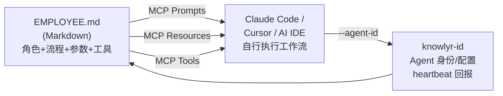
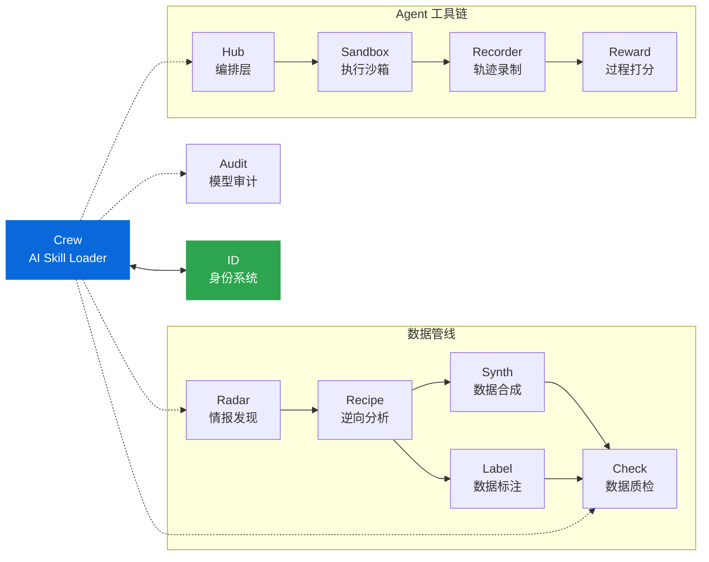

<div align="center">

<h1>Crew — AI Skill Loader</h1>

<p><strong>用 Markdown 定义专业技能，通过 MCP 加载到 AI IDE</strong><br/>
<em>Define AI skills in Markdown, load into Claude Code / Cursor via MCP</em></p>

[](https://pypi.org/project/knowlyr-crew/)
[](https://www.python.org/downloads/)
[](LICENSE)
[](#开发)

**GitHub Topics**: `ai-skill-loader`, `mcp`, `model-context-protocol`, `digital-employee`, `claude-code`

[MCP 集成](#mcp-集成推荐) · [CLI 使用](#cli-使用) · [内置技能](#内置技能) · [自定义技能](#自定义技能) · [Skills 互通](#claude-code-skills-互通) · [knowlyr-id 协作](#knowlyr-id-协作) · [生态](#data-pipeline-生态)

</div>

> **Crew 不是又一个 Agent 框架。**
> 它是 AI IDE 的"人才市场"—— 每个"数字员工"是一个 Markdown 文件，
> 通过 MCP 协议加载为可复用的专业技能。
> AI IDE 自己决定怎么执行，Crew 只负责定义"谁做什么"。

---

## 工作原理



Crew 通过 MCP 协议暴露三种原语：

| MCP 原语 | 作用 | 数量 |
|----------|------|------|
| **Prompts** | 每个员工 = 一个可调用的 prompt 模板，带类型化参数 | 每员工 1 个 |
| **Resources** | 员工定义的原始 Markdown，可读取查看 | 每员工 1 个 |
| **Tools** | 列出 / 查看 / 运行员工，工作日志，项目检测，流水线 | 7 个 |

---

## MCP 集成（推荐）

### 配置

将以下内容添加到 MCP 配置文件（Claude Desktop: `claude_desktop_config.json`，Claude Code: `.mcp.json`）：

```json
{
  "mcpServers": {
    "crew": {
      "command": "knowlyr-crew",
      "args": ["mcp"]
    }
  }
}
```

配置后 AI IDE 可直接：
- 调用 `code-reviewer` prompt 审查代码
- 调用 `test-engineer` prompt 编写测试
- 读取员工定义了解其能力
- 通过 `run_employee` 工具动态生成 prompt

### 安装

```bash
pip install knowlyr-crew[mcp]
```

---

## CLI 使用

```bash
pip install knowlyr-crew

# 列出所有可用技能
knowlyr-crew list

# 召唤代码审查员审查 main 分支
knowlyr-crew run code-reviewer main

# 用触发词（简写）
knowlyr-crew run review main --arg focus=security

# 绑定 knowlyr-id Agent 身份
knowlyr-crew run code-reviewer main --agent-id 3050

# 复制到剪贴板
knowlyr-crew run review main --copy

# 查看员工详情
knowlyr-crew show code-reviewer
```

### 全部命令

```bash
knowlyr-crew list [--tag TAG] [--layer LAYER] [-f json]       # 列出技能
knowlyr-crew show <name>                                       # 查看详情
knowlyr-crew run <name> [ARGS...] [--smart-context] [--copy]   # 生成 prompt
knowlyr-crew validate <path>                                   # 校验文件
knowlyr-crew init [--employee <name>]                          # 初始化
knowlyr-crew export <name>                                     # 导出为 SKILL.md
knowlyr-crew export-all                                        # 批量导出
knowlyr-crew sync [--clean]                                    # 同步到 .claude/skills/
knowlyr-crew pipeline list                                     # 列出流水线
knowlyr-crew pipeline show <name>                              # 查看流水线
knowlyr-crew pipeline run <name> [--arg key=val]               # 执行流水线
knowlyr-crew log list [--employee NAME]                        # 工作日志
knowlyr-crew log show <session_id>                             # 日志详情
knowlyr-crew mcp                                               # 启动 MCP Server
```

---

## 内置技能

| 名称 | 显示名 | 触发词 | 需要工具 | 预读上下文 | 用途 |
|------|--------|--------|----------|-----------|------|
| `code-reviewer` | 代码审查员 | `review`, `cr` | git, file_read | pyproject.toml | 审查代码变更，按 Critical/Warning/Suggestion 分类 |
| `test-engineer` | 测试工程师 | `test` | file_read, file_write, bash | tests/, pyproject.toml | 编写或补充单元测试 |
| `doc-writer` | 文档工程师 | `doc`, `docs` | file_read, file_write | README.md, pyproject.toml | 生成或更新文档 |
| `refactor-guide` | 重构顾问 | `refactor` | file_read, git | pyproject.toml | 分析代码结构，提出重构方案 |
| `pr-creator` | PR 创建员 | `pr` | git, bash | pyproject.toml | 分析变更，创建规范 Pull Request |
| `product-manager` | 产品经理 | `pm` | file_read, git | README.md, pyproject.toml | 需求分析、优先级排序、路线图 |

---

## 自定义技能

### 四层发现机制

| 优先级 | 位置 | 说明 |
|--------|------|------|
| 最高 | `.crew/*.md`（项目目录） | 项目专属技能 |
| 高 | `.claude/skills/<name>/SKILL.md` | Claude Code Skills 格式 |
| 中 | `~/.knowlyr/crew/*.md` | 全局自定义技能 |
| 低 | 包内置 | 默认技能 |

高层同名技能会覆盖低层。

### 创建自定义技能

```bash
# 初始化项目的 .crew/ 目录
knowlyr-crew init

# 从模板创建
knowlyr-crew init --employee security-auditor

# 编辑后校验
knowlyr-crew validate .crew/
```

### EMPLOYEE.md 格式

```yaml
---
name: security-auditor        # 必填，唯一 ID [a-z0-9-]
display_name: 安全审计员       # 可选，中文显示名
description: 审查安全漏洞      # 必填，一句话描述
tags: [security, audit]       # 可选，分类标签
triggers: [audit]             # 可选，触发别名
tools:                        # 可选，声明需要的工具
  - file_read
  - bash
context:                      # 可选，声明需要预读的文件
  - pyproject.toml
  - src/
args:                         # 可选，参数定义
  - name: target
    description: 审查目标
    required: true
  - name: severity
    default: all
output:                       # 可选，输出配置
  format: markdown
  filename: "audit-{date}.md"
---

正文是自然语言指令，支持变量替换：
- $target, $severity — 按参数名替换
- $1, $2 — 按位置替换
- {date}, {cwd}, {git_branch} — 环境变量
```

`tools` 和 `context` 是声明式的提示——告诉 AI IDE 这个技能需要什么工具和上下文，
由 AI IDE 自行决定如何使用。

---

## Claude Code Skills 互通

Crew 支持与 Claude Code 原生 Skills 系统双向转换，实现**一次定义，多处使用**。

### 格式对照

| EMPLOYEE.md | SKILL.md | 转换 |
|-------------|----------|------|
| `tools: [file_read, git]` | `allowed-tools: Read Bash(git:*)` | 自动映射 |
| `args` (typed, required) | `argument-hint: <target> [mode]` | `<>` = 必填, `[]` = 可选 |
| `$target`, `$focus` | `$0`, `$1` | 位置变量互转 |
| `display_name`, `tags` 等 | HTML 注释保留 | 元数据往返 |

### 导出到 Claude Code

```bash
# 导出单个员工
knowlyr-crew export code-reviewer
# → .claude/skills/code-reviewer/SKILL.md

# 批量导出所有员工
knowlyr-crew export-all

# 同步（+ 清理孤儿）
knowlyr-crew sync --clean
```

### 从 Skills 发现

`.claude/skills/<name>/SKILL.md` 中的技能会被自动发现，与 EMPLOYEE.md 一样参与四层优先级合并。

---

## knowlyr-id 协作

Crew 可与 [knowlyr-id](https://github.com/liuxiaotong/knowlyr-id) 协作——
**id 管"人事档案"（身份、配额、API Key），Crew 管"岗位技能"（流程、工具、参数）**。

### 工作流

```
knowlyr-crew run code-reviewer main --agent-id 3050
    │
    ├─ 1. 发现 code-reviewer 技能定义（不变）
    ├─ 2. 从 knowlyr-id 获取 Agent 3050 的身份
    │      → nickname, title, domains, memory
    ├─ 3. 生成 prompt（注入 Agent 身份到 header）
    ├─ 4. 向 knowlyr-id 发送心跳（计入日执行数）
    └─ 5. 输出 prompt
```

### 配置

```bash
# 环境变量
export KNOWLYR_ID_URL=https://id.knowlyr.com
export AGENT_API_TOKEN=your-token

# 安装 HTTP 客户端依赖
pip install knowlyr-crew[id]
```

不带 `--agent-id` 时，所有行为与原来完全一致。knowlyr-id 连接是可选的。

---

## Data Pipeline 生态

<details>
<summary>生态架构图</summary>



</details>

| 层 | 项目 | PyPI 包 | 说明 | 仓库 |
|---|---|---|---|---|
| 情报 | **AI Dataset Radar** | knowlyr-radar | 竞争情报、趋势分析 | [GitHub](https://github.com/liuxiaotong/ai-dataset-radar) |
| 分析 | **DataRecipe** | knowlyr-datarecipe | 逆向分析、Schema 提取 | [GitHub](https://github.com/liuxiaotong/data-recipe) |
| 生产 | **DataSynth** | knowlyr-datasynth | LLM 批量合成 | [GitHub](https://github.com/liuxiaotong/data-synth) |
| 生产 | **DataLabel** | knowlyr-datalabel | 轻量标注 | [GitHub](https://github.com/liuxiaotong/data-label) |
| 质检 | **DataCheck** | knowlyr-datacheck | 规则验证、重复检测 | [GitHub](https://github.com/liuxiaotong/data-check) |
| 审计 | **ModelAudit** | knowlyr-modelaudit | 蒸馏检测、模型指纹 | [GitHub](https://github.com/liuxiaotong/model-audit) |
| 身份 | **knowlyr-id** | — | 用户身份、Agent 管理 | [GitHub](https://github.com/liuxiaotong/knowlyr-id) |
| 协作 | **Crew** | knowlyr-crew | AI Skill Loader | You are here |
| Agent | **knowlyr-agent** | knowlyr-sandbox / recorder / reward / hub | 沙箱 + 录制 + Reward + 编排 | [GitHub](https://github.com/liuxiaotong/knowlyr-agent) |

---

## 开发

```bash
git clone https://github.com/liuxiaotong/knowlyr-crew.git
cd knowlyr-crew
pip install -e ".[all]"
pytest -v
```

**测试**: 170 个用例，覆盖解析、发现、引擎、CLI、MCP Server、Skills 转换、knowlyr-id 客户端、项目检测、流水线全链路。

## License

[MIT](LICENSE)

---

<div align="center">
<sub><a href="https://github.com/liuxiaotong">knowlyr</a> 数据工程生态 · AI Skill Loader</sub>
</div>
