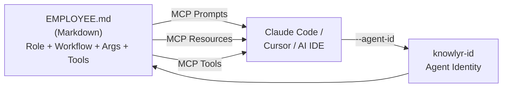
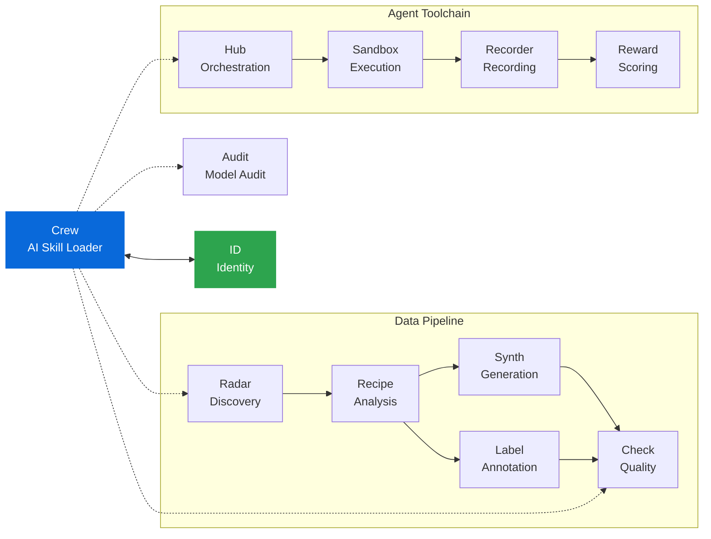

<div align="center">

<h1>Crew — AI Skill Loader</h1>

<p><strong>用 Markdown 定义专业技能，通过 MCP 加载到 AI IDE</strong><br/>
<em>Define professional AI skills in Markdown, load into Claude Code / Cursor via MCP</em></p>

[](https://pypi.org/project/knowlyr-crew/)
[](https://www.python.org/downloads/)
[](LICENSE)
[](#开发--development)

[快速开始](#快速开始--quick-start) · [MCP 集成](#mcp-集成--mcp-integration) · [CLI](#cli-使用--cli-usage) · [内置技能](#内置技能--builtin-skills) · [讨论会](#讨论会--discussions) · [自定义技能](#自定义技能--custom-skills) · [Skills 互通](#skills-互通--interoperability) · [knowlyr-id](#knowlyr-id-协作--integration) · [生态](#生态--ecosystem)

</div>

> **Crew 不是又一个 Agent 框架。**
> 它是 AI IDE 的"人才市场"—— 每个"数字员工"是一个 Markdown 文件，
> 通过 MCP 协议加载为可复用的专业技能。
> AI IDE 自己决定怎么执行，Crew 只负责定义"谁做什么"。

---

## 快速开始 / Quick Start

```bash
pip install knowlyr-crew[mcp]

# 列出所有可用技能 / List available skills
knowlyr-crew list

# 运行代码审查 / Run code review
knowlyr-crew run code-reviewer main

# 或配置 MCP 后由 AI IDE 自动调用（见下方）
```

---

## 工作原理 / How It Works



Crew 通过 MCP 协议暴露三种原语 / Three MCP primitives:

| MCP Primitive | Purpose | Count |
|---------------|---------|-------|
| **Prompts** | Each employee = a callable prompt template with typed arguments | 1 per employee |
| **Resources** | Raw Markdown definition, readable by AI IDE | 1 per employee |
| **Tools** | List / show / run employees, discussions, logs, project detection, pipelines | 9 |

---

## MCP 集成 / MCP Integration

将以下内容添加到 MCP 配置文件 / Add to your MCP config:

```json
{
  "mcpServers": {
    "crew": {
      "command": "knowlyr-crew",
      "args": ["mcp"]
    }
  }
}
```

> Claude Desktop: `claude_desktop_config.json` · Claude Code: `.mcp.json`

配置后 AI IDE 可直接 / After setup, AI IDE can:
- Call `code-reviewer` prompt to review code
- Call `test-engineer` prompt to write tests
- Read employee definitions to understand capabilities
- Use `run_employee` tool to generate prompts dynamically

```bash
pip install knowlyr-crew[mcp]
```

---

## CLI 使用 / CLI Usage

```bash
pip install knowlyr-crew

knowlyr-crew list                                     # List all skills
knowlyr-crew show <name>                              # Show details
knowlyr-crew run <name> [ARGS...] [--copy]            # Generate prompt
knowlyr-crew run review main --arg focus=security     # Trigger word + args
knowlyr-crew run code-reviewer main --agent-id 3050   # With knowlyr-id

knowlyr-crew validate <path>                          # Validate definition
knowlyr-crew init [--employee <name>]                 # Initialize .crew/
knowlyr-crew export <name>                            # Export to SKILL.md
knowlyr-crew export-all                               # Export all
knowlyr-crew sync [--clean]                           # Sync to .claude/skills/

knowlyr-crew discuss list                             # List discussions
knowlyr-crew discuss show <name>                      # Show discussion
knowlyr-crew discuss run <name> [--arg key=val]       # Run discussion

knowlyr-crew pipeline list | show | run <name>        # Pipelines
knowlyr-crew log list [--employee NAME]               # Work logs
knowlyr-crew mcp                                      # Start MCP Server
```

---

## 内置技能 / Builtin Skills

6 个通用数字员工，各有专业工作流 / 6 generic employees with professional workflows:

| ID | Display Name | Triggers | Purpose |
|----|-------------|----------|---------|
| `product-manager` | Product Manager | `pm` | Requirements analysis, prioritization, roadmap |
| `code-reviewer` | Code Reviewer | `review`, `cr` | Review code for quality, security, maintainability |
| `test-engineer` | Test Engineer | `test` | Write or supplement unit tests |
| `refactor-guide` | Refactor Guide | `refactor` | Analyze structure, propose refactoring plans |
| `doc-writer` | Doc Writer | `doc`, `docs` | Generate or update documentation |
| `pr-creator` | PR Creator | `pr` | Analyze changes, create well-formatted PRs |

通过 `~/.knowlyr/crew/` 可覆盖或扩展内置员工 / Override or extend via `~/.knowlyr/crew/`.

---

## 讨论会 / Discussions

多名数字员工围绕议题进行多轮结构化讨论，支持交叉挑战与辩论。

Multiple employees discuss a topic in structured rounds, with cross-challenge and debate.

```bash
knowlyr-crew discuss list
knowlyr-crew discuss run architecture-review --arg target=auth.py
knowlyr-crew discuss run .crew/discussions/my-review.yaml
```

### 内置讨论会 / Builtin Discussions

| Name | Participants | Rounds | Purpose |
|------|-------------|--------|---------|
| `architecture-review` | 4 | 3 | Multi-role architecture review |
| `feature-design` | 4 | 3 (custom) | Feature design from requirements to plan |

### YAML 格式 / Format

```yaml
name: my-review
topic: Review $target design
goal: Produce improvement decisions
background_mode: auto                       # full / summary / minimal / auto
participants:
  - employee: product-manager
    role: moderator                         # moderator / speaker / recorder
    focus: Requirements completeness
  - employee: code-reviewer
    role: speaker
    focus: Security
rules:                                      # Optional, defaults provided
  - Every participant must speak each round
  - Encourage constructive disagreement
rounds:                                     # int (auto-generate) or list (custom)
  - name: Initial Assessment
    instruction: Each role gives initial evaluation
    interaction: round-robin                # free / round-robin / challenge / response
  - name: Cross-Challenge
    instruction: Challenge each other's conclusions
    interaction: challenge
  - name: Response
    interaction: response
  - name: Decision
    instruction: Summarize action items
output_format: decision                     # decision / transcript / summary
```

### 核心特性 / Key Features

| Feature | Description |
|---------|-------------|
| **background_mode** | `auto` selects context depth by participant count (≤3 full, 4-6 summary, >6 minimal) |
| **interaction modes** | `challenge` rounds auto-append challenge rules; `response` rounds require point-by-point replies |
| **character_name** | Optional: if employees define `character_name`, discussions show persona names (e.g., `Alex·Code Reviewer`) |
| **custom rules** | Define your own discussion rules, or omit for 6 defaults |
| **3-layer discovery** | `builtin < global (~/.knowlyr/crew/discussions/) < project (.crew/discussions/)` |

---

## 自定义技能 / Custom Skills

### 四层发现 / 4-Layer Discovery

| Priority | Location | Description |
|----------|----------|-------------|
| Highest | `.crew/*.md` (project) | Project-specific skills |
| High | `.claude/skills/<name>/SKILL.md` | Claude Code Skills format |
| Medium | `~/.knowlyr/crew/*.md` | Global custom skills |
| Low | Package builtin | Default skills |

高层同名技能覆盖低层 / Higher layers override lower layers by name.

### 创建自定义技能 / Create Custom Skills

```bash
knowlyr-crew init
knowlyr-crew init --employee security-auditor
knowlyr-crew validate .crew/
```

### EMPLOYEE.md 格式 / Format

```yaml
---
name: security-auditor          # Required, unique ID [a-z0-9-]
display_name: Security Auditor  # Optional, human-readable name
character_name: Alex Morgan     # Optional, persona name for discussions
summary: Security expert...     # Optional, for discussion summary mode
description: Audit security vulnerabilities  # Required, one-line description
tags: [security, audit]         # Optional, categorization
triggers: [audit, sec]          # Optional, shorthand aliases
tools:                          # Optional, declare required tools
  - file_read
  - bash
  - grep
context:                        # Optional, files to pre-read
  - pyproject.toml
  - src/
args:                           # Optional, typed parameters
  - name: target
    description: Audit target (file/directory/module)
    required: true
  - name: severity
    description: Minimum severity level
    default: medium
output:                         # Optional, output configuration
  format: markdown
  filename: "audit-{date}.md"
---

Body is natural language instructions with variable substitution:
- $target, $severity — argument values
- $1, $2 — positional
- {date}, {cwd}, {git_branch} — environment variables
```

`tools` 和 `context` 是声明式提示，由 AI IDE 自行决定如何使用。

`tools` and `context` are declarative hints — the AI IDE decides how to use them.

---

## Skills 互通 / Interoperability

与 Claude Code 原生 Skills 双向转换 / Bidirectional conversion with Claude Code Skills:

| EMPLOYEE.md | SKILL.md | Conversion |
|-------------|----------|------------|
| `tools: [file_read, git]` | `allowed-tools: Read Bash(git:*)` | Auto-mapped |
| `args` (typed, required) | `argument-hint: <target> [mode]` | `<>` = required, `[]` = optional |
| `$target`, `$focus` | `$0`, `$1` | Positional variable conversion |
| `display_name`, `tags` etc. | HTML comments | Metadata round-trip |

```bash
knowlyr-crew export code-reviewer      # → .claude/skills/code-reviewer/SKILL.md
knowlyr-crew export-all                # Export all employees
knowlyr-crew sync --clean              # Sync + clean orphans
```

`.claude/skills/<name>/SKILL.md` 会被自动发现，参与四层优先级合并。

---

## knowlyr-id 协作 / Integration

与 [knowlyr-id](https://github.com/liuxiaotong/knowlyr-id) 协作——id 管身份，Crew 管技能。

```
knowlyr-crew run code-reviewer main --agent-id 3050
    │
    ├─ 1. Discover skill definition
    ├─ 2. Fetch Agent 3050 identity from knowlyr-id
    │      → nickname, title, domains, memory
    ├─ 3. Generate prompt (inject agent identity)
    ├─ 4. Send heartbeat to knowlyr-id
    └─ 5. Output prompt
```

```bash
export KNOWLYR_ID_URL=https://id.knowlyr.com
export AGENT_API_TOKEN=your-token
pip install knowlyr-crew[id]
```

不带 `--agent-id` 时行为完全一致，knowlyr-id 连接是可选的。

---

## 生态 / Ecosystem

<details>
<summary>Architecture Diagram</summary>



</details>

| Layer | Project | PyPI | Description | Repo |
|-------|---------|------|-------------|------|
| Discovery | **AI Dataset Radar** | knowlyr-radar | Competitive intelligence, trend analysis | [GitHub](https://github.com/liuxiaotong/ai-dataset-radar) |
| Analysis | **DataRecipe** | knowlyr-datarecipe | Reverse engineering, schema extraction | [GitHub](https://github.com/liuxiaotong/data-recipe) |
| Production | **DataSynth** | knowlyr-datasynth | LLM batch generation | [GitHub](https://github.com/liuxiaotong/data-synth) |
| Production | **DataLabel** | knowlyr-datalabel | Lightweight annotation | [GitHub](https://github.com/liuxiaotong/data-label) |
| Quality | **DataCheck** | knowlyr-datacheck | Rule validation, dedup | [GitHub](https://github.com/liuxiaotong/data-check) |
| Audit | **ModelAudit** | knowlyr-modelaudit | Distillation detection, fingerprinting | [GitHub](https://github.com/liuxiaotong/model-audit) |
| Identity | **knowlyr-id** | — | User identity, agent management | [GitHub](https://github.com/liuxiaotong/knowlyr-id) |
| Skills | **Crew** | knowlyr-crew | AI Skill Loader | You are here |
| Agent | **knowlyr-agent** | knowlyr-sandbox / recorder / reward / hub | Sandbox + recording + reward + orchestration | [GitHub](https://github.com/liuxiaotong/knowlyr-agent) |

---

## 开发 / Development

```bash
git clone https://github.com/liuxiaotong/knowlyr-crew.git
cd knowlyr-crew
pip install -e ".[all]"
pytest -v
```

**Tests**: 196 cases covering parsing, discovery, engine, CLI, MCP Server, Skills conversion, knowlyr-id client, project detection, pipelines, and discussions.

## License

[MIT](LICENSE)

---

<div align="center">
<sub><a href="https://github.com/liuxiaotong">knowlyr</a> data engineering ecosystem · AI Skill Loader</sub>
</div>
