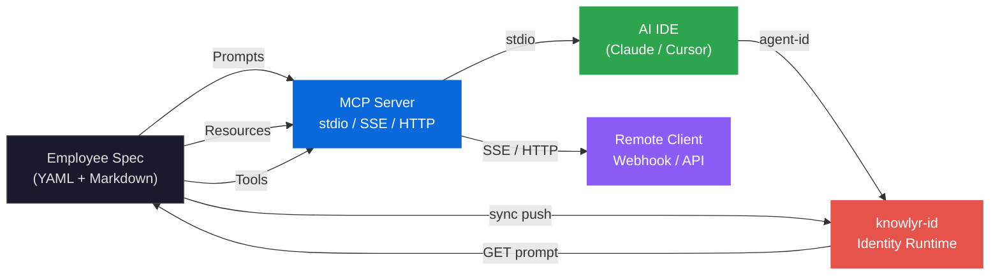
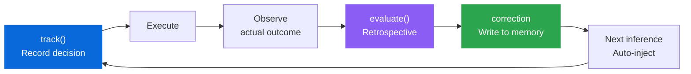
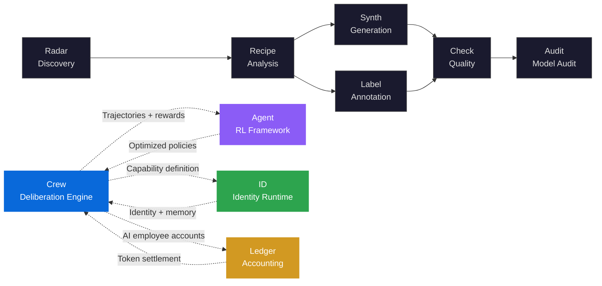

<div align="right">

**English** | [中文](README.zh-CN.md)

</div>

<div align="center">

<h1>knowlyr-crew</h1>

<h3>The Operating System for Digital Civilization's Organizational Layer</h3>

<p><strong>Effective Agent = Identity + Experience + Deliberation. 40 MCP tools · 16 memory modules · 9 deliberation modes · 7 LLM providers.</strong></p>

[](https://pypi.org/project/knowlyr-crew/)
[](https://www.python.org/downloads/)
[](LICENSE)
[](https://github.com/liuxiaotong/knowlyr-crew/actions/workflows/test.yml)
<br/>
[](#development)
[](#mcp-primitive-mapping)
[](#pipeline-orchestration)
[](#structured-dialectical-deliberation)

[The Agent Paradox](#the-agent-paradox) · [Core Thesis](#core-thesis) · [Formal Framework](#formal-framework) · [Architecture](#architecture) · [Against Stateless Identity](#against-stateless-identity) · [Against Amnesia](#against-amnesia) · [Against Groupthink](#against-groupthink) · [Infrastructure](#infrastructure-that-makes-it-real) · [Quick Start](#quick-start) · [References](#references)

</div>

---

## The Agent Paradox

A single AI Agent is impressive. It can write code, search the web, reason through complex problems, and use dozens of tools. But the moment you need a *team* of Agents to operate continuously — to build software across sprints, to make decisions that compound, to learn from mistakes and never repeat them — every organizational problem humanity has faced comes roaring back.

Amnesia: the agent that debugged a subtle race condition last Tuesday has no memory of it on Wednesday. Groupthink: three agents asked to review a design will converge on the same polite consensus, suppressing the dissent that would have caught the flaw. Identity fragmentation: the "senior engineer" persona is rebuilt from scratch each session, its personality drifting with temperature randomness. Governance vacuum: no one tracks which agent can deploy to production, which decisions need human approval, or whether last month's estimate of "two days" actually took eleven.

These are not implementation bugs. They are structural inevitabilities. Any group of intelligent agents that collaborates over time must reinvent organization. Humanity took millennia. We need to be faster.

---

## Core Thesis

Existing multi-agent frameworks share a common, usually unstated assumption:

$$\text{Agent} = \text{Model} + \text{Tools} + \text{Prompt}$$

This is a "no-organization assumption." It treats each agent as a stateless function call — powerful in isolation, but structurally incapable of sustaining collaborative work over time. knowlyr-crew proposes an alternative formulation:

$$\text{Effective Agent} = \text{Identity} + \text{Experience} + \text{Deliberation}$$

These are not our invention. They are decades of organizational research — from cognitive psychology to management science — formalized into computable, version-controlled, protocol-native specifications.

| Missing Element | Production Failure Mode | Research Basis | Crew's Implementation |
|:---|:---|:---|:---|
| **Persistent Identity** | Personality rebuilt from scratch each session; unpredictable behavior | Personal identity theory (Parfit, 1984) | Soul system + declarative specs |
| **Experiential Learning** | Same mistakes repeated; no improvement from failure | Ebbinghaus (1885); RLHF (Christiano et al., 2017) | 16-module memory ecosystem + evaluation loop + Skills auto-trigger |
| **Cognitive Conflict** | Groupthink; agents complement rather than challenge; declining decision quality | Janis (1972); Stasser & Titus (1985); Nemeth (1994) | 9 dialectical modes + cognitive conflict constraints |
| **Protocol Neutrality** | Agent definitions locked to specific SDKs; migration cost $\propto$ definition complexity | Infrastructure as Code (Morris, 2016) | MCP-native, declarative YAML/Markdown |

> knowlyr-crew is not another orchestration framework. It is an operating system for the organizational layer of digital civilization — formalizing millennia of human organizational wisdom into AI-executable declarative specifications. 40 MCP tools, 3 transport protocols, 7 LLM providers, multi-channel reach via Feishu, WeCom, and Web.

---

## Formal Framework

### Employee Specification

Each AI employee is a **declarative specification** $e \in \mathcal{E}$, decoupled from code, version-trackable, and IDE-agnostic:

$$e = \langle \text{soul}, \text{name}, \text{model}, \text{tools}, \text{prompt}, \text{args}, \text{output}, \text{skills} \rangle$$

Where:
- $\text{soul} \in \Sigma^*$ — Soul configuration (Markdown), defining the employee's persistent identity, personality, and behavioral principles; auto-versioned
- $\text{model} \in \mathcal{M}$ = {`claude-*`, `gpt-*`, `deepseek-*`, `kimi-*`, `gemini-*`, `glm-*`, `qwen-*`} — Unified routing across 7 providers
- $\text{tools} \subseteq \mathcal{T}$ — Available tool set, constrained by `PermissionPolicy`
- $\text{prompt}: \Sigma^* \to \Sigma^*$ — Markdown template function with variable substitution and context injection
- $\text{skills} \subseteq \mathcal{S}$ — Auto-trigger rule set defining scene-matching conditions and memory-loading strategies

### Structured Dialectical Deliberation

The deliberation process is formalized as a 4-tuple $D = \langle P, R, \Phi, \Psi \rangle$:

| Symbol | Definition | Description |
|:---|:---|:---|
| $P = \{p_1, \ldots, p_n\}$ | Participant set | $p_i = (\text{employee}, \text{role}, \text{stance}, \text{focus})$ |
| $R = [r_1, \ldots, r_k]$ | Round sequence | $r_j \in$ {`round-robin`, `cross-examine`, `steelman-then-attack`, `debate`, `vote`, ...} |
| $\Phi$ | Disagreement constraint function | $\text{must\_challenge}(p_i) \subseteq P \setminus \{p_i\}$; $\text{max\_agree\_ratio}(p_i) \in [0, 1]$ |
| $\Psi$ | Tension seed set | Pre-seeded controversy points that force topic-space diversification |

**Key constraint**: When $\Phi$ defines $\text{max\_agree\_ratio}(p_i) = \rho$, participant $p_i$ may not agree with others' views in more than proportion $\rho$ of the entire discussion, forcing cognitive conflict rather than groupthink. This corresponds to the Devil's Advocacy method from organizational decision research (Schwenk, 1990).

### Memory Evolution Model

Each memory $m$'s effective confidence decays over time, following the exponential model of Ebbinghaus's forgetting curve:

$$C_{\text{eff}}(t) = C_0 \cdot \left(\frac{1}{2}\right)^{t / \tau}$$

Where $C_0$ is initial confidence (default 1.0), $t$ is memory age in days, and $\tau$ is half-life (default 90 days). Retrieval ranks by $C_{\text{eff}}$; memories below threshold $C_{\min}$ are automatically culled.

**Semantic retrieval** uses hybrid vector-keyword scoring:

$$\text{score}(q, m) = \alpha \cdot \cos(\mathbf{v}_q, \mathbf{v}_m) + (1 - \alpha) \cdot \text{keyword}(q, m), \quad \alpha = 0.7$$

**Correction chains** implement cognitive self-correction, corresponding to a computational model of memory reconsolidation: $\text{correct}(m_{\text{old}}, m_{\text{new}})$ marks $m_{\text{old}}$ as superseded ($C \leftarrow 0$) and creates a new correction-type entry ($C \leftarrow 1.0$).

### Evaluation Feedback Loop

Drawing on the core mechanism of RLHF — human feedback directly shaping agent behavior (Christiano et al., 2017):

```
track(employee, category, prediction) → Decision d
    │
    ▼  Execute + observe actual outcome
evaluate(d, outcome, evaluation) → MemoryEntry m_correction
    │
    ▼  m_correction auto-injected into the employee's subsequent inference context
employee.next_inference(context ∪ {m_correction})
```

Three decision categories: `estimate` / `recommendation` / `commitment`. Evaluation conclusions are automatically written as `correction` entries into persistent memory, forming a **decide → execute → review → improve** loop.

---

## Architecture


```mermaid
graph LR
    E["Employee Spec<br/>(YAML + Markdown)"] -->|Prompts| S["MCP Server<br/>stdio / SSE / HTTP"]
    E -->|Resources| S
    E -->|Tools| S
    S -->|stdio| IDE["AI IDE<br/>(Claude / Cursor)"]
    S -->|SSE / HTTP| Remote["Remote Client<br/>Webhook / API"]
    IDE -->|agent-id| ID["knowlyr-id<br/>Identity Runtime"]
    ID -->|GET prompt| E
    E -->|sync push| ID

    style E fill:#1a1a2e,color:#e0e0e0,stroke:#444
    style S fill:#0969da,color:#fff,stroke:#0969da
    style IDE fill:#2da44e,color:#fff,stroke:#2da44e
    style Remote fill:#8b5cf6,color:#fff,stroke:#8b5cf6
    style ID fill:#e5534b,color:#fff,stroke:#e5534b
```

### Layered Architecture

| Layer | Modules | Responsibilities |
|:---|:---|:---|
| **Specification** | Parser · Discovery · Models · Soul Store | Declarative employee definition parsing, YAML/Markdown dual-format, Soul configuration (auto-versioning + history tracking), 6-layer priority discovery |
| **Protocol** | MCP Server · Skill Converter · MCP Gateway | 40 Tools + Prompts + Resources, stdio/SSE/HTTP triple-protocol, external MCP tool dynamic injection |
| **Skills** | Trigger Engine · Action Executor | Semantic/keyword/always three trigger modes, auto-load related memories into prompt, trigger rate statistics and history |
| **Deliberation** | Discussion Engine | 9 structured interaction modes, 4 built-in round templates, cognitive conflict constraints, topological sort execution plans |
| **Orchestration** | Pipeline · Route · Task Registry | Parallel/sequential/conditional/loop orchestration, checkpoint resume, multi-model routing |
| **Memory** | Memory Store · Semantic Index · PostgreSQL | 16 specialized modules, remote persistence, semantic search, exponential decay, importance ranking, draft/archive/shared/feedback, cross-employee pattern sharing, multi-backend embedding degradation |
| **Evaluation** | Evaluation Engine · Scoring · Cron | Decision tracking, retrospective evaluation, auto-correction memory, overdue decision scanning, quality scoring |
| **Execution** | Providers · Output Sanitizer · Cost Tracker · Runtime Tools | 7 providers unified invocation, retry/fallback/per-task cost metering, dual-layer output sanitization, 30+ runtime tools |
| **Integration** | ID Client · Webhook · Cron · Feishu · WeCom · GitHub | Identity federation (circuit breaker), Feishu multi-bot / WeCom / GitHub multi-channel event routing, scheduled tasks (patrol/review/KPI/knowledge weekly) |
| **Observability** | Trajectory · Session · Metrics · Events · Audit | Zero-intrusion trajectory recording (contextvars), session system, permission matrix queries, tool call audit logs, CI post-deploy audit, Feishu alerting |
| **Wiki** | Wiki Client · Attachment Store | Knowledge base space management, document CRUD, attachment upload/read/delete, AI-friendly views |
| **Governance** | Classification · Multi-Tenant · Authority Overrides | 4-level information classification, tenant-scoped data isolation, adaptive authority degradation/restoration |
| **CLI** | `cli/` modular package (8 submodules) | 30+ commands: employee · pipeline · route · discuss · memory · eval · server · ops, lazy registration |

### MCP Primitive Mapping

| MCP Primitive | Purpose | Count |
|:---|:---|:---|
| **Prompts** | Each employee = one callable prompt template with typed parameters | 1 per employee |
| **Resources** | Raw Markdown definitions, directly readable by AI IDEs | 1 per employee |
| **Tools** | Employee/soul/deliberation/pipeline/memory/evaluation/permissions/audit/metrics/config/wiki | 40 |

<details>
<summary>40 MCP Tools in detail</summary>

**Employee Management** (7)

| Tool | Description |
|:---|:---|
| `list_employees` | List all employees (filterable by tag) |
| `get_employee` | Get complete employee definition |
| `run_employee` | Generate executable prompt |
| `create_employee` | Create new AI employee (with avatar generation) |
| `get_work_log` | View employee work logs |
| `get_soul` | Read employee soul configuration (soul.md) |
| `update_soul` | Update employee soul configuration (auto-versioning + history tracking) |

**Deliberation & Pipeline** (8)

| Tool | Description |
|:---|:---|
| `list_discussions` | List all discussions |
| `run_discussion` | Generate discussion prompt (supports orchestrated mode) |
| `create_discussion` | Create discussion configuration |
| `update_discussion` | Update discussion configuration |
| `list_pipelines` | List all pipelines |
| `run_pipeline` | Execute pipeline (prompt-only or execute mode) |
| `create_pipeline` | Create pipeline configuration |
| `update_pipeline` | Update pipeline configuration |

**Memory & Evaluation** (7)

| Tool | Description |
|:---|:---|
| `add_memory` | Add persistent memory for an employee (classification, tags, information level, TTL) |
| `query_memory` | Query employee memories (semantic search + keyword hybrid) |
| `track_decision` | Record a decision for future evaluation (estimate / recommendation / commitment) |
| `evaluate_decision` | Evaluate a decision; experience auto-written to employee memory |
| `list_overdue_decisions` | List overdue unevaluated decisions |
| `list_meeting_history` | View discussion meeting history |
| `get_meeting_detail` | Get full record of a specific meeting |

**Observability & Governance** (5)

| Tool | Description |
|:---|:---|
| `list_tool_schemas` | List all available tool definitions (filterable by role) |
| `get_permission_matrix` | View employee permission matrix and policies |
| `get_audit_log` | Query tool call audit logs |
| `get_tool_metrics` | Query tool usage statistics (call counts, success/failure, average latency) |
| `query_events` | Query unified event stream (filter by type/name/time range) |

**Configuration & Project** (4)

| Tool | Description |
|:---|:---|
| `put_config` | Write to KV store (cross-machine sync) |
| `get_config` | Read from KV store |
| `list_configs` | List all keys under a given prefix |
| `detect_project` | Detect project type, framework, package manager, test framework |

**Wiki Knowledge Base** (9)

| Tool | Description |
|:---|:---|
| `wiki_list_spaces` | List all Wiki spaces |
| `wiki_list_docs` | List documents in a space |
| `wiki_read_doc` | Read document content (supports AI-friendly view) |
| `wiki_create_doc` | Create a Wiki document |
| `wiki_update_doc` | Update an existing Wiki document |
| `wiki_upload_attachment` | Upload attachment (local file or base64) |
| `wiki_read_attachment` | Read attachment (text content + signed URL) |
| `wiki_list_attachments` | List attachments (filter by space/document/MIME type) |
| `wiki_delete_attachment` | Delete attachment |

</details>

### Transport Protocols

```bash
knowlyr-crew mcp                                # stdio (default, local IDE)
knowlyr-crew mcp -t sse --port 9000             # SSE (remote connection)
knowlyr-crew mcp -t http --port 9001            # Streamable HTTP
knowlyr-crew mcp -t sse --api-token SECRET      # Enable Bearer authentication
```

---

## Against Stateless Identity

### 5.1 Declarative Employee Specification

By analogy with **Infrastructure as Code** (Morris, 2016) — Terraform uses declarative HCL to define infrastructure, Kubernetes uses YAML to define desired service state — Crew uses declarative specifications to define an AI employee's capability boundary. Configuration is separated from prompts, version-trackable, and IDE-agnostic.

**Directory format (recommended)**:

```
security-auditor/
├── employee.yaml    # Metadata, parameters, tools, output format
├── prompt.md        # Role definition + core instructions
├── soul.md          # Soul: persistent identity, personality, behavioral principles
├── workflows/       # Scenario-specific workflows
│   ├── scan.md
│   └── report.md
└── adaptors/        # Project-type adaptors (python / nodejs / ...)
    └── python.md
```

```yaml
# employee.yaml
name: security-auditor
display_name: Security Auditor
character_name: Alex Morgan
version: "1.0"
model: claude-opus-4-6
model_tier: claude              # Model tier inheritance for cost/capability grouping
tags: [security, audit]
triggers: [audit, sec]
tools: [file_read, bash, grep]
context: [pyproject.toml, src/]
auto_memory: true               # Auto-save task summaries to persistent memory
kpi:                             # KPI metrics (auto-evaluated in weekly reports)
  - OWASP coverage
  - Recommendation actionability
  - Zero false-positive rate
args:
  - name: target
    description: Audit target
    required: true
  - name: severity
    description: Minimum severity level
    default: medium
output:
  format: markdown
  filename: "audit-{date}.md"
```

**Single-file format**: For simple employees — YAML frontmatter + Markdown body.

**6-Layer Discovery with Priority**:

| Priority | Location | Description |
|:---|:---|:---|
| Highest | `private/employees/` | Repository-local custom employees |
| High | Database (remote) | Server-managed employee definitions |
| Medium-High | `.claude/skills/` | Claude Code Skills compatibility layer |
| Medium | `.crew/employees/` | Crew workspace employees |
| Low | Package built-ins | Default employees |
| Fallback | Organization defaults | `organization.yaml` model_defaults |

**Smart context** (`--smart-context`): Automatically detects project type (Python / Node.js / Go / Rust / Java), framework, package manager, and test framework, injecting adaptation information into prompts.

<details>
<summary>Built-in employees</summary>

| Employee | Trigger | Purpose |
|:---|:---|:---|
| `product-manager` | `pm` | Requirements analysis, user stories, roadmaps |
| `code-reviewer` | `review` | Code review: quality, security, performance |
| `test-engineer` | `test` | Write or supplement unit tests |
| `refactor-guide` | `refactor` | Code structure analysis, refactoring recommendations |
| `doc-writer` | `doc` | Documentation generation (README / API / CHANGELOG) |
| `pr-creator` | `pr` | Analyze changes, create Pull Requests |

</details>

<details>
<summary>Prompt variable substitution</summary>

| Variable | Description |
|:---|:---|
| `$target`, `$severity` | Named parameter values |
| `$1`, `$2` | Positional parameters |
| `{date}`, `{datetime}` | Current date/time |
| `{cwd}`, `{git_branch}` | Working directory / Git branch |
| `{project_type}`, `{framework}` | Project type / framework |
| `{test_framework}`, `{package_manager}` | Test framework / package manager |

</details>

### 5.2 Soul — Persistent Identity

Each AI employee possesses an independent **soul configuration** (`soul.md`) — defining their persistent identity, personality traits, and behavioral principles. The Soul is the only component in the employee specification that is **cross-session persistent** and **auto-versioned**, solving the "identity fragmentation" problem in agent frameworks: rebuilding personality from scratch each session vs. restoring a complete identity from a soul file.

$$\text{soul}(e) = \langle \text{identity}, \text{principles}, \text{style}, \text{boundaries} \rangle$$

| Feature | Description |
|:---|:---|
| **Auto-versioning** | Each update automatically increments the version number, preserving complete history |
| **Change tracking** | Records the updater and timestamp for every modification |
| **5-layer loading** | Soul (L0) → Global instructions (L1) → Skills (L1.5) → Memory (L2) → Wiki (L3) |
| **Multi-tenant isolation** | Soul data scoped per tenant; updates do not cross tenant boundaries |
| **MCP tools** | `get_soul` / `update_soul` — any AI IDE can read and update employee souls |

The distinction between Soul and memory: memory is **accumulated experience** (decays, can be corrected); Soul is **identity definition** (does not decay, requires deliberate updates). The analogy is human personality vs. memory — personality is stable while memory flows.

**What this points to**: The Soul system represents a paradigm shift from *tool-centric* to *entity-centric* agent design. Traditional frameworks define agents by what they *do* (tools, prompts). Crew defines agents by who they *are* (identity, principles, boundaries). This is the difference between hiring a contractor with a task list and employing a colleague with professional identity. As AI workforces scale, this distinction will determine whether organizations can maintain behavioral consistency across thousands of agent instances.

### 5.3 Organization Governance

Declarative organizational structure defines team groupings, permission levels, and collaboration routing templates — grounding delegation decisions in policy rather than AI guesswork. The permission system features **adaptive degradation**:

```yaml
# private/organization.yaml
model_defaults:
  default_model: claude-sonnet-4-5
  default_temperature: 0.7
  tier_overrides:
    claude: { model: claude-opus-4-6, temperature: 0.5 }
    fast: { model: claude-sonnet-4-5, temperature: 0.7 }

teams:
  engineering:
    label: Engineering
    members: [code-reviewer, test-engineer, backend-engineer]
  data:
    label: Data
    members: [data-engineer, dba, mlops-engineer]

authority:
  A:
    label: Autonomous execution
    members: [code-reviewer, test-engineer, doc-writer]
  B:
    label: Requires confirmation
    members: [product-manager, solutions-architect]
  C:
    label: Context-dependent
    members: [backend-engineer, devops-engineer]

routing_templates:
  code_change:
    steps:
      - role: implement
        team: engineering
      - role: review
        employee: code-reviewer
      - role: test
        employees: [test-engineer, e2e-tester]
```

| Feature | Description |
|:---|:---|
| **Three-level authority** | A (autonomous) / B (requires confirmation) / C (context-dependent); delegation lists auto-annotated |
| **Adaptive degradation** | 3 consecutive task failures → authority downgraded from A/B to C, persisted to JSON |
| **Model defaults** | Organization-wide model/temperature defaults with tier-based overrides |
| **Multi-tenant** | Tenant-scoped organization configs; each tenant maintains independent authority policies |
| **Routing templates** | `route` tool expands templates into `delegate_chain` with multi-process rows, CI step annotations, human judgment nodes, repository bindings |
| **KPI measurement** | Each employee declares KPI metrics; weekly cron auto-evaluates with A/B/C/D ratings |
| **Manual restoration** | One-click API to restore downgraded authority |
| **Information classification** | 4-level system (public / internal / restricted / confidential) applied to memories, outputs, and governance decisions |

---

## Against Amnesia

### 6.1 Memory Ecosystem (16 Modules)

Ebbinghaus (1885) demonstrated that memory strength decays exponentially over time, and that spaced repetition effectively counters forgetting. Crew brings this cognitive science principle into the knowledge persistence mechanism of agent systems — not as a metaphor, but as an implemented mathematical model.

**16 specialized memory modules**:

| Module | Category | Description |
|:---|:---|:---|
| Core storage | `decision` | Decision records ("Chose JWT over session-based auth") |
| | `estimate` | Estimation records ("CSS split estimated at 2 days") |
| | `finding` | Discovery records ("main.css has 2057 lines, exceeds maintainability threshold") |
| | `correction` | Correction records ("CSS split actually took 5 days; underestimated cross-module dependencies") |
| | `pattern` | Work patterns ("API changes must synchronize SDK documentation") — auto-shared across employees |
| Lifecycle | Draft | Memory drafts pending approval (draft → approve/reject) |
| | Archive | Archived memories with restoration capability |
| | Shared pool | Cross-employee visible shared memories |
| Retrieval | Semantic index | Vector-keyword hybrid scoring ($\alpha = 0.7$) |
| | Importance ranking | 1-5 importance weight with minimum-importance filtering |
| | Access tracking | `last_accessed` timestamp, auto-updated on query |
| | Confidence decay | Exponential decay with configurable half-life ($\tau = 90$ days) |
| Intelligence | Correction chains | Reconsolidation: old memory $C \leftarrow 0$, new correction $C \leftarrow 1.0$ with provenance link |
| | Deduplication | Semantic similarity detection prevents redundant entries |
| | Classification | 4-level information classification (public/internal/restricted/confidential) |
| | Recommendations | Context-aware memory suggestions based on current task |

**Storage**: PostgreSQL as primary persistent store, supporting semantic search + multi-dimensional filtering (category, tags, classification, importance, tenant).

**Embedding degradation chain** (graceful degradation):

```
OpenAI text-embedding-3-small → Gemini text-embedding-004 → TF-IDF (zero-dependency fallback)
```

Any upstream unavailability triggers automatic fallback to the next tier, ensuring semantic search works even without API keys.

**Cross-employee work patterns** (`pattern`): Reusable patterns distilled from individual experience. Automatically marked as shared (`shared: true`), with configurable trigger conditions (`trigger_condition`) and applicability scope (`applicability`). Other employees automatically receive matching patterns in relevant contexts.

**Self-check learning loop**: Via `_templates/selfcheck.md`, employees automatically output a self-check checklist after each task. The system extracts self-check results, writes them as `correction` memories, and auto-injects them on next execution — forming a **execute → self-check → memorize → improve** continuous learning loop.

**What this points to**: The 16-module memory ecosystem is not just a persistence layer — it is the beginning of *institutional memory* for AI organizations. Human organizations accumulate institutional knowledge through onboarding documents, post-mortems, and tribal knowledge. Most of this is lossy, unsearchable, and siloed. A memory system with semantic retrieval, exponential decay, correction chains, and cross-employee pattern sharing is what institutional memory looks like when it can be precisely engineered.

### 6.2 Evaluation Feedback Loop

Tracking decision quality and retrospectively evaluating outcomes, then automatically writing lessons learned into employee memory — functionally isomorphic to RLHF (Christiano et al., 2017): human preference feedback directly influences subsequent model behavior; here, human evaluation results directly influence subsequent inference context.


```mermaid
graph LR
    D["track()<br/>Record decision"] --> E["Execute"]
    E --> O["Observe<br/>actual outcome"]
    O --> V["evaluate()<br/>Retrospective"]
    V --> M["correction<br/>Write to memory"]
    M --> I["Next inference<br/>Auto-inject"]
    I --> D

    style D fill:#0969da,color:#fff,stroke:#0969da
    style V fill:#8b5cf6,color:#fff,stroke:#8b5cf6
    style M fill:#2da44e,color:#fff,stroke:#2da44e
```

Three decision categories: `estimate` / `recommendation` / `commitment`. Evaluation conclusions are automatically written as `correction` entries into the employee's persistent memory and auto-injected during subsequent inference — the agent updates its cognition from its own decision errors.

| Feature | Description |
|:---|:---|
| **Overdue scanning** | `list_overdue_decisions` automatically surfaces decisions past their deadline without evaluation, preventing loop breakage |
| **Quality scoring** | Output-end `{"score": N}` JSON parsing, correlated to task results for ROI analysis |
| **Cron integration** | Scheduled overdue scans with automatic Feishu notifications for unevaluated decisions |

```bash
# Record a decision
knowlyr-crew eval track pm estimate "CSS split will take 2 days"

# Evaluate (conclusion auto-written to memory)
knowlyr-crew eval run <id> "Actually took 5 days" \
  --evaluation "Underestimated cross-module dependency complexity; future ×2.5"
```

### 6.3 Skills — Context-Aware Auto-Trigger

Skills solve the **last mile** problem of the evolution layer: memories accumulate, but how do they get injected at the right moment? Human experts develop "conditioned reflexes" — seeing SQL triggers thoughts of injection risk, seeing a deadline recalls last time's underestimate. These are automatic trigger patterns formed through internalized experience. Skills make this mechanism computational:

$$\text{trigger}(task, s) = \begin{cases} \text{execute}(s.\text{actions}) & \text{if } \text{match}(task, s.\text{condition}) \\ \emptyset & \text{otherwise} \end{cases}$$

**Three trigger modes**:

| Mode | Matching Method | Typical Scenario |
|:---|:---|:---|
| `semantic` | Semantic similarity $\geq$ threshold | "Write API" → load API-related pitfall memories |
| `keyword` | Keyword hit | "Deploy" → load deployment checklist |
| `always` | Triggered on every execution | Load shared knowledge base |

**Trigger → Load → Inject flow**:

```
Employee receives task → Server checks Skills trigger conditions → On match, execute Actions
(query_memory / load_checklist / read_wiki) → Inject results into prompt extra_context
→ Employee "automatically recalls" relevant experience
```

**Full-channel coverage**: Feishu @employee, WeCom conversations, Web interface, API calls, Claude Code `/pull` — tasks from any channel pass through Skills checking, ensuring experience injection has no blind spots.

| Feature | Description |
|:---|:---|
| **Priority** | critical > high > medium > low; higher-priority Skills execute first |
| **Action types** | `query_memory` (retrieve memories) / `load_checklist` (load checklists) / `read_wiki` (read docs) / `custom` |
| **Classification awareness** | Skills respect information classification levels; restricted/confidential memories only inject when channel clearance matches |
| **Trigger statistics** | Trigger rate, hit rate, history records — supports continuous optimization of trigger conditions |
| **API authentication** | Read/execute are open; create/update/delete require admin |

### 6.4 Information Classification

Every piece of organizational knowledge is not equally shareable. A customer's contract terms, an employee's performance review, a security vulnerability report — these require different handling than a coding convention or a meeting summary. Crew implements a 4-level information classification system:

| Level | Scope | Example |
|:---|:---|:---|
| `public` | Shareable externally | Product documentation, public API specs |
| `internal` | Organization-wide (default) | Coding standards, architecture decisions |
| `restricted` | Domain-isolated | HR records (domain: `['hr']`), financial data (domain: `['finance']`) |
| `confidential` | Maximum restriction | Security vulnerabilities, credential-related findings |

Classification is enforced at every layer: memory storage, Skills injection, channel output, and audit logging. Domain isolation ensures that `restricted` memories tagged with `domain: ['hr']` are invisible to engineering-focused queries, even within the same tenant.

---

## Against Groupthink

### 7.1 Structured Dialectical Deliberation

The core challenge in multi-agent collaboration is maintaining **epistemic diversity**. Stasser & Titus (1985) demonstrated experimentally that in unstructured group discussions, commonly-known information is discussed at significantly higher rates than individually-held unique information, causing optimal decisions to be systematically overlooked. Nemeth (1994) found that even *incorrect* minority opinions, when persistently expressed, improve majority group decision quality — because they force the majority to more carefully examine their own assumptions.

Crew implements 9 structured interaction modes, each imposing different argumentative constraints on participants:

| Mode | Mechanism |
|:---|:---|
| `round-robin` | Equal-weight expression; prevents discourse power imbalance |
| `challenge` | Each participant must raise evidence-based challenges to at least one other's conclusions |
| `response` | Structured response; vague evasion prohibited; must explicitly accept/partially accept/rebut |
| `cross-examine` | Three-dimensional deep examination: factual challenge / logical extrapolation / alternative proposals |
| `steelman-then-attack` | First construct the strongest form of the opponent's argument (steel-manning), then attack residual weaknesses |
| `debate` | Structured pro/con argumentation requiring specific facts and data citations |
| `brainstorm` | Suspend judgment; maximize creative space |
| `vote` | Force explicit position + brief rationale |
| `free` | Unconstrained open exchange |

**4 Built-in Round Templates**:

| Template | Structure | Best For |
|:---|:---|:---|
| `standard` | round-robin → challenge → response → vote | General decisions |
| `brainstorm-to-decision` | brainstorm → cross-examine → vote | Creative exploration then convergence |
| `adversarial` | debate → steelman-then-attack → vote | High-stakes decisions requiring stress-testing |
| `deep-dive` | round-robin → cross-examine → response → challenge → vote | Complex technical assessments |

**Dialectical constraints** — computational implementation of the Devil's Advocacy methodology (Schwenk, 1990):

- **`stance`** — Pre-assigned position, forcing participants to argue from a specific perspective
- **`must_challenge`** — Must challenge designated participants, countering shared information bias
- **`max_agree_ratio`** — Disagreement quota $\rho_{max} \in [0, 1]$, quantitatively controlling cognitive conflict density
- **`tension_seeds`** — Controversy seed injection, ensuring topic space covers critical tension dimensions
- **`min_disagreements`** — Minimum disagreements per round, quantifying debate output

**Background injection modes**: Discussion context can be auto-populated from project files, recent memories, or Wiki documents, ensuring deliberation is grounded in current state rather than abstract reasoning.

**Discussion → Execution bridge**: Setting `action_output: true` auto-generates a structured ActionPlan JSON, which `pipeline_from_action_plan()` converts into an executable Pipeline via dependency topological sort.

**What this points to**: The 9 modes and their constraints represent the first attempt at *quantifiable cognitive diversity* in AI systems. When you can specify that a participant must disagree at least 40% of the time, or that every conclusion must survive steel-manning before acceptance, you have moved from hoping for good decisions to engineering the conditions that produce them. This is what organizational decision-making looks like when you can actually measure and control the epistemic diversity of the group.

<details>
<summary>Discussion YAML example</summary>

```yaml
name: architecture-review
topic: Review $target design
goal: Produce improvement decisions
mode: auto
participants:
  - employee: product-manager
    role: moderator
    focus: Requirements completeness
    stance: Bias toward user experience
  - employee: code-reviewer
    role: speaker
    focus: Security
    must_challenge: [product-manager]
    max_agree_ratio: 0.6
tension_seeds:
  - Security vs development velocity
rounds:
  - name: Opening positions
    interaction: round-robin
  - name: Cross-examination
    interaction: cross-examine
    require_direct_reply: true
    min_disagreements: 2
  - name: Decision
    interaction: vote
output_format: decision
```

</details>

```bash
# Pre-defined discussion
knowlyr-crew discuss run architecture-review --arg target=auth.py

# Ad-hoc discussion (no YAML needed)
knowlyr-crew discuss adhoc -e "code-reviewer,test-engineer" -t "auth module quality"

# Orchestrated mode: each participant reasons independently
knowlyr-crew discuss run architecture-review --orchestrated
```

### 7.2 Pipeline Orchestration

Multi-employee DAG (directed acyclic graph) orchestration with four step types:

| Step Type | Description |
|:---|:---|
| **Sequential** | Serial execution; `{prev}` references previous step output |
| **Parallel Group** | `asyncio.gather` concurrent execution, 600s timeout |
| **Conditional** | `contains` / `matches` / `equals` conditional branching |
| **Loop** | Iterative execution with state passing between iterations |

**Multi-provider routing**:

| Provider | Model Prefix | Examples |
|:---|:---|:---|
| Anthropic | `claude-` | `claude-opus-4-6`, `claude-sonnet-4-5` |
| OpenAI | `gpt-`, `o1-`, `o3-` | `gpt-4o`, `o3-mini` |
| DeepSeek | `deepseek-` | `deepseek-chat`, `deepseek-reasoner` |
| Moonshot | `kimi-`, `moonshot-` | `kimi-k2.5` |
| Google | `gemini-` | `gemini-2.5-pro` |
| Zhipu | `glm-` | `glm-4-plus` |
| Alibaba | `qwen-` | `qwen-max` |

Routes to the corresponding provider API by model name prefix; supports primary model + fallback.

| Feature | Description |
|:---|:---|
| **Output passing** | `{prev}` (previous step), `{steps.<id>.output}` (by ID reference) |
| **Checkpoint resume** | Resume from last completed step after mid-pipeline failure |
| **Fallback** | Auto-switch to backup model after primary retries exhausted |
| **Mermaid visualization** | Auto-generate flow diagrams from pipeline definitions |

```bash
# Generate per-step prompts
knowlyr-crew pipeline run review-test-pr --arg target=main

# Execute mode: auto-invoke LLMs in sequence
knowlyr-crew pipeline run full-review --execute --model claude-opus-4-6
```

---

## Infrastructure That Makes It Real

### 8.1 Runtime Tool Ecosystem

During execution (via webhook server or pipeline execute mode), AI employees have access to 30+ runtime tools beyond the 40 MCP specification tools:

| Category | Tools | Description |
|:---|:---|:---|
| **Orchestration** | `delegate_async`, `delegate_chain`, `check_task`, `list_tasks`, `organize_meeting` | Async delegation, chain delegation, task status queries, multi-employee meetings |
| **Engineering** | `agent_file_read`, `agent_file_grep`, `run_python` | Path-safe file operations, sandboxed Python execution |
| **Communication** | `send_feishu_message`, `find_free_time` | Feishu messaging, calendar availability queries |
| **GitHub** | `github_create_pr`, `github_list_prs`, `github_get_diff` | PR creation, listing, diff retrieval |
| **Scheduling** | `schedule_task`, `list_schedules` | Dynamic cron task management |
| **Data** | `query_data` | Fine-grained business data queries |
| **Utilities** | `run_pipeline`, `query_cost` | Pipeline triggering, cost summaries |

The `run_python` tool executes arbitrary Python in a sandboxed environment — useful for data analysis, calculations, and format transformations without leaving the agent context.

### 8.2 Multi-Channel Reach

AI employees do not only work inside IDEs. Through Feishu and WeCom, employees respond directly to team needs in instant messaging:

| Channel | Trigger Method | Description |
|:---|:---|:---|
| **Feishu** | @employee name in message | Multi-bot architecture: each employee can be a separate Feishu bot; auto-routing to corresponding employee; Skills auto-trigger + memory injection |
| **WeCom** | @employee name in message | XML encryption + signature verification; multi-app support; employee offboarding auto-cleans bindings; periodic check-in messages |
| **Web / API** | HTTP POST | Standard REST API with SSE streaming output |
| **Claude Code** | `/pull employee-name` | MCP protocol invocation, local IDE interaction |

All channels are unified through Skills trigger checking + output sanitization + audit logging, ensuring behavioral consistency. Channel-specific sanitization rules prevent internal reasoning traces from leaking to end users.

### 8.3 Multi-Tenant Isolation

Crew supports full multi-tenant isolation for SaaS deployments:

| Dimension | Isolation Level |
|:---|:---|
| **Employee data** | Tenant-scoped employee definitions, souls, and configurations |
| **Memory** | All memories tagged with `tenant_id`; queries never cross tenant boundaries |
| **Configuration** | KV store keys prefixed with tenant namespace |
| **Skills** | Trigger conditions and action results scoped per tenant |
| **Audit logs** | Complete per-tenant audit trail |

**Tenant resolution**: Bearer token in API requests resolves to tenant context. MCP connections can bind to a specific tenant via `--tenant-id`. Feishu/WeCom integrations resolve tenant from app configuration.

### 8.4 MCP Gateway

Crew can connect to external MCP servers, dynamically injecting their tools into employee specifications:

| Feature | Description |
|:---|:---|
| **External connection** | Connect to any MCP-compatible server via stdio/SSE/HTTP |
| **Circuit breaker** | 3 consecutive failures → 30s pause; prevents cascading failures |
| **Tool whitelist** | `PermissionPolicy` controls which external tools each employee can access |
| **Credential management** | External server API keys stored in encrypted configuration, never exposed in prompts |
| **Audit integration** | All external tool calls logged to the unified audit system |

### 8.5 Cost-Aware Orchestration

Built-in per-model pricing table across 7 providers, with per-task cost calculation supporting aggregation by employee / model / time period for **ROI per Decision** analysis:

| Provider | Model | Input ($/1M tokens) | Output ($/1M tokens) |
|:---|:---|:---|:---|
| Anthropic | claude-opus-4-6 | 15.00 | 75.00 |
| Anthropic | claude-sonnet-4-5 | 3.00 | 15.00 |
| OpenAI | gpt-4o | 2.50 | 10.00 |
| OpenAI | o3-mini | 1.10 | 4.40 |
| DeepSeek | deepseek-chat | 0.27 | 1.10 |
| Google | gemini-2.5-pro | 1.25 | 10.00 |
| Alibaba | qwen-max | 0.80 | 2.00 |

| Feature | Description |
|:---|:---|
| **Per-task metering** | Each execution auto-records input/output tokens + cost_usd |
| **Quality pre-scoring** | Parses output-end `{"score": N}` JSON, correlated to task results |
| **Multi-dimensional aggregation** | By employee / model / time period / trigger source |
| **A/B testing** | Primary model + fallback model, comparing cost-quality Pareto frontiers |

### 8.6 Output Sanitization — Defense in Depth

LLM raw output may contain internal reasoning tags (`<thinking>`, `<reflection>`, `<inner_monologue>`) and tool call XML blocks — these are the model's "working drafts" that should not be exposed to end users. The Output Sanitizer implements **dual-layer defense** (defense in depth):

| Defense Layer | Location | Responsibility |
|:---|:---|:---|
| **Source sanitization** | `webhook_executor` | LLM return values sanitized before entering business logic |
| **Exit sanitization** | `webhook_handlers` · `webhook_feishu` | Messages sanitized again before sending to users/callbacks |

Sanitization rules cover 5 tag pattern classes (regex matching + content removal), handling nested tags and multi-line residual whitespace. When either layer misses something, the other catches it — borrowing the defense-in-depth principle from network security (Schneier, 2000).

### 8.7 Trajectory Recording

Zero-intrusion trajectory recording via `contextvars.ContextVar` — no business code modifications required, automatically capturing agent reasoning, tool calls, execution results, and token consumption:

```
Crew produces trajectories → agentrecorder standard format → knowlyr-gym PRM scoring → SFT / DPO / GRPO training
```

This is the data bridge connecting **Crew** (collaboration layer) and **knowlyr-gym** (training layer) — real interaction trajectories generated during Crew runtime can be directly used for agent reinforcement learning.

| Feature | Description |
|:---|:---|
| **Export formats** | Standard JSON, agentrecorder format, CSV summary |
| **Extraction** | Tool call sequences, reasoning chains, decision points |
| **Annotation** | Human annotations attachable to trajectory segments |
| **Session system** | Trajectories grouped by session; session metadata includes trigger source, employee, duration, cost |

### 8.8 Deployment & Operations

```bash
# Docker deployment
docker build -t knowlyr-crew .
docker run -p 8765:8765 -e API_TOKEN=secret knowlyr-crew

# CI/CD via GitHub Actions
git push origin main  # → auto-deploy via GitHub Actions

# Makefile shortcuts
make deploy           # Full deployment pipeline
make push             # Emergency bypass (direct push)
make test             # Run full test suite

# Health check
curl http://localhost:8765/health

# Post-deploy verification
scripts/audit-permissions.sh  # Auto-run in CI; Feishu alert on failure
```

| Feature | Description |
|:---|:---|
| **Docker support** | Multi-stage build, minimal image size |
| **CI/CD** | GitHub Actions: test → build → deploy → audit |
| **Health checks** | `/health` endpoint; 10s startup grace period |
| **Makefile** | `deploy`, `push`, `test`, `lint`, `sync` targets |
| **Scripts** | `audit-permissions.sh`, `project-status.sh`, deployment verification |
| **Heartbeat** | 60s periodic heartbeat to knowlyr-id |
| **Task persistence** | `.crew/tasks.jsonl`; survives restarts |
| **Concurrency safety** | `fcntl.flock` file locks + SQLite WAL mode |

---

## Quick Start

```bash
pip install knowlyr-crew[mcp]

# 1. List all available employees
knowlyr-crew list

# 2. Run a code review (auto-detect project type)
knowlyr-crew run review main --smart-context

# 3. Start a multi-employee structured discussion
knowlyr-crew discuss adhoc -e "code-reviewer,test-engineer" -t "auth module security"

# 4. Track a decision and evaluate it
knowlyr-crew eval track pm estimate "Refactoring will take 3 days"
# ... after execution ...
knowlyr-crew eval run <id> "Actually took 7 days" --evaluation "Underestimated cross-module deps"

# 5. View employee memories (including evaluation corrections)
knowlyr-crew memory show product-manager
```

**MCP configuration** (Claude Desktop / Claude Code / Cursor):

```json
{
  "mcpServers": {
    "crew": {
      "command": "knowlyr-crew",
      "args": ["mcp"]
    }
  }
}
```

Once configured, AI IDEs can directly invoke `code-reviewer` for code review, `test-engineer` for writing tests, `run_pipeline` for multi-employee pipeline orchestration, and `run_discussion` for structured multi-employee deliberation.

---

## Async Delegation & Meeting Orchestration

AI employees can **delegate in parallel** to multiple colleagues, or **organize multi-person meetings** for asynchronous discussion:

```
User → Jiang Moyan: "Have code-reviewer review the PR and test-engineer write tests simultaneously"

Jiang Moyan:
  ① delegate_async → code-reviewer (task_id: 20260216-143022-a3f5b8c2)
  ② delegate_async → test-engineer (task_id: 20260216-143022-b7d4e9f1)
  ③ "Both tasks are running in parallel"
  ④ check_task → view progress/results
```

| Tool | Description |
|:---|:---|
| `delegate_async` | Async delegation, returns task_id immediately |
| `delegate_chain` | Sequential chain delegation; `{prev}` references previous step output |
| `check_task` / `list_tasks` | Query task status and results |
| `organize_meeting` | Multi-employee async discussion; each round `asyncio.gather` parallel inference |
| `schedule_task` / `list_schedules` | Dynamic cron scheduled tasks |
| `run_pipeline` | Trigger pre-defined pipeline (async execution) |
| `agent_file_read` / `agent_file_grep` | Path-safe file operations |
| `query_data` | Fine-grained business data queries |
| `find_free_time` | Feishu busy/free queries; find common availability across multiple people |

**Proactive patrol & autonomous operations**: Via `.crew/cron.yaml` scheduled tasks:

| Schedule | Description |
|:---|:---|
| Daily 9:00 | Morning patrol — business data, to-dos, calendar, system status → Feishu briefing |
| Daily 23:00 | AI diary — personal diary based on day's work and memories |
| Thursday 16:00 | Team knowledge weekly — cross-team output + common issues + best practices → Feishu doc |
| Friday 17:00 | KPI weekly — employee-by-employee ratings + anomaly auto-delegation (D-grade → HR follow-up) |
| Friday 18:00 | Weekly retrospective — highlights, issues, next-week recommendations |

---

## Production Server

Crew runs as an HTTP server, receiving external events and auto-triggering pipeline / employee execution:

```bash
pip install knowlyr-crew[webhook]
knowlyr-crew serve --port 8765 --token YOUR_SECRET
```

### API Endpoints

| Category | Path | Method | Description |
|:---|:---|:---|:---|
| **Core** | `/health` | GET | Health check (no auth required) |
| | `/metrics` | GET | Call/latency/token/error statistics |
| | `/cron/status` | GET | Cron scheduler status |
| **Event Ingress** | `/webhook/github` | POST | GitHub webhook (HMAC-SHA256 signature verification) |
| | `/webhook/openclaw` | POST | OpenClaw message events |
| | `/feishu/event` | POST | Feishu event callback (@employee triggers) |
| | `/wecom/event/{app_id}` | GET/POST | WeCom event callback |
| **Execution** | `/run/pipeline/{name}` | POST | Trigger pipeline (async/sync/SSE streaming) |
| | `/run/route/{name}` | POST | Trigger collaboration route |
| | `/run/employee/{name}` | POST | Trigger employee (supports SSE streaming) |
| | `/tasks/{task_id}` | GET | Query task status and results |
| **Employee Management** | `/api/employees` | GET/POST | List/create employees |
| | `/api/employees/{id}` | GET/PUT/DELETE | Employee CRUD |
| | `/api/employees/{id}/prompt` | GET | Employee capability definition (team, permissions, 7-day cost) |
| | `/api/employees/{id}/state` | GET | Runtime state (personality, memories, notes) |
| | `/api/employees/{id}/authority/restore` | POST | Restore auto-downgraded authority |
| **Soul** | `/api/souls` | GET | List all employee souls |
| | `/api/souls/{name}` | GET/PUT | Read/update soul configuration |
| **Skills** | `/api/employees/{name}/skills` | GET/POST | List/create Skills |
| | `/api/employees/{name}/skills/{skill}` | GET/PUT/DELETE | Skill CRUD |
| | `/api/skills/check-triggers` | POST | Check Skills trigger conditions |
| | `/api/skills/execute` | POST | Execute Skill actions |
| | `/api/skills/stats` | GET | Skill usage statistics |
| **Memory** | `/api/memory/*` | — | Full memory API (add/query/archive/draft/shared/semantic search/feedback) |
| **Decisions** | `/api/decisions/*` | — | Decision tracking/evaluation/batch scanning |
| **Wiki** | `/api/wiki/spaces` | GET | List Wiki spaces |
| | `/api/wiki/files/*` | — | Attachment upload/read/delete |
| **Configuration** | `/api/kv/*` | GET/PUT | KV store (cross-machine sync of CLAUDE.md, etc.) |
| | `/api/config/*` | — | Discussion/pipeline configuration CRUD |
| **Governance** | `/api/cost/summary` | GET | Cost aggregation |
| | `/api/permission-matrix` | GET | Permission matrix |
| | `/api/audit/trends` | GET | Audit trends |
| | `/api/project/status` | GET | Project status overview |
| **Multi-Tenant** | `/api/tenants` | CRUD | Tenant isolation (data, memory independent) |

<details>
<summary>Production features</summary>

| Feature | Description |
|:---|:---|
| Bearer auth | `--api-token`, timing-safe comparison |
| CORS | `--cors-origin`, multi-origin support |
| Rate limiting | 60 requests/minute/IP |
| Request size limit | Default 1MB |
| Circuit breaker | knowlyr-id 3 consecutive failures → 30s pause |
| Cost tracking | Per-task token metering + model pricing |
| Auto-degradation | Consecutive failures auto-downgrade employee authority |
| CI audit | Post-deploy auto-run permission audit script; Feishu alert on failure |
| Trace IDs | Unique trace_id per task |
| Concurrency safety | `fcntl.flock` file locks + SQLite WAL |
| Task persistence | `.crew/tasks.jsonl`, survives restarts |
| Heartbeat | 60s periodic heartbeat to knowlyr-id |

</details>

### Webhook Configuration

`.crew/webhook.yaml` defines event routing rules (GitHub HMAC-SHA256 signature verification). `.crew/cron.yaml` defines scheduled tasks (croniter parsing). KPI weekly cron has built-in anomaly auto-delegation rules — D-rated (no output) employees auto-escalate to HR; consecutive self-check issues auto-notify team lead.

---

## Integrations

### knowlyr-id — Identity & Runtime Federation

Crew defines "who does what"; [knowlyr-id](https://github.com/liuxiaotong/knowlyr-id) manages identity, conversations, and runtime. Both collaborate but each can operate independently:

```
┌──────────────────────────────────────┐
│        Crew (Capability Authority)    │
│  prompt · model · tools · avatar     │
│  temperature · bio · tags            │
└──────────────┬───────────────────────┘
     API fetch prompt │ sync push all fields
┌──────────────┴───────────────────────┐
│      knowlyr-id (Identity + Runtime)  │
│  user accounts · conversations       │
│  memory · scheduling · API keys      │
└──────────────────────────────────────┘
```

knowlyr-id fetches employee prompt / model / temperature / team / permissions / cost via `CREW_API_URL` (5-minute cache); falls back to DB cache when unavailable. The connection is **optional** — Crew operates independently without it. The admin dashboard displays each employee's permission badges, team membership, and 7-day cost in real-time, with one-click authority restoration.

**Employee state sync** (`agent_status`): Crew maintains a three-state lifecycle — `active` (normal operation) / `frozen` (suspended; configuration preserved but execution skipped) / `inactive` (decommissioned). State changes are bidirectionally synced to knowlyr-id; frozen employees are automatically skipped during pipeline execution.

<details>
<summary>Field mapping</summary>

| Crew Employee | knowlyr-id | Direction |
|:---|:---|:---|
| `name` | `crew_name` | push → |
| `character_name` | `nickname` | push → |
| `display_name` | `title` | push → |
| `bio` | `bio` | push → |
| `description` | `capabilities` | push → |
| `tags` | `domains` | push → |
| rendered prompt | `system_prompt` | push → |
| `avatar.webp` | `avatar_base64` | push → |
| `model` | `model` | push → |
| `temperature` | `temperature` | ↔ |
| `max_tokens` | `max_tokens` | push → |
| `memory-id.md` | `memory` | ← pull |

</details>

### Feishu · WeCom — Multi-Channel Reach

AI employees respond directly in instant messaging platforms:

| Channel | Trigger | Features |
|:---|:---|:---|
| **Feishu** | @employee in message | Multi-bot architecture; auto-routing; Skills trigger + memory injection; rich card responses |
| **WeCom** | @employee in message | XML encrypt + signature verification; multi-app; offboarding auto-cleanup; periodic check-ins |
| **Web / API** | HTTP POST | REST API; SSE streaming; Bearer auth |
| **Claude Code** | `/pull employee-name` | MCP protocol; local IDE interaction |

All channels are unified through Skills checking + output sanitization + audit logging.

### Claude Code Skills Interoperability

Crew employees and Claude Code native Skills bidirectionally convert: `tools` ↔ `allowed-tools`, `args` ↔ `argument-hint`, metadata round-trips via HTML comments.

```bash
knowlyr-crew export code-reviewer    # → .claude/skills/code-reviewer/SKILL.md
knowlyr-crew sync --clean            # Sync + clean orphaned directories
```

### Avatar Generation

Tongyi Wanxiang (DashScope) generates photorealistic professional headshots, 768×768 → 256×256 webp:

```bash
pip install knowlyr-crew[avatar]
knowlyr-crew avatar security-auditor
```

---

## CLI Reference

<details>
<summary>Complete CLI command listing (30+ commands)</summary>

### Core

```bash
knowlyr-crew list [--tag TAG] [--layer LAYER] [-f json]   # List employees
knowlyr-crew show <name>                                    # View details
knowlyr-crew run <name> [ARGS] [--smart-context] [--agent-id ID] [--copy] [-o FILE]
knowlyr-crew init [--employee NAME] [--dir-format] [--avatar]
knowlyr-crew validate <path>                                # Validate employee spec
knowlyr-crew check --json                                   # Quality radar
```

### Discussions

```bash
knowlyr-crew discuss list
knowlyr-crew discuss run <name> [--orchestrated] [--arg key=val]
knowlyr-crew discuss adhoc -e "emp1,emp2" -t "topic" [--rounds N]
knowlyr-crew discuss history [-n 20]
knowlyr-crew discuss view <meeting_id>
knowlyr-crew discuss create <name> --yaml <path>
knowlyr-crew discuss update <name> --yaml <path>
```

### Memory

```bash
knowlyr-crew memory list
knowlyr-crew memory show <employee> [--category ...] [--classification ...]
knowlyr-crew memory add <employee> <category> <text> [--tags ...] [--classification ...]
knowlyr-crew memory correct <employee> <old_id> <text>
knowlyr-crew memory archive <employee> <memory_id>
knowlyr-crew memory restore <employee> <memory_id>
```

### Evaluation

```bash
knowlyr-crew eval track <employee> <category> <text> [--deadline DATE]
knowlyr-crew eval list [--status pending]
knowlyr-crew eval run <decision_id> <outcome> [--evaluation TEXT]
knowlyr-crew eval prompt <decision_id>
knowlyr-crew eval overdue [--as-of DATE]
```

### Pipeline

```bash
knowlyr-crew pipeline list
knowlyr-crew pipeline run <name> [--execute] [--model MODEL] [--arg key=val]
knowlyr-crew pipeline create <name> --yaml <path>
knowlyr-crew pipeline update <name> --yaml <path>
knowlyr-crew pipeline checkpoint list
knowlyr-crew pipeline checkpoint resume <task_id>
```

### Route

```bash
knowlyr-crew route list [-f json]                           # List collaboration templates
knowlyr-crew route show <name>                              # View route details
knowlyr-crew route run <name> <task> [--execute] [--remote] # Execute collaboration route
```

### Server & MCP

```bash
knowlyr-crew serve --port 8765 --token SECRET [--no-cron] [--cors-origin URL]
knowlyr-crew mcp [-t stdio|sse|http] [--port PORT] [--api-token TOKEN] [--tenant-id ID]
```

### Agent Management

```bash
knowlyr-crew register <name> [--dry-run]
knowlyr-crew agents list
knowlyr-crew agents status <id>
knowlyr-crew agents sync <name>
knowlyr-crew agents sync-all [--push-only|--pull-only] [--force] [--dry-run]
```

### Soul Management

```bash
knowlyr-crew soul show <name>                               # View soul configuration
knowlyr-crew soul update <name> --content <text>             # Update soul
knowlyr-crew soul history <name>                             # View version history
```

### Templates & Export

```bash
knowlyr-crew template list
knowlyr-crew template apply <template> --employee <name> [--var key=val]
knowlyr-crew export <name>                                   # → SKILL.md
knowlyr-crew export-all
knowlyr-crew sync [--clean]                                  # → .claude/skills/
```

### Other

```bash
knowlyr-crew avatar <name>                                   # Avatar generation
knowlyr-crew log list [--employee NAME] [-n 20]              # Work logs
knowlyr-crew log show <session_id>
knowlyr-crew deploy [--dry-run]                              # Deployment management
```

</details>

---

## Ecosystem

<details>
<summary>Architecture diagram</summary>


```mermaid
graph LR
    Radar["Radar<br/>Discovery"] --> Recipe["Recipe<br/>Analysis"]
    Recipe --> Synth["Synth<br/>Generation"]
    Recipe --> Label["Label<br/>Annotation"]
    Synth --> Check["Check<br/>Quality"]
    Label --> Check
    Check --> Audit["Audit<br/>Model Audit"]
    Crew["Crew<br/>Deliberation Engine"]
    Agent["Agent<br/>RL Framework"]
    ID["ID<br/>Identity Runtime"]
    Crew -.->|Capability definition| ID
    ID -.->|Identity + memory| Crew
    Crew -.->|Trajectories + rewards| Agent
    Agent -.->|Optimized policies| Crew
    Ledger["Ledger<br/>Accounting"]
    Crew -.->|AI employee accounts| Ledger
    Ledger -.->|Token settlement| Crew

    style Crew fill:#0969da,color:#fff,stroke:#0969da
    style Ledger fill:#d29922,color:#fff,stroke:#d29922
    style ID fill:#2da44e,color:#fff,stroke:#2da44e
    style Agent fill:#8b5cf6,color:#fff,stroke:#8b5cf6
    style Radar fill:#1a1a2e,color:#e0e0e0,stroke:#444
    style Recipe fill:#1a1a2e,color:#e0e0e0,stroke:#444
    style Synth fill:#1a1a2e,color:#e0e0e0,stroke:#444
    style Label fill:#1a1a2e,color:#e0e0e0,stroke:#444
    style Check fill:#1a1a2e,color:#e0e0e0,stroke:#444
    style Audit fill:#1a1a2e,color:#e0e0e0,stroke:#444
```

</details>

| Layer | Project | Description | Repository |
|:---|:---|:---|:---|
| Discovery | **AI Dataset Radar** | Dataset competitive intelligence, trend analysis | [GitHub](https://github.com/liuxiaotong/ai-dataset-radar) |
| Analysis | **DataRecipe** | Reverse analysis, schema extraction, cost estimation | [GitHub](https://github.com/liuxiaotong/data-recipe) |
| Production | **DataSynth** / **DataLabel** | LLM batch synthesis / lightweight annotation | [GitHub](https://github.com/liuxiaotong/data-synth) · [GitHub](https://github.com/liuxiaotong/data-label) |
| Quality | **DataCheck** | Rule validation, dedup detection, distribution analysis | [GitHub](https://github.com/liuxiaotong/data-check) |
| Audit | **ModelAudit** | Distillation detection, model fingerprinting | [GitHub](https://github.com/liuxiaotong/model-audit) |
| Identity | **knowlyr-id** | Identity system + AI employee runtime | [GitHub](https://github.com/liuxiaotong/knowlyr-id) |
| Ledger | **knowlyr-ledger** | Unified ledger, double-entry bookkeeping, row-lock safety, idempotent transactions | [GitHub](https://github.com/liuxiaotong/knowlyr-ledger) |
| Deliberation | **Crew** | Structured dialectical deliberation, persistent memory, MCP-native | This project |
| Agent Training | **knowlyr-gym** | Gymnasium-style RL framework, process reward models, SFT/DPO/GRPO | [GitHub](https://github.com/liuxiaotong/knowlyr-gym) |

---

## Development

```bash
git clone https://github.com/liuxiaotong/knowlyr-crew.git
cd knowlyr-crew
pip install -e ".[all]"
uv run --extra dev --extra mcp pytest tests/ -q    # 2025 test cases
```

---

## What We're Actually Building

> knowlyr-crew ships 40 MCP tools, 100 Python modules, 45,000 lines of code. But these are implementation details.
>
> What we're actually building is an answer to a question that's about to become very important: **When AI employees outnumber human ones, what should an organization look like?**
>
> The answer won't start from scratch. From Aristotle's rhetoric to Janis's groupthink research, from the Ebbinghaus forgetting curve to modern RLHF — millennia of human organizational wisdom is the best starting point. Crew's job is to make that wisdom executable by AI.
>
> This is not the destination. This is the starting point.

---

## References

- **Personal Identity** — Parfit, D., 1984. *Reasons and Persons*. Oxford University Press — The philosophical foundation for persistent agent identity
- **Model Context Protocol (MCP)** — Anthropic, 2024. Open standard protocol for agent tool interaction
- **Multi-Agent Systems** — Wooldridge, M., 2009. *An Introduction to MultiAgent Systems*. Wiley
- **Groupthink** — Janis, I.L., 1972. *Victims of Groupthink*. Houghton Mifflin
- **Shared Information Bias** — Stasser, G. & Titus, W., 1985. *Pooling of Unshared Information in Group Decision Making.* JPSP, 48(6)
- **Minority Influence** — Nemeth, C.J., 1994. *The Value of Minority Dissent.* In S. Moscovici et al. (Eds.), *Minority Influence*. Nelson-Hall
- **Devil's Advocacy** — Schwenk, C.R., 1990. *Effects of devil's advocacy and dialectical inquiry on decision making.* Organizational Behavior and Human Decision Processes, 47(1)
- **Cognitive Conflict** — Amason, A.C., 1996. *Distinguishing the Effects of Functional and Dysfunctional Conflict.* Academy of Management Journal, 39(1)
- **RLHF** — Christiano, P. et al., 2017. *Deep RL from Human Preferences.* [arXiv:1706.03741](https://arxiv.org/abs/1706.03741)
- **Ebbinghaus Forgetting Curve** — Ebbinghaus, H., 1885. *Uber das Gedachtnis* — Inspiration for the memory decay model
- **Defense in Depth** — Schneier, B., 2000. *Secrets and Lies: Digital Security in a Networked World*. Wiley — Source of multi-layer defense principles
- **Infrastructure as Code** — Morris, K., 2016. *Infrastructure as Code*. O'Reilly — Paradigmatic source for declarative specifications
- **Gymnasium** — Towers et al., 2024. *Gymnasium: A Standard Interface for RL Environments.* [arXiv:2407.17032](https://arxiv.org/abs/2407.17032)

---

## License

[MIT](LICENSE)

---

<div align="center">
<sub><a href="https://github.com/liuxiaotong">knowlyr</a> — Structured dialectical deliberation engine for AI workforces</sub>
</div>
