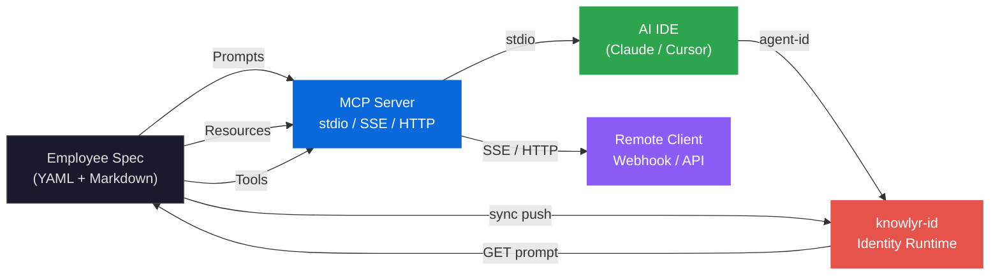
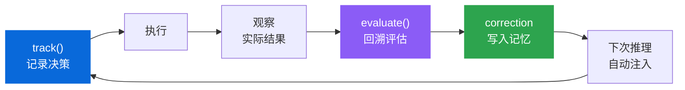
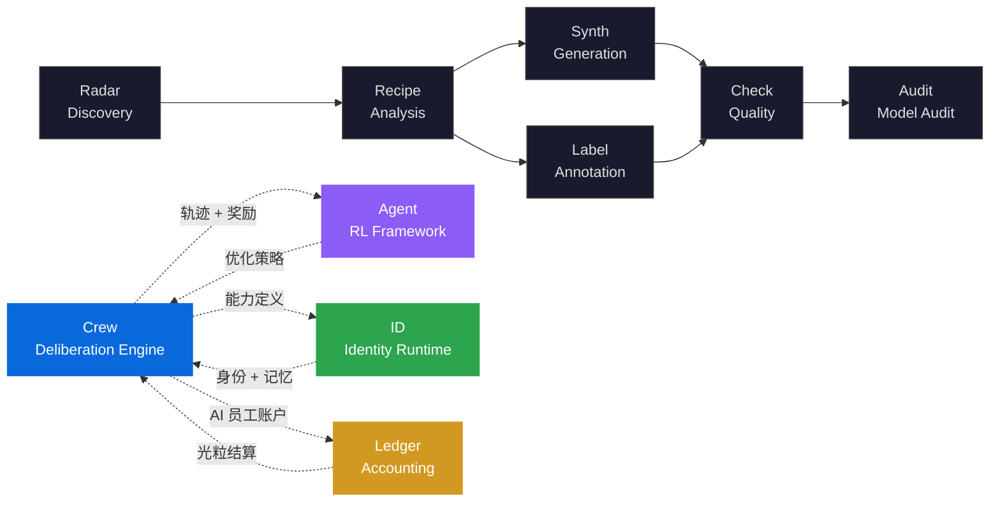

<div align="right">

[English](README.md) | **中文**

</div>

<div align="center">

<h1>knowlyr-crew</h1>

<h3>数字文明组织层的操作系统</h3>

<p><strong>有效 Agent = 身份 + 经验 + 协商。40 MCP 工具 · 16 记忆模块 · 9 协商模式 · 7 LLM 供应商</strong><br/>
<em>Effective Agent = Identity + Experience + Deliberation</em></p>

[](https://pypi.org/project/knowlyr-crew/)
[](https://www.python.org/downloads/)
[](LICENSE)
[](https://github.com/liuxiaotong/knowlyr-crew/actions/workflows/test.yml)
<br/>
[](#开发-development)
[](#mcp-原语映射-mcp-primitive-mapping)
[](#成本感知编排-cost-aware-orchestration)
[](#结构化辩证协商-structured-dialectical-deliberation)

[Agent 悖论](#the-agent-paradox-agent-悖论) · [核心论点](#核心论点-core-thesis) · [形式化框架](#形式化框架-formal-framework) · [架构](#架构-architecture) · [反对无状态身份](#against-stateless-identity--反对无状态身份) · [反对失忆](#against-amnesia--反对失忆) · [反对群体偏见](#against-groupthink--反对群体偏见) · [基础设施](#让一切成为现实的基础设施-infrastructure-that-makes-it-real) · [快速开始](#快速开始-quick-start) · [生产服务器](#生产服务器-production-server) · [CLI 参考](#cli-参考-cli-reference) · [生态系统](#生态系统-ecosystem) · [参考文献](#参考文献-references)

</div>

---

## The Agent Paradox (Agent 悖论)

AI Agent 正在变得越来越强大。单个 Agent 可以写代码、做推理、搜索信息、调用工具——这些能力每隔几个月就在刷新基准测试。但当你试图让多个 Agent 组成团队、持续运作时，一个吊诡的现象出现了：**人类组织的所有经典问题卷土重来**。

失忆——昨天犯的错误今天原样重犯，因为每次会话从零开始。群体偏见——Agent 之间互相补充而非质疑，决策质量随团队规模增长而下降（Janis, 1972）。身份断裂——同一个"员工"在不同会话中表现判若两人。治理真空——没有权限、没有审计、没有组织结构，一切全凭 prompt 里的自然语言约定。

这不是巧合，这是定律。Stasser & Titus (1985) 在人类群体中发现的共享信息偏差，在 Agent 群体中以更极端的形式重现——因为 Agent 连"未共享的独有信息"都没有，它们共享同一个训练集。Nemeth (1994) 证明少数异见改善决策质量，但没有任何主流框架强制 Agent 产生异见。Ebbinghaus (1885) 的遗忘曲线描述了记忆衰减，但大多数 Agent 根本没有记忆可以衰减。

**任何持续协作的智能体群体，都必须重新发明组织。人类用了几千年。我们需要更快。**

---

## 核心论点 (Core Thesis)

现有主流框架——LangChain、CrewAI、AutoGen、MetaGPT——共享一个隐含假设：

$$\text{Agent} = \text{Model} + \text{Tools} + \text{Prompt}$$

这是一个**"无组织假设"** (no-organization assumption)。它假设只要给 Agent 足够好的模型、足够多的工具、足够精确的 prompt，协作问题就会自然解决。这在单次任务中或许成立，但在持续运作的团队中必然失败——正如一群聪明人没有组织架构也无法持续高效协作。

knowlyr-crew 提出替代公式：

$$\text{Effective Agent} = \text{Identity} + \text{Experience} + \text{Deliberation}$$

这三个要素不是我们发明的。它们是人类组织学、认知心理学和决策科学几十年研究的结论。我们的工作是将它们**形式化为可计算、可版本控制、可跨协议运行的声明式规范**。

| 被遗漏的要素 | 生产中的失败模式 | 研究基础 | Crew 的实现 |
|:---|:---|:---|:---|
| **持久身份** | 每次会话从零构建人格，行为不可预测 | Personal identity theory (Parfit, 1984) | Soul 灵魂系统 + 声明式规范 |
| **经验积累** | 同一错误反复出现，无法从失败中改进 | Ebbinghaus (1885); RLHF (Christiano et al., 2017) | 16 模块记忆生态 + 评估闭环 + Skills 自动触发 |
| **认知对抗** | 群体偏见，互相补充而非质疑，决策质量下降 | Janis (1972); Stasser & Titus (1985); Nemeth (1994) | 9 种辩证协商模式 + 认知冲突约束 |
| **协议中立** | Agent 定义绑定特定 SDK，迁移成本正比于定义复杂度 | Infrastructure as Code (Morris, 2016) | MCP 协议原生，声明式 YAML/Markdown |

> **knowlyr-crew 不是又一个编排框架。它是为数字文明的组织层写操作系统——将人类几千年的组织智慧形式化为 AI 可执行的声明式规范。系统暴露 40 个 MCP 工具，支持 3 种传输协议，路由至 7 个 LLM 供应商，通过飞书、企微、Web 多端触达。**

---

## 形式化框架 (Formal Framework)

### 员工规范 (Employee Specification)

每位 AI 员工是一个**声明式规范** $e \in \mathcal{E}$，与代码解耦、版本可追踪、IDE 无关：

$$e = \langle \text{soul}, \text{name}, \text{model}, \text{tools}, \text{prompt}, \text{args}, \text{output}, \text{skills} \rangle$$

其中：
- $\text{soul} \in \Sigma^*$ — 灵魂配置（Markdown），定义员工的持久身份、性格与行为准则，自动版本递增
- $\text{model} \in \mathcal{M}$ = {`claude-*`, `gpt-*`, `deepseek-*`, `kimi-*`, `gemini-*`, `glm-*`, `qwen-*`} — 7 Provider 统一路由，支持 model_tier 组织级继承
- $\text{tools} \subseteq \mathcal{T}$ — 可用工具集，受 `PermissionPolicy` 约束
- $\text{prompt}: \Sigma^* \to \Sigma^*$ — Markdown 模板函数，支持变量替换与上下文注入
- $\text{skills} \subseteq \mathcal{S}$ — 自动触发规则集，定义场景匹配条件与记忆加载策略

### 结构化辩证协商 (Structured Dialectical Deliberation)

讨论过程形式化为四元组 $D = \langle P, R, \Phi, \Psi \rangle$：

| 符号 | 定义 | 说明 |
|:---|:---|:---|
| $P = \{p_1, \ldots, p_n\}$ | 参与者集合 | $p_i = (\text{employee}, \text{role}, \text{stance}, \text{focus})$ |
| $R = [r_1, \ldots, r_k]$ | 轮次序列 | $r_j \in$ {`round-robin`, `cross-examine`, `steelman-then-attack`, `debate`, `vote`, ...} |
| $\Phi$ | 分歧约束函数 | $\text{must\_challenge}(p_i) \subseteq P \setminus \{p_i\}$; $\text{max\_agree\_ratio}(p_i) \in [0, 1]$ |
| $\Psi$ | 张力种子集 | 预设争议点注入，强制议题空间多样化 |

**关键约束**：当 $\Phi$ 定义了 $\text{max\_agree\_ratio}(p_i) = \rho$，参与者 $p_i$ 在整个讨论中同意其他人观点的比例不得超过 $\rho$，强制产生认知冲突（cognitive conflict）而非群体偏见。这对应于组织决策研究中的 Devil's Advocacy 方法（Schwenk, 1990）。

### 记忆演化模型 (Memory Evolution Model)

每条记忆 $m$ 的有效置信度随时间衰减，遵循 Ebbinghaus 遗忘曲线的指数模型：

$$C_{\text{eff}}(t) = C_0 \cdot \left(\frac{1}{2}\right)^{t / \tau}$$

其中 $C_0$ 为初始置信度（默认 1.0），$t$ 为记忆年龄（天），$\tau$ 为半衰期（默认 90 天）。检索时按 $C_{\text{eff}}$ 排序，低于阈值 $C_{\min}$ 的记忆自动淘汰。

**语义检索**采用向量-关键词混合评分：

$$\text{score}(q, m) = \alpha \cdot \cos(\mathbf{v}_q, \mathbf{v}_m) + (1 - \alpha) \cdot \text{keyword}(q, m), \quad \alpha = 0.7$$

**纠正链**实现认知自校正，对应记忆再巩固（reconsolidation）的计算模型：$\text{correct}(m_{\text{old}}, m_{\text{new}})$ 将 $m_{\text{old}}$ 标记为 superseded ($C \leftarrow 0$)，创建 correction 类型新条目 ($C \leftarrow 1.0$)。

### 评估反馈闭环 (Evaluation Feedback Loop)

借鉴 RLHF 的核心机制——人工反馈直接塑造 Agent 行为（Christiano et al., 2017）：

```
track(employee, category, prediction) → Decision d
    │
    ▼  执行 + 观察实际结果
evaluate(d, outcome, evaluation) → MemoryEntry m_correction
    │
    ▼  m_correction 自动注入该 Employee 的后续推理上下文
employee.next_inference(context ∪ {m_correction})
```

三种决策类别：`estimate`（估算）/ `recommendation`（建议）/ `commitment`（承诺）。评估结论自动作为 `correction` 写入持久记忆，形成**决策 → 执行 → 复盘 → 改进**的闭环。

---

## 架构 (Architecture)



### 分层架构 (Layered Architecture)

| 层 | 模块 | 职责 |
|:---|:---|:---|
| **Specification** | Parser · Discovery · Models · Soul Store | 声明式员工定义解析，6 层优先级发现（db → private → skill → project → global → builtin）+ TTL 缓存 + 冲突检测 |
| **Protocol** | MCP Server · MCP Gateway · Skill Converter | 40 Tools + 3 协议（stdio/SSE/HTTP），外部 MCP 工具动态注入 |
| **Skills** | Trigger Engine · Action Executor | 语义/关键词/常驻三种触发模式，自动加载相关记忆注入 prompt |
| **Deliberation** | Discussion Engine | 9 种结构化交互模式 + 4 种内置轮次模板，认知冲突约束 |
| **Orchestration** | Pipeline · Route · Task Registry | 并行/串行/条件/循环编排，断点恢复，多模型路由 |
| **Memory** | 16 专业模块 | Store · Search · Semantic · Similarity · Index · Cache · Tags · Drafts · Feedback · Quality · Performance · Archive · Shared Stats · Dedup · Cron Extract · Cron Archive |
| **Evaluation** | Evaluation Engine · Scoring · Cron Evaluate | 决策追踪，回溯评估，评分系统，过期决策自动扫描 |
| **Execution** | 7 Providers · Output Sanitizer · Cost Tracker | 统一调用，重试/降级/逐任务成本计量，30+ 运行时工具 |
| **Integration** | knowlyr-id · Feishu (multi-bot) · WeCom (XML encrypt) · GitHub · Webhook · Cron | 身份联邦（Circuit Breaker），多渠道事件路由，定时任务 |
| **Observability** | Trajectory · Session · Metrics · Audit · Event Collector | 零侵入轨迹录制（contextvars），权限矩阵查询，工具调用审计 |
| **Wiki** | Wiki Client · Attachment Store · Doc Management | 知识库空间管理，文档 CRUD，附件管理，AI 友好视图 |
| **Governance** | Classification (4-level) · Permission Matrix · Multi-tenant · Authority Overrides | 信息分级，权限矩阵，多租户隔离，自适应降级与恢复 |
| **CLI** | `cli/` 模块化包 (8 子模块) | 30+ 命令：employee · pipeline · route · discuss · memory · server · ops · session |

### MCP 原语映射 (MCP Primitive Mapping)

| MCP 原语 | 作用 | 数量 |
|:---|:---|:---|
| **Prompts** | 每位员工 = 一个可调用的 prompt 模板，带类型化参数 | 1 per employee |
| **Resources** | 原始 Markdown 定义，AI IDE 可直接读取 | 1 per employee |
| **Tools** | 员工/灵魂/协商/流水线/记忆/评估/权限/审计/指标/配置/Wiki 等 | 40 |

<details>
<summary>40 个 MCP Tools 详情</summary>

**员工管理** (7)

| Tool | 描述 |
|:---|:---|
| `list_employees` | 列出所有员工（可按 tag 过滤） |
| `get_employee` | 获取完整员工定义 |
| `run_employee` | 生成可执行 prompt |
| `create_employee` | 创建新 AI 员工（含头像生成） |
| `get_work_log` | 查看员工工作日志 |
| `get_soul` | 读取员工灵魂配置（soul.md） |
| `update_soul` | 更新员工灵魂配置（自动版本递增 + 历史追踪） |

**协商与流水线** (8)

| Tool | 描述 |
|:---|:---|
| `list_discussions` | 列出所有讨论会 |
| `run_discussion` | 生成讨论会 prompt（支持编排模式） |
| `create_discussion` | 创建讨论会配置 |
| `update_discussion` | 更新讨论会配置 |
| `list_pipelines` | 列出所有流水线 |
| `run_pipeline` | 执行流水线（prompt-only 或 execute 模式） |
| `create_pipeline` | 创建流水线配置 |
| `update_pipeline` | 更新流水线配置 |

**记忆与评估** (7)

| Tool | 描述 |
|:---|:---|
| `add_memory` | 为员工添加持久化记忆（支持分类、标签、信息分级、TTL） |
| `query_memory` | 查询员工的持久化记忆（语义搜索 + 关键词混合） |
| `track_decision` | 记录待评估的决策（estimate / recommendation / commitment） |
| `evaluate_decision` | 评估决策并将经验自动写入员工记忆 |
| `list_overdue_decisions` | 列出已过期且未评估的决策 |
| `list_meeting_history` | 查看讨论会历史记录 |
| `get_meeting_detail` | 获取某次讨论会的完整记录 |

**可观测性与治理** (5)

| Tool | 描述 |
|:---|:---|
| `list_tool_schemas` | 列出所有可用工具定义（按角色过滤） |
| `get_permission_matrix` | 查看员工权限矩阵与策略 |
| `get_audit_log` | 查询工具调用审计日志 |
| `get_tool_metrics` | 查询工具使用率统计（调用次数、成功/失败、平均耗时） |
| `query_events` | 查询统一埋点事件流（按类型/名称/时间范围过滤） |

**配置与项目** (4)

| Tool | 描述 |
|:---|:---|
| `put_config` | 写入 KV 存储配置（跨机器同步） |
| `get_config` | 读取 KV 存储配置 |
| `list_configs` | 列出指定前缀下的所有配置键 |
| `detect_project` | 检测项目类型、框架、包管理器、测试框架 |

**Wiki 知识库** (9)

| Tool | 描述 |
|:---|:---|
| `wiki_list_spaces` | 列出所有 Wiki 空间 |
| `wiki_list_docs` | 列出指定空间下的文档页面 |
| `wiki_read_doc` | 读取文档正文（支持 AI 友好视图） |
| `wiki_create_doc` | 创建 Wiki 文档页 |
| `wiki_update_doc` | 更新已有 Wiki 文档页 |
| `wiki_upload_attachment` | 上传附件（本地文件或 base64） |
| `wiki_read_attachment` | 读取附件（文本内容 + 签名 URL） |
| `wiki_list_attachments` | 列出附件（按空间/文档/MIME 类型过滤） |
| `wiki_delete_attachment` | 删除附件 |

</details>

### 传输协议 (Transport Protocols)

```bash
knowlyr-crew mcp                                # stdio（默认，本地 IDE）
knowlyr-crew mcp -t sse --port 9000             # SSE（远程连接）
knowlyr-crew mcp -t http --port 9001            # Streamable HTTP
knowlyr-crew mcp -t sse --api-token SECRET      # 启用 Bearer 认证
```

---

## Against Stateless Identity — 反对无状态身份

### 5.1 声明式员工规范 (Declarative Employee Specification)

类比 **Infrastructure as Code** (Morris, 2016)——Terraform 用声明式 HCL 定义基础设施，Kubernetes 用 YAML 定义服务期望状态，Crew 用声明式规范定义 AI 员工的能力边界——配置与提示词分离，版本可追踪，IDE 无关：

**目录格式（推荐）**：

```
security-auditor/
├── employee.yaml    # 元数据、参数、工具、输出格式
├── prompt.md        # 角色定义 + 核心指令
├── soul.md          # 灵魂配置：持久身份、性格、行为准则
├── workflows/       # 按场景拆分的工作流
│   ├── scan.md
│   └── report.md
└── adaptors/        # 按项目类型适配（python / nodejs / ...）
    └── python.md
```

```yaml
# employee.yaml
name: security-auditor
display_name: Security Auditor
character_name: Alex Morgan
version: "1.0"
model: claude-opus-4-6
tags: [security, audit]
triggers: [audit, sec]
tools: [file_read, bash, grep]
context: [pyproject.toml, src/]
auto_memory: true                    # 自动保存任务摘要到持久记忆
kpi:                                 # KPI 指标（KPI 周报自动评估）
  - OWASP 覆盖率
  - 建议可操作性
  - 零误报率
args:
  - name: target
    description: 审计目标
    required: true
  - name: severity
    description: 最低严重等级
    default: medium
output:
  format: markdown
  filename: "audit-{date}.md"
```

**单文件格式**：适合简单员工——YAML frontmatter + Markdown 正文。

**6 层发现优先级**：

| 优先级 | 来源 | 说明 |
|:---|:---|:---|
| 1（最高） | 数据库 (db) | 运行时动态创建的员工 |
| 2 | `private/employees/` | 仓库内自定义员工 |
| 3 | `.claude/skills/` | Claude Code Skills 兼容层 |
| 4 | 项目级 `employees/` | 项目内定义 |
| 5 | 全局配置 | 用户全局员工 |
| 6（最低） | 包内置 | 默认员工 |

发现结果经 TTL 缓存加速重复访问，冲突检测确保同名员工不会产生歧义。

**model_tier 继承**：员工未指定 model 时，从 `organization.yaml` 的 `model_defaults` 按 `model_tier` 继承组织级默认模型，避免逐一配置。

**智能上下文** (`--smart-context`)：自动检测项目类型（Python / Node.js / Go / Rust / Java）、框架、包管理器和测试框架，注入适配信息到 prompt。

<details>
<summary>内置员工</summary>

| 员工 | 触发词 | 用途 |
|:---|:---|:---|
| `product-manager` | `pm` | 需求分析、用户故事、路线图 |
| `code-reviewer` | `review` | 代码审查：质量、安全、性能 |
| `test-engineer` | `test` | 编写或补充单元测试 |
| `refactor-guide` | `refactor` | 代码结构分析、重构建议 |
| `doc-writer` | `doc` | 文档生成（README / API / CHANGELOG） |
| `pr-creator` | `pr` | 分析变更、创建 Pull Request |

</details>

<details>
<summary>Prompt 变量替换</summary>

| 变量 | 说明 |
|:---|:---|
| `$target`, `$severity` | 命名参数值 |
| `$1`, `$2` | 位置参数 |
| `{date}`, `{datetime}` | 当前日期/时间 |
| `{cwd}`, `{git_branch}` | 工作目录 / Git 分支 |
| `{project_type}`, `{framework}` | 项目类型 / 框架 |
| `{test_framework}`, `{package_manager}` | 测试框架 / 包管理器 |

</details>

### 5.2 Soul 灵魂系统 (Soul — Persistent Identity)

每位 AI 员工拥有一份独立的**灵魂配置** (`soul.md`)——定义其持久身份、性格特质与行为准则。Soul 是员工规范中唯一**跨会话持久**且**自动版本递增**的组件，解决 Agent 框架中的"身份断裂"问题：每次会话从零构建人格 vs. 从灵魂文件恢复完整身份。

$$\text{soul}(e) = \langle \text{identity}, \text{principles}, \text{style}, \text{boundaries} \rangle$$

| 特性 | 说明 |
|:---|:---|
| **自动版本递增** | 每次更新自动递增版本号，保留完整历史记录表 |
| **变更追踪** | 记录每次修改的更新者和时间戳，支持审计回溯 |
| **多租户隔离** | Soul 数据按 tenant_id 隔离，不同租户的同名员工互不影响 |
| **四层加载** | Soul (L0) → 全局指令 (L1) → Skills (L1.5) → 记忆 (L2) → Wiki (L3) |
| **MCP 工具** | `get_soul` / `update_soul`——任何 AI IDE 可读取和更新员工灵魂 |

Soul 与记忆的区别：记忆是**经验积累**（会衰减、可纠正），Soul 是**身份定义**（不衰减、需审慎更新）。类比人的性格 vs. 记忆——性格稳定而记忆流动。

当 Agent 跨会话、跨平台保持身份连续性时，它不再是"工具的一次调用"，而是"实体的持续存在"。这是从工具范式到实体范式的转变——Parfit (1984) 关于人格同一性的哲学讨论，在 AI 系统中获得了工程化的实现。

### 5.3 组织治理 (Organization Governance)

声明式组织架构定义团队分组、权限级别、协作路由模板——让委派决策有据可依，而非全凭 AI 猜测。权限系统具备**自适应降级** (adaptive degradation) 能力：

```yaml
# private/organization.yaml
model_defaults:
  claude:
    model: claude-sonnet-4-5
  premium:
    model: claude-opus-4-6

teams:
  engineering:
    label: 工程组
    members: [code-reviewer, test-engineer, backend-engineer]
  data:
    label: 数据组
    members: [data-engineer, dba, mlops-engineer]

authority:
  A:
    label: 自主执行
    members: [code-reviewer, test-engineer, doc-writer]
  B:
    label: 需确认
    members: [product-manager, solutions-architect]
  C:
    label: 看场景
    members: [backend-engineer, devops-engineer]

routing_templates:
  code_change:
    steps:
      - role: implement
        team: engineering
      - role: review
        employee: code-reviewer
      - role: test
        employees: [test-engineer, e2e-tester]
```

| 特性 | 说明 |
|:---|:---|
| **三级权限** | A（自主执行）/ B（需确认）/ C（看场景），委派名单自动标注 |
| **自动降级** | 连续 3 次任务失败 → 权限从 A/B 降至 C，持久化到 JSON |
| **路由模板** | `route` 工具按模板展开为 `delegate_chain`，支持多流程行、CI 步骤标注、人类判断节点、仓库绑定 |
| **model_tier** | 员工未指定 model 时从 `model_defaults` 按 tier 继承，组织级统一管理模型选择 |
| **KPI 度量** | 每位员工声明 KPI 指标，周报 cron 自动评估并生成 A/B/C/D 评级 |
| **多租户隔离** | 全量数据按 tenant_id 隔离：员工、记忆、配置、审计日志 |
| **手动恢复** | API 一键恢复被降级的权限 |

**信息分级体系** (Information Classification)：

| 等级 | 标识 | 说明 |
|:---|:---|:---|
| 公开 | `public` | 可对外公开的信息 |
| 内部 | `internal` | 仅内部可见（默认） |
| 受限 | `restricted` | 需指定 domain（如 `['hr']`, `['finance']`），仅匹配 domain 的员工可访问 |
| 机密 | `confidential` | 最高级别，严格访问控制 |

信息分级贯穿所有记忆操作——添加记忆时指定 classification，查询时根据调用者的渠道和身份自动过滤。

---

## Against Amnesia — 反对失忆

### 6.1 记忆生态系统 (Memory Ecosystem — 16 Modules)

Ebbinghaus (1885) 的遗忘曲线表明，记忆强度随时间呈指数下降，间隔重复（spaced repetition）可有效对抗遗忘。大多数 Agent 框架用滑动窗口 buffer 模拟"记忆"——这不是记忆，这是缓存。真正的记忆需要持久化、语义检索、衰减淘汰、纠正更新、跨个体共享。Crew 用 16 个专业模块实现完整的记忆生态系统：

| 模块 | 职责 |
|:---|:---|
| `memory.py` | 核心接口：添加/查询/纠正/共享/团队/模式 |
| `memory_store_db.py` | PostgreSQL 后端，租户隔离，容量管理（每员工 ≤ 500 条） |
| `memory_search.py` | 混合搜索：70% 向量 + 30% 关键词 |
| `memory_semantic.py` | 语义引擎：search + recommend_for_task + find_similar |
| `memory_similarity.py` | 相似度评分 |
| `memory_index.py` | 全文索引：SQLite FTS5 / PostgreSQL pg_trgm GIN |
| `memory_cache.py` | LRU 缓存层（TTL 300s） |
| `memory_tags.py` | 标签规范化 + 自动建议 |
| `memory_drafts.py` | 草稿审核：pending → approved / rejected |
| `memory_feedback.py` | 记忆质量反馈 |
| `memory_quality.py` | 质量度量 |
| `memory_performance.py` | 性能分析：查询延迟、缓存命中率 |
| `memory_archive.py` | TTL 过期归档 + 恢复 |
| `memory_shared_stats.py` | 跨员工共享统计 |
| `cron_extract_memories.py` | 定时记忆提取 |
| `cron_archive_memories.py` | 定时过期归档 |

**五种记忆类别**：

| 类别 | 说明 | 示例 |
|:---|:---|:---|
| `decision` | 决策记录 | "选择了 JWT 而非 Session 方案" |
| `estimate` | 估算记录 | "CSS 拆分预计 2 天" |
| `finding` | 发现记录 | "main.css 有 2057 行，超出维护阈值" |
| `correction` | 纠正记录 | "CSS 拆分实际花了 5 天，低估跨模块依赖" |
| `pattern` | 工作模式 | "API 变更必须同步更新 SDK 文档"（跨员工自动共享） |

**存储与检索**：记忆持久化于远程 PostgreSQL 数据库，支持语义搜索（向量-关键词混合评分）+ 多维过滤（分类、标签、信息分级、重要性）。

**语义推荐**：`recommend_for_task()` 根据任务描述自动推荐相关记忆；`find_similar_memories()` 查找语义相近的记忆条目，用于去重和关联。

**记忆去重**：写入时自动检测与已有记忆的相似度，超过可配置阈值时合并而非重复创建。

**Embedding 降级链** (Graceful Degradation)：

```
OpenAI text-embedding-3-small → Gemini text-embedding-004 → TF-IDF (zero-dependency fallback)
```

存储后端同样支持优雅降级：

```
PostgreSQL → SQLite FTS5 → 内存扫描 (in-memory scan)
```

任一上游不可用时自动降级到下一层，确保无 API key 或无数据库环境下仍可运行。

**重要性与访问追踪**：每条记忆携带 `importance`（1-5）权重和 `last_accessed` 时间戳，查询时支持按重要性排序和最低重要性过滤，API 调用自动更新访问时间。

**跨员工工作模式** (`pattern`)：从个体经验中提炼的可复用工作模式，自动标记为共享（`shared: true`），可设置触发条件 (`trigger_condition`) 和适用范围 (`applicability`)，其他员工在匹配场景下自动获取。

**纠正链**对应记忆科学中的 reconsolidation 机制：$\text{correct}(m_{\text{old}}, m_{\text{new}})$ 不是删除旧记忆，而是将其置信度归零并创建有溯源链接的新条目，保留认知演化轨迹。

**自检学习闭环**：通过 `_templates/selfcheck.md` 共享模板，员工每次任务结束时自动输出自检清单。系统从输出中提取自检结果，写入 `correction` 记忆，下次执行时自动注入——形成 **执行 → 自检 → 记忆 → 改进** 的持续学习闭环。

**自动记忆** (`auto_memory: true`)：员工执行任务后自动保存摘要到持久记忆（`category=finding`），无需手动调用。

```bash
knowlyr-crew memory add code-reviewer finding "main.css 有 2057 行，超出维护阈值"
knowlyr-crew memory show code-reviewer
knowlyr-crew memory correct code-reviewer <old_id> "CSS 拆分实际花了 5 天"
```

这是**机构记忆** (institutional memory) 的计算实现。人类组织中，老员工离职带走的隐性知识是最大的资产损失。当 AI 员工的经验被形式化为可查询、可衰减、可纠正的持久记忆时，组织的知识不再依附于任何单一个体。每一条 correction 都是组织在学习，而不仅仅是某个 Agent 在学习。

### 6.2 评估反馈闭环 (Evaluation Feedback Loop)

追踪决策质量，回溯评估后自动将经验教训写入员工记忆——与 RLHF（Christiano et al., 2017）的核心机制在功能上同构：人工偏好反馈直接影响后续模型行为，此处为人工评估结果直接影响后续推理上下文：



三种决策类别：`estimate`（估算）/ `recommendation`（建议）/ `commitment`（承诺）。评估结论自动作为 `correction` 写入该员工持久记忆，后续推理时自动注入——Agent 从自身决策误差中更新认知。

**过期自动提醒**：`list_overdue_decisions` 工具 + cron 定时扫描，自动识别过期未评估的决策，防止闭环断裂。

**评分系统**：评估结果关联评分（解析输出末尾 `{"score": N}` JSON），支持按员工/时间段追踪决策质量趋势。

```bash
# 记录决策
knowlyr-crew eval track pm estimate "CSS 拆分需要 2 天"

# 评估（结论自动写入记忆）
knowlyr-crew eval run <id> "实际花了 5 天" \
  --evaluation "低估了跨模块依赖的复杂度，未来 ×2.5"
```

### 6.3 Skills 自动触发 (Skills — Context-Aware Auto-Trigger)

Skills 解决进化层的**最后一公里**问题：记忆积累了，但如何在正确的时机自动注入？人类专家的"条件反射"——看到 SQL 就想到注入风险，看到 deadline 就想到上次低估——是通过经验内化形成的自动触发模式。Skills 将这一机制计算化：

$$\text{trigger}(task, s) = \begin{cases} \text{execute}(s.\text{actions}) & \text{if } \text{match}(task, s.\text{condition}) \\ \emptyset & \text{otherwise} \end{cases}$$

**三种触发模式**：

| 模式 | 匹配方式 | 典型场景 |
|:---|:---|:---|
| `semantic` | 语义相似度 ≥ 阈值 | "写 API" → 加载 API 相关踩坑记忆 |
| `keyword` | 关键词命中 | "部署" → 加载部署检查清单 |
| `always` | 每次执行都触发 | 加载公共知识库 |

**触发 → 加载 → 注入**流程：

```
员工收到任务 → 服务端检查 Skills 触发条件 → 命中则执行 Actions（query_memory / load_checklist / read_wiki）
→ 将结果注入 prompt 的 extra_context → 员工"自动想起"相关经验
```

**全场景覆盖**：飞书 @员工、企微对话、Web 界面、API 调用、Claude Code `/pull`——任何渠道触发的任务都经过 Skills 检查，确保经验注入无死角。

| 特性 | 说明 |
|:---|:---|
| **优先级** | critical > high > medium > low，高优先级 Skill 优先执行 |
| **动作类型** | `query_memory`（检索记忆）/ `load_checklist`（加载清单）/ `read_wiki`（读取文档）/ `custom` |
| **信息分级感知** | 根据触发渠道自动确定 clearance 级别，过滤超出权限的记忆 |
| **触发历史** | 每日 JSONL 记录触发日志，支持触发率和命中率统计 |
| **API 鉴权** | 读取/执行开放，创建/更新/删除需 admin 权限 |

Skills 是**计算化的条件反射** (computational reflexes)。人类专家需要数年实践才能内化的领域直觉，在 Agent 系统中可以被显式定义、即时部署、跨个体共享。这不是替代经验，而是让经验的传递从隐性变为显性、从缓慢变为即时。

### 6.4 信息分级体系 (Information Classification)

记忆系统承载的不只是经验，还有敏感信息。一条关于"HR 计划裁员 10%"的决策记录和一条关于"API 需要添加缓存"的技术发现，需要完全不同的访问控制。Crew 实现四级信息分级：

| 等级 | 说明 | 典型内容 |
|:---|:---|:---|
| `public` | 可对外公开 | 产品文档、公开 API 说明 |
| `internal` | 仅内部可见（默认） | 技术决策、代码审查发现 |
| `restricted` | 需指定 domain，仅匹配 domain 的员工可访问 | HR 决策（`domain: ['hr']`）、财务数据（`domain: ['finance']`） |
| `confidential` | 最高级别，严格访问控制 | 战略规划、敏感人事信息 |

**Domain 隔离**：`restricted` 级别的记忆必须指定 domain 标签（如 `['hr']`, `['finance']`），只有具备对应 domain 权限的员工才能查询到。

**渠道自动推断**：系统根据触发渠道和发送者身份自动推断 clearance 级别——飞书 CEO 群的消息 vs. 公开 API 调用，获得不同的信息访问权限。

**全链路贯穿**：信息分级在 `add_memory`、`query_memory`、Skills 自动触发、讨论会记录等所有涉及记忆的操作中强制执行。

---

## Against Groupthink — 反对群体偏见

### 7.1 结构化辩证协商 (Structured Dialectical Deliberation)

多 Agent 协作的核心挑战在于**认识论多元性** (epistemic diversity) 的维护。Stasser & Titus (1985) 的实验表明，无结构群体讨论中，成员共知的信息被讨论的频率显著高于个体独有信息，导致最优决策被系统性忽略。Nemeth (1994) 则发现，即使是错误的少数意见，只要持续表达，也能改善多数群体的决策质量——因为它迫使多数派更仔细地审视自己的假设。

Crew 实现 9 种结构化交互模式，每种模式对参与者施加不同的论辩约束：

| Mode | 中文 | 机制描述 |
|:---|:---|:---|
| `round-robin` | 轮询发言 | 等权表达，避免话语权失衡 |
| `challenge` | 质疑挑战 | 每位参与者必须对至少一人的结论提出有据质疑 |
| `response` | 回应辩护 | 结构化回应，禁止模糊回避，必须明确接受/部分接受/反驳 |
| `cross-examine` | 交叉盘问 | 三维度深度盘问：事实挑战 / 逻辑推演 / 替代方案 |
| `steelman-then-attack` | 先强化后攻击 | 先构建对方论点的最强形式（steel-manning），再攻击其残余弱点 |
| `debate` | 结构化辩论 | 正反方对抗，要求引用具体事实和数据 |
| `brainstorm` | 发散创意 | 暂停评判，最大化创意空间 |
| `vote` | 投票决策 | 强制给出明确立场 + 简要理由 |
| `free` | 自由讨论 | 无结构约束的开放式交流 |

**4 种内置轮次模板** (Built-in Round Templates)：

| 模板 | 轮次 | 模式序列 |
|:---|:---|:---|
| `standard` | 3 | round-robin → 深入讨论 → 总结决议 |
| `brainstorm-to-decision` | 3 | brainstorm → round-robin → vote |
| `adversarial` | 4 | round-robin → challenge → response → vote |
| `deep-adversarial` | 5 | + cross-examine + steelman-then-attack |

**辩证约束** (Dialectical Constraints)——对应 Schwenk (1990) Devil's Advocacy 方法论的计算实现：

- **`stance`** — 预设立场，强制参与者从特定视角论辩
- **`must_challenge`** — 必须质疑指定参与者，对抗共享信息偏差
- **`max_agree_ratio`** — 分歧配额 $\rho_{max} \in [0, 1]$，量化控制认知冲突密度
- **`tension_seeds`** — 争议种子注入，确保议题空间覆盖关键张力维度
- **`min_disagreements`** — 每轮最少分歧数，量化辩论产出

**背景注入模式** (Background Injection)：`full`（完整前轮输出）/ `summary`（摘要）/ `minimal`（仅结论）/ `auto`（根据轮次深度自动选择），控制参与者看到多少前轮讨论内容。

**Discussion → Execution 衔接**：设置 `action_output: true` 后自动生成结构化 ActionPlan JSON，通过 `pipeline_from_action_plan()` 按依赖拓扑排序转为可执行 Pipeline。`post_pipeline` 配置可在讨论结束后自动触发后续流水线。

<details>
<summary>讨论会 YAML 示例</summary>

```yaml
name: architecture-review
topic: Review $target design
goal: Produce improvement decisions
mode: auto
participants:
  - employee: product-manager
    role: moderator
    focus: 需求完整性
    stance: 偏用户体验
  - employee: code-reviewer
    role: speaker
    focus: 安全性
    must_challenge: [product-manager]
    max_agree_ratio: 0.6
tension_seeds:
  - 安全性 vs 开发效率
rounds:
  - name: 各抒己见
    interaction: round-robin
  - name: 交叉盘问
    interaction: cross-examine
    require_direct_reply: true
    min_disagreements: 2
  - name: Decision
    interaction: vote
output_format: decision
```

</details>

```bash
# 预定义讨论
knowlyr-crew discuss run architecture-review --arg target=auth.py

# 即席讨论（无需 YAML）
knowlyr-crew discuss adhoc -e "code-reviewer,test-engineer" -t "auth 模块质量"

# 编排模式：每位参会者独立推理
knowlyr-crew discuss run architecture-review --orchestrated
```

Nemeth (1994) 证明即使错误的少数意见也能改善群体决策。当这一机制被计算化后，我们第一次可以**量化和调控**团队的认知多样性——通过 `max_agree_ratio` 设定冲突密度，通过 `tension_seeds` 注入争议维度，通过 `must_challenge` 强制跨视角交换。这不只是 AI 协作的技术，这是**决策科学的基础设施**。

### 7.2 流水线编排 (Pipeline Orchestration)

多员工按 DAG（有向无环图）编排执行，支持四种步骤类型：

| 步骤类型 | 说明 |
|:---|:---|
| **Sequential** | 串行执行，`{prev}` 引用上一步输出 |
| **Parallel Group** | `asyncio.gather` 并发执行，600s 超时 |
| **Conditional** | `contains` / `matches` / `equals` 条件分支 |
| **Loop** | 循环执行，支持状态传递，`max_iterations` 防止无限循环 |

**多模型路由** (Multi-Provider Routing)：

| Provider | 模型前缀 | 示例 |
|:---|:---|:---|
| Anthropic | `claude-` | `claude-opus-4-6`, `claude-sonnet-4-5` |
| OpenAI | `gpt-`, `o1-`, `o3-` | `gpt-4o`, `o3-mini` |
| DeepSeek | `deepseek-` | `deepseek-chat`, `deepseek-reasoner` |
| Moonshot | `kimi-`, `moonshot-` | `kimi-k2.5` |
| Google | `gemini-` | `gemini-2.5-pro` |
| Zhipu | `glm-` | `glm-4-plus` |
| Alibaba | `qwen-` | `qwen-max` |

按模型名前缀自动路由至对应 Provider API，支持主模型 + Fallback 备选。

| 特性 | 说明 |
|:---|:---|
| **输出传递** | `{prev}`（上一步）、`{steps.<id>.output}`（按 ID 引用） |
| **断点恢复** | 中途失败从最后完成的步骤恢复 (`pipeline checkpoint resume`) |
| **Fallback** | 主模型重试耗尽后自动切换备选模型 |
| **Mermaid 可视化** | 自动从 Pipeline 定义生成流程图 |

```bash
# 生成各步骤 prompt
knowlyr-crew pipeline run review-test-pr --arg target=main

# Execute 模式：自动调用 LLM 串联执行
knowlyr-crew pipeline run full-review --execute --model claude-opus-4-6
```

---

## 让一切成为现实的基础设施 (Infrastructure That Makes It Real)

### 8.1 运行时工具生态 (Runtime Tool Ecosystem)

员工通过 webhook 服务器执行任务时，除 40 个 MCP 工具外，还拥有 30+ 运行时工具：

| 类别 | 工具 | 说明 |
|:---|:---|:---|
| **编排** | `delegate_async`, `check_task`, `organize_meeting`, `schedule_task`, `run_pipeline` | 异步委派、任务查询、会议组织、定时调度 |
| **工程** | `agent_file_read`, `agent_file_grep`, `run_python` (沙箱) | 安全的文件访问和代码执行 |
| **通信** | `send_message`, `web_search`, `read_url` | 消息发送和信息检索 |
| **GitHub** | `github_prs`, `github_issues`, `github_repo` | 代码仓库集成 |
| **飞书** | `read_feishu_calendar`, `find_free_time` | 日历和忙闲查询 |
| **实用** | `unit_convert`, `holidays`, `timestamp`, `password_gen`, `dns_lookup`, `regex_test`, `hash`, `diff` | 工程辅助工具 |

这些工具在 MCP 工具之上提供了完整的执行能力——Agent 不仅能被定义和协商，还能在真实环境中自主行动。

### 8.2 多渠道触达 (Multi-Channel Reach)

AI 员工不仅在 IDE 中工作——通过飞书和企业微信，员工可以直接在即时通讯中响应团队需求：

| 渠道 | 触发方式 | 说明 |
|:---|:---|:---|
| **飞书** | @员工名 发消息 | 多 Bot 架构，聊天记录持久化，事件去重 |
| **企业微信** | @员工名 发消息 | XML 加密通信，通讯录同步，每日签到汇报 |
| **Web / API** | HTTP POST | 标准 REST API，支持 SSE 流式输出 |
| **Claude Code** | `/pull 员工名` | MCP 协议调用，本地 IDE 内交互 |

所有渠道统一经过 Skills 触发检查 + 输出清洗 + 审计日志，确保行为一致性。飞书支持多 Bot 架构——不同员工绑定不同 Bot，独立接收和处理消息。企业微信实现 XML 加密通信（AES-CBC），通讯录自动同步，支持每日签到汇报推送。

### 8.3 多租户隔离 (Multi-Tenant Isolation)

生产环境中，多个组织可能共享同一套 Crew 基础设施。多租户隔离确保数据安全：

| 隔离维度 | 实现 |
|:---|:---|
| **数据隔离** | 所有表 `tenant_id` 字段，查询自动过滤 |
| **记忆隔离** | 员工记忆按租户独立存储，跨租户不可见 |
| **配置隔离** | 员工定义、讨论会、流水线配置均按租户隔离 |
| **认证** | Bearer Token → 租户解析，每个请求自动关联租户 |
| **管理租户** | Admin 租户可执行跨租户操作（运维、审计） |

### 8.4 MCP Gateway (外部工具动态注入)

Crew 可连接外部 MCP 服务器，将第三方工具动态注入到员工的工具集中：

| 特性 | 说明 |
|:---|:---|
| **动态注入** | 连接外部 MCP Server，工具自动对员工可用 |
| **断路器** | 连续 3 次失败 → 60s 熔断，自动恢复 |
| **工具白名单** | 可配置允许的工具列表，过滤不需要的工具 |
| **凭证管理** | 安全存储外部服务凭证 |
| **审计日志** | 所有外部工具调用记录到审计日志 |

### 8.5 成本感知编排 (Cost-Aware Orchestration)

内置模型单价表（7 Provider），逐任务计算成本，支持按员工 / 模型 / 时间段汇总，实现 **ROI per Decision** 分析：

| Provider | 代表模型 | Input ($/M tokens) | Output ($/M tokens) |
|:---|:---|:---|:---|
| Anthropic | claude-opus-4-6 | 15.00 | 75.00 |
| Anthropic | claude-sonnet-4-5 | 3.00 | 15.00 |
| OpenAI | gpt-4o | 2.50 | 10.00 |
| DeepSeek | deepseek-chat | 0.27 | 1.10 |
| Moonshot | kimi-k2.5 | 按量 | 按量 |
| Google | gemini-2.5-pro | 1.25 | 10.00 |
| Zhipu | glm-4-plus | 按量 | 按量 |
| Alibaba | qwen-max | 按量 | 按量 |

| 特性 | 说明 |
|:---|:---|
| **逐任务计量** | 每次执行自动记录 input/output tokens + cost_usd |
| **质量预评分** | 解析输出末尾 `{"score": N}` JSON，关联到任务结果 |
| **多维汇总** | 按员工 / 模型 / 时间段 / 触发源聚合 |
| **A/B 测试** | 主模型 + fallback 模型，对比成本与质量的帕累托前沿 |
| **Proxy 覆盖** | 支持自定义 API endpoint，通过代理访问受限 Provider |

```bash
# MCP / Agent 工具
query_cost(days=7)
query_cost(days=30, employee="code-reviewer")

# HTTP API
curl /api/cost/summary?days=7
```

### 8.6 输出清洗——纵深防御 (Output Sanitization — Defense in Depth)

LLM 原始输出可能包含内部推理标签（`<thinking>`、`<reflection>`、`<inner_monologue>`）和工具调用 XML 块——这些是模型的"工作草稿"，不应暴露给终端用户。Output Sanitizer 实现**双层防御** (defense in depth)：

| 防御层 | 位置 | 职责 |
|:---|:---|:---|
| **源头清洗** | `webhook_executor` | LLM 返回值在进入业务逻辑前即清洗 |
| **出口清洗** | `webhook_handlers` · `webhook_feishu` | 消息发送给用户/回调前二次清洗 |

清洗规则覆盖 5 类标签模式（正则匹配 + 内容移除），处理嵌套标签和多行残余空白。任一层遗漏时另一层兜底——借鉴网络安全的纵深防御原则 (Schneier, 2000)。

### 8.7 零侵入轨迹录制 (Zero-Intrusion Trajectory Recording)

通过 `contextvars.ContextVar` 实现**零侵入轨迹录制**——无需修改任何业务代码，自动捕获 Agent 的思考、工具调用、执行结果、token 消耗：

```
Crew 产出轨迹 → agentrecorder 标准格式 → knowlyr-gym PRM 评分 → SFT / DPO / GRPO 训练
```

| 模块 | 职责 |
|:---|:---|
| `trajectory_export` | 轨迹导出为标准格式 |
| `trajectory_extractor` | 从原始日志提取结构化轨迹 |
| `trajectory_annotation` | 轨迹标注（奖励信号） |
| `session_recorder` | 会话级录制 |
| `session_summary` | 会话摘要生成 |
| `session_converter` | 会话格式转换 |

这是连接 **Crew**（协作层）和 **knowlyr-gym**（训练层）的数据桥梁——Crew 运行时产生的真实交互轨迹，可直接用于 Agent 的强化学习训练。

### 8.8 部署与运维 (Deployment & Operations)

| 特性 | 说明 |
|:---|:---|
| **Docker** | 完整容器化支持，一键启动 |
| **CI/CD** | GitHub Actions：test → deploy → audit → rollback on failure |
| **Makefile** | `make deploy`（标准部署）/ `make push`（紧急旁路）/ `make test` / `make lint` |
| **健康检查** | `/health` 端点，部署后自动验证 |
| **脚本** | 30+ 运维脚本：备份、恢复、迁移、审计、监控 |
| **部署安全** | `git push main` → 自动部署，禁止直接 SSH 修改服务器 |
| **审计告警** | CI 部署后自动运行权限审计，失败时飞书告警 |

---

## 快速开始 (Quick Start)

```bash
pip install knowlyr-crew[mcp]

# 1. 查看所有可用员工
knowlyr-crew list

# 2. 运行代码审查（自动检测项目类型）
knowlyr-crew run review main --smart-context

# 3. 发起多员工结构化讨论
knowlyr-crew discuss adhoc -e "code-reviewer,test-engineer" -t "auth 模块安全性"

# 4. 追踪决策并评估
knowlyr-crew eval track pm estimate "重构需要 3 天"
# ... 执行后 ...
knowlyr-crew eval run <id> "实际花了 7 天" --evaluation "低估跨模块依赖"

# 5. 查看员工记忆（包含评估纠正）
knowlyr-crew memory show product-manager
```

**MCP 配置**（Claude Desktop / Claude Code / Cursor）：

```json
{
  "mcpServers": {
    "crew": {
      "command": "knowlyr-crew",
      "args": ["mcp"]
    }
  }
}
```

配置后 AI IDE 可直接调用 40 个 MCP 工具：`run_employee` 执行员工、`run_pipeline` 串联流水线、`run_discussion` 发起讨论、`add_memory` / `query_memory` 管理记忆、`wiki_read_doc` 查阅知识库。

---

## 异步委派与会议编排 (Async Delegation & Meeting Orchestration)

AI 员工可以**并行委派**多位同事执行任务，或**组织多人会议**异步讨论议题：

```
用户 → 姜墨言: "让 code-reviewer 审查 PR，同时让 test-engineer 写测试"

姜墨言:
  ① delegate_async → code-reviewer (task_id: 20260216-143022-a3f5b8c2)
  ② delegate_async → test-engineer (task_id: 20260216-143022-b7d4e9f1)
  ③ "两个任务已并行执行中"
  ④ check_task → 查看进度/结果
```

| 工具 | 说明 |
|:---|:---|
| `delegate_async` | 异步委派，立即返回 task_id |
| `delegate_chain` | 顺序链式委派，`{prev}` 引用上一步输出 |
| `check_task` / `list_tasks` | 查询任务状态和结果 |
| `organize_meeting` | 多员工异步讨论会，每轮 `asyncio.gather` 并行推理 |
| `schedule_task` / `list_schedules` | 动态 cron 定时任务 |
| `run_pipeline` | 触发预定义流水线（异步执行） |
| `agent_file_read` / `agent_file_grep` | 路径安全的文件操作 |
| `query_data` | 细粒度业务数据查询 |
| `find_free_time` | 飞书忙闲查询，多人共同空闲 |

**主动巡检 & 自驱运营**：通过 `.crew/cron.yaml` 配置定时任务：

| 调度 | 说明 |
|:---|:---|
| 每天 9:00 | 晨间巡检——业务数据、待办、日程、系统状态 → 飞书简报 |
| 每天 23:00 | AI 日记——基于当日工作和记忆写个人日记 |
| 每周四 16:00 | 团队知识周刊——跨团队工作产出 + 共性问题 + 最佳实践 → 飞书文档 |
| 每周五 17:00 | KPI 周报——员工逐一评级 + 异常自动委派（D 级 → HR 跟进，连续待改进 → 团队关注） |
| 每周五 18:00 | 周复盘——本周亮点、问题、下周建议 |

---

## 生产服务器 (Production Server)

Crew 可作为 HTTP 服务器运行，接收外部事件并自动触发 pipeline / 员工执行：

```bash
pip install knowlyr-crew[webhook]
knowlyr-crew serve --port 8765 --token YOUR_SECRET
```

### API 端点 (API Endpoints)

| 类别 | 路径 | 方法 | 说明 |
|:---|:---|:---|:---|
| **基础** | `/health` | GET | 健康检查（免认证） |
| | `/metrics` | GET | 调用/延迟/token/错误统计 |
| | `/cron/status` | GET | Cron 调度器状态 |
| **事件入口** | `/webhook/github` | POST | GitHub webhook（HMAC-SHA256 签名验证） |
| | `/webhook/openclaw` | POST | OpenClaw 消息事件 |
| | `/feishu/event` | POST | 飞书事件回调（@员工触发） |
| | `/wecom/event/{app_id}` | GET/POST | 企业微信事件回调 |
| **执行** | `/run/pipeline/{name}` | POST | 触发 pipeline（异步/同步/SSE 流式） |
| | `/run/route/{name}` | POST | 触发协作路由 |
| | `/run/employee/{name}` | POST | 触发员工（支持 SSE 流式） |
| | `/tasks/{task_id}` | GET | 查询任务状态和结果 |
| **员工管理** | `/api/employees` | GET/POST | 列出/创建员工 |
| | `/api/employees/{id}` | GET/PUT/DELETE | 员工 CRUD |
| | `/api/employees/{id}/prompt` | GET | 员工能力定义（含团队、权限、7日成本） |
| | `/api/employees/{id}/state` | GET | 运行时状态（性格、记忆、笔记） |
| | `/api/employees/{id}/authority/restore` | POST | 恢复被自动降级的权限 |
| **灵魂** | `/api/souls` | GET | 列出所有员工灵魂 |
| | `/api/souls/{name}` | GET/PUT | 读取/更新灵魂配置 |
| **Skills** | `/api/employees/{name}/skills` | GET/POST | 列出/创建 Skills |
| | `/api/employees/{name}/skills/{skill}` | GET/PUT/DELETE | Skill CRUD |
| | `/api/skills/check-triggers` | POST | 检查 Skills 触发条件 |
| | `/api/skills/execute` | POST | 执行 Skill Actions |
| | `/api/skills/stats` | GET | Skill 使用统计 |
| **记忆** | `/api/memory/*` | -- | 完整记忆 API（添加/查询/归档/草稿/共享/语义搜索/反馈） |
| **决策** | `/api/decisions/*` | -- | 决策追踪/评估/批量扫描 |
| **Wiki** | `/api/wiki/spaces` | GET | 列出 Wiki 空间 |
| | `/api/wiki/files/*` | -- | 附件上传/读取/删除 |
| **配置** | `/api/kv/*` | GET/PUT | KV 存储（跨机器同步 CLAUDE.md 等） |
| | `/api/config/*` | -- | 讨论会/流水线配置 CRUD |
| **治理** | `/api/cost/summary` | GET | 成本汇总 |
| | `/api/permission-matrix` | GET | 权限矩阵 |
| | `/api/audit/trends` | GET | 审计趋势 |
| | `/api/project/status` | GET | 项目状态概览 |
| **多租户** | `/api/tenants` | CRUD | 租户隔离（数据、记忆独立） |

<details>
<summary>生产特性</summary>

| 特性 | 说明 |
|:---|:---|
| Bearer 认证 | `--api-token`，timing-safe 比较 |
| CORS 跨域 | `--cors-origin`，多 origin 支持 |
| 速率限制 | 60 请求/分钟/IP |
| 请求大小限制 | 默认 1MB |
| 断路器 | knowlyr-id 连续 3 次失败后暂停 30 秒 |
| 成本追踪 | 逐任务 token 计量 + 模型单价 |
| 自动降级 | 连续失败自动降低员工权限 |
| CI 审计 | 部署后自动运行权限审计脚本，失败时飞书告警 |
| 链路追踪 | 每个任务唯一 trace_id |
| 并发安全 | `fcntl.flock` 文件锁 + SQLite WAL |
| 任务持久化 | `.crew/tasks.jsonl`，重启恢复 |
| 周期心跳 | 每 60s 向 knowlyr-id 发送心跳 |

</details>

### Webhook 配置 (Webhook Configuration)

`.crew/webhook.yaml` 定义事件路由规则（GitHub HMAC-SHA256 签名验证），`.crew/cron.yaml` 定义定时任务（croniter 解析）。KPI 周报 cron 内置异常自动委派规则——评级 D（无产出）的员工自动转 HR 跟进，连续自检待改进项自动通知团队关注。

---

## 集成 (Integrations)

### knowlyr-id — 身份与运行时联邦 (Identity & Runtime Federation)

Crew 定义"谁做什么"，[knowlyr-id](https://github.com/liuxiaotong/knowlyr-id) 管理身份、对话和运行时。两者协作但各自可独立使用：

```
┌──────────────────────────────────────┐
│        Crew（能力权威）                │
│  prompt · model · tools · avatar     │
│  temperature · bio · tags            │
└──────────────┬───────────────────────┘
     API 获取 prompt │ sync 推送全字段
┌──────────────┴───────────────────────┐
│      knowlyr-id（身份 + 运行时）       │
│  用户账号 · 对话 · 记忆 · 心跳        │
│  调度 · 触达 · API Key · 工作日志     │
└──────────────────────────────────────┘
```

knowlyr-id 通过 `CREW_API_URL` 获取员工的 prompt / model / temperature / 团队 / 权限 / 成本（5 分钟缓存），不可用时回退到 DB 缓存。连接是**可选的**——不配置时 Crew 独立运行。管理后台实时展示每位员工的权限徽章、团队归属、7 日成本，并支持一键恢复被自动降级的权限。

**员工状态同步** (`agent_status`)：Crew 维护三态生命周期——`active`（正常运行）/ `frozen`（冻结，保留配置但跳过执行）/ `inactive`（已停用）。状态变更通过 `sync` 双向同步至 knowlyr-id，frozen 员工在 pipeline 执行时自动跳过。

<details>
<summary>字段映射</summary>

| Crew Employee | knowlyr-id | 方向 |
|:---|:---|:---|
| `name` | `crew_name` | push → |
| `character_name` | `nickname` | push → |
| `display_name` | `title` | push → |
| `bio` | `bio` | push → |
| `description` | `capabilities` | push → |
| `tags` | `domains` | push → |
| rendered prompt | `system_prompt` | push → |
| `avatar.webp` | `avatar_base64` | push → |
| `model` | `model` | push → |
| `temperature` | `temperature` | ↔ |
| `max_tokens` | `max_tokens` | push → |
| `memory-id.md` | `memory` | ← pull |

</details>

```bash
# 一键部署（git push 触发 GitHub Actions）
make deploy
```

### Claude Code Skills 互操作 (Claude Code Skills Interoperability)

Crew 员工与 Claude Code 原生 Skills 双向转换：`tools` ↔ `allowed-tools`、`args` ↔ `argument-hint`、元数据通过 HTML 注释往返保持。

```bash
knowlyr-crew export code-reviewer    # → .claude/skills/code-reviewer/SKILL.md
knowlyr-crew sync --clean            # 同步 + 清理孤立目录
```

### 头像生成 (Avatar Generation)

通义万相（DashScope）生成写实职业照头像，768×768 → 256×256 webp：

```bash
pip install knowlyr-crew[avatar]
knowlyr-crew avatar security-auditor
```

---

## CLI 参考 (CLI Reference)

<details>
<summary>完整 CLI 命令列表（30+ 命令，8 子模块）</summary>

### 核心命令 (Core)

```bash
knowlyr-crew list [--tag TAG] [--layer LAYER] [-f json]  # 列出员工
knowlyr-crew show <name>                                  # 查看详情
knowlyr-crew run <name> [ARGS] [--smart-context] [--agent-id ID] [--copy] [-o FILE]
knowlyr-crew init [--employee NAME] [--dir-format] [--avatar]
knowlyr-crew validate <path>
knowlyr-crew check --json                                 # 质量雷达
knowlyr-crew delete <name> [--force]                      # 删除员工
knowlyr-crew catalog [--format json|table]                # 员工目录
knowlyr-crew lint <path>                                   # 规范检查
knowlyr-crew changelog [--since TAG]                       # 变更日志
```

### 讨论 (Discussions)

```bash
knowlyr-crew discuss list
knowlyr-crew discuss run <name> [--orchestrated] [--arg key=val]
knowlyr-crew discuss adhoc -e "员工1,员工2" -t "议题"
knowlyr-crew discuss history [-n 20]
knowlyr-crew discuss view <meeting_id>
knowlyr-crew discuss meetings [--keyword KEYWORD]         # 会议历史搜索
```

### 记忆 (Memory)

```bash
knowlyr-crew memory list
knowlyr-crew memory show <employee> [--category ...]
knowlyr-crew memory add <employee> <category> <text>
knowlyr-crew memory correct <employee> <old_id> <text>
knowlyr-crew memory rollback <employee> <memory_id>       # 回滚记忆
```

### 评估 (Evaluation)

```bash
knowlyr-crew eval track <employee> <category> <text>
knowlyr-crew eval list [--status pending]
knowlyr-crew eval run <decision_id> <outcome> [--evaluation TEXT]
knowlyr-crew eval prompt <decision_id>
```

### 流水线 (Pipeline)

```bash
knowlyr-crew pipeline list
knowlyr-crew pipeline run <name> [--execute] [--model MODEL] [--arg key=val]
knowlyr-crew pipeline checkpoint list
knowlyr-crew pipeline checkpoint resume <task_id>
```

### 路由 (Route)

```bash
knowlyr-crew route list [-f json]                                  # 列出协作流程模板
knowlyr-crew route show <name>                                     # 查看流程详情
knowlyr-crew route run <name> <task> [--execute] [--remote]        # 执行协作流程
```

### 服务器与 MCP (Server & MCP)

```bash
knowlyr-crew serve --port 8765 --token SECRET [--no-cron] [--cors-origin URL]
knowlyr-crew mcp [-t stdio|sse|http] [--port PORT] [--api-token TOKEN]
```

### Agent 管理 (Agent Management)

```bash
knowlyr-crew register <name> [--dry-run]
knowlyr-crew agents list
knowlyr-crew agents status <id>
knowlyr-crew agents sync <name>
knowlyr-crew agents sync-all [--push-only|--pull-only] [--force] [--dry-run]
```

### 会话与轨迹 (Session & Trajectory)

```bash
knowlyr-crew session list [--employee NAME]               # 列出会话
knowlyr-crew session show <session_id>                     # 查看会话详情
knowlyr-crew trajectory export <session_id> [-o FILE]      # 导出轨迹
knowlyr-crew trajectory annotate <session_id>              # 标注轨迹
```

### 定时任务 (Cron)

```bash
knowlyr-crew cron status                                   # 查看调度状态
knowlyr-crew cron trigger <job_name>                       # 手动触发
```

### 模板与导出 (Templates & Export)

```bash
knowlyr-crew template list
knowlyr-crew template apply <template> --employee <name> [--var key=val]
knowlyr-crew export <name>                                # → SKILL.md
knowlyr-crew export-all
knowlyr-crew sync [--clean]                               # → .claude/skills/
```

### 其他 (Other)

```bash
knowlyr-crew avatar <name>                                # 头像生成
knowlyr-crew log list [--employee NAME] [-n 20]           # 工作日志
knowlyr-crew log show <session_id>
```

</details>

---

## 生态系统 (Ecosystem)

<details>
<summary>架构图 (Architecture Diagram)</summary>



</details>

| 层 | 项目 | 描述 | 仓库 |
|:---|:---|:---|:---|
| 发现 | **AI Dataset Radar** | 数据集竞争情报、趋势分析 | [GitHub](https://github.com/liuxiaotong/ai-dataset-radar) |
| 分析 | **DataRecipe** | 逆向分析、Schema 提取、成本估算 | [GitHub](https://github.com/liuxiaotong/data-recipe) |
| 生产 | **DataSynth** / **DataLabel** | LLM 批量合成 / 轻量标注 | [GitHub](https://github.com/liuxiaotong/data-synth) · [GitHub](https://github.com/liuxiaotong/data-label) |
| 质量 | **DataCheck** | 规则验证、重复检测、分布分析 | [GitHub](https://github.com/liuxiaotong/data-check) |
| 审计 | **ModelAudit** | 蒸馏检测、模型指纹 | [GitHub](https://github.com/liuxiaotong/model-audit) |
| 身份 | **knowlyr-id** | 身份系统 + AI 员工运行时 | [GitHub](https://github.com/liuxiaotong/knowlyr-id) |
| 账本 | **knowlyr-ledger** | 统一账本 · 复式记账 · 行锁安全 · 幂等交易 | [GitHub](https://github.com/liuxiaotong/knowlyr-ledger) |
| 协商 | **Crew** | 结构化辩证协商 · 持久记忆积累 · MCP 原生 | 当前项目 |
| Agent 训练 | **knowlyr-gym** | Gymnasium 风格 RL 框架 · 过程奖励模型 · SFT/DPO/GRPO | [GitHub](https://github.com/liuxiaotong/knowlyr-gym) |

---

## 开发 (Development)

```bash
git clone https://github.com/liuxiaotong/knowlyr-crew.git
cd knowlyr-crew
pip install -e ".[all]"
uv run --extra dev --extra mcp pytest tests/ -q    # 2025 test cases
```

---

## 我们真正在做什么 (What We're Actually Building)

> knowlyr-crew 暴露 40 个 MCP 工具、100 个 Python 模块、45000 行代码。但这些是实现细节。
>
> 我们真正在做的，是回答一个即将变得非常重要的问题：**当 AI 员工数量超过人类员工时，组织应该长什么样？**
>
> 答案不会从零开始。从亚里士多德的修辞学到 Janis 的群体偏见研究，从 Ebbinghaus 的遗忘曲线到现代 RLHF——人类几千年的组织智慧是最好的起点。Crew 的工作是让这些智慧对 AI 可执行。
>
> 这不是终点。这是起点。

---

## 参考文献 (References)

- **Personal Identity** — Parfit, D., 1984. *Reasons and Persons*. Oxford University Press — 人格同一性理论的哲学基础
- **Model Context Protocol (MCP)** — Anthropic, 2024. Agent 工具交互的开放标准协议
- **Multi-Agent Systems** — Wooldridge, M., 2009. *An Introduction to MultiAgent Systems*. Wiley
- **Groupthink** — Janis, I.L., 1972. *Victims of Groupthink*. Houghton Mifflin
- **Shared Information Bias** — Stasser, G. & Titus, W., 1985. *Pooling of Unshared Information in Group Decision Making.* JPSP, 48(6)
- **Minority Influence** — Nemeth, C.J., 1994. *The Value of Minority Dissent.* In S. Moscovici et al. (Eds.), *Minority Influence*. Nelson-Hall
- **Devil's Advocacy** — Schwenk, C.R., 1990. *Effects of devil's advocacy and dialectical inquiry on decision making.* Organizational Behavior and Human Decision Processes, 47(1)
- **Cognitive Conflict** — Amason, A.C., 1996. *Distinguishing the Effects of Functional and Dysfunctional Conflict.* Academy of Management Journal, 39(1)
- **RLHF** — Christiano, P. et al., 2017. *Deep RL from Human Preferences.* [arXiv:1706.03741](https://arxiv.org/abs/1706.03741)
- **Ebbinghaus Forgetting Curve** — Ebbinghaus, H., 1885. *Uber das Gedachtnis* — 记忆衰减模型的启发来源
- **Defense in Depth** — Schneier, B., 2000. *Secrets and Lies: Digital Security in a Networked World*. Wiley — 多层防御原则的来源
- **Infrastructure as Code** — Morris, K., 2016. *Infrastructure as Code*. O'Reilly — 声明式规范的范式来源
- **Gymnasium** — Towers et al., 2024. *Gymnasium: A Standard Interface for RL Environments.* [arXiv:2407.17032](https://arxiv.org/abs/2407.17032)

---

## 许可证 (License)

[MIT](LICENSE)

---

<div align="center">
<sub><a href="https://github.com/liuxiaotong">knowlyr</a> — 为数字文明的组织层写操作系统</sub>
</div>
