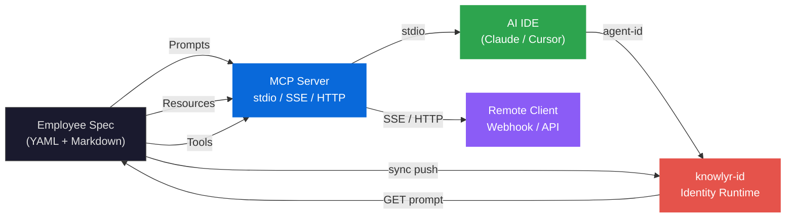
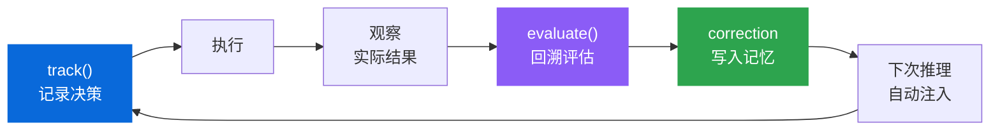
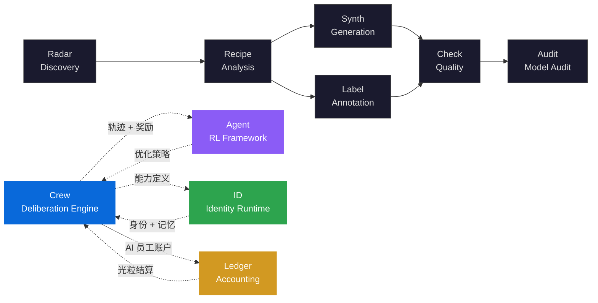

<div align="right">

**English** | [中文](landing-zh.md)

</div>

<div align="center">

<h1>knowlyr-crew</h1>

<h2>Structured Dialectical Deliberation Engine<br/>for AI Workforces</h2>

<p>Declarative AI workforce engine — structured dialectical deliberation, protocol-native interoperability, evolving through experience</p>

<p>
<a href="https://github.com/liuxiaotong/knowlyr-crew">GitHub</a> ·
<a href="https://github.com/liuxiaotong/knowlyr-crew/blob/main/README.md">Full Documentation</a> ·
<a href="https://pypi.org/project/knowlyr-crew/">PyPI</a> ·
<a href="https://knowlyr.com">knowlyr.com</a>
</p>

</div>

## Abstract

The primary failure modes of multi-agent collaboration systems are threefold: **groupthink** (Janis, 1972), **shared information bias** (Stasser & Titus, 1985), and **framework lock-in**. knowlyr-crew proposes a declarative multi-agent deliberation framework that breaks information sampling bias through structured dialectical protocols, achieves cognitive accumulation and natural attrition through exponentially decaying persistent memory (inspired by the Ebbinghaus forgetting curve), and eliminates toolchain coupling through protocol-native MCP integration.

The system implements a self-correcting closed loop of "**define -> deliberate -> decide -> evaluate -> update memory**", feeding human feedback directly into agents' persistent memory -- functionally isomorphic to the core mechanism of RLHF (Christiano et al., 2017): human evaluation outcomes shape subsequent inference behavior.

> **knowlyr-crew** formalizes AI workforce capabilities as declarative specifications (YAML + Markdown), implements structured dialectical deliberation with 9 interaction modes and devil's advocacy constraints, and provides persistent semantic memory with exponential confidence decay. The system exposes 20 MCP tools across 3 transport protocols, routes across 7 LLM providers, and maintains a complete evaluation-to-memory feedback loop.

## Problem Statement

The failure mechanisms of multi-agent collaboration have a solid empirical foundation in cognitive psychology and organizational decision-making research:

| Root Problem | Research Basis | Limitations of Existing Frameworks | Crew's Approach |
|:---|:---|:---|:---|
| **Groupthink** | Groups under pressure converge toward consensus and suppress dissent (Janis, 1972); even incorrect minority opinions improve majority decision quality (Nemeth, 1994) | CrewAI / AutoGen lack mandatory dissent mechanisms -- agents "supplement" rather than "challenge" each other | Structured dialectical deliberation: 9 interaction modes + disagreement quota $\rho_{max}$ + tension seed injection |
| **Shared Information Bias** | In group discussions, commonly known information is exchanged at significantly higher rates than individually held information (Stasser & Titus, 1985); task-focused cognitive conflict improves decision quality (Amason, 1996) | Unstructured multi-agent conversations reinforce known information, drowning out individual perspectives | Role-based participants + `focus` constraints + `must_challenge` forcing cross-perspective exchange |
| **Stateless Inference** | Each session starts from scratch; the same cognitive errors recur $\forall t: s_t \perp s_{t-1}$ | LangChain memory is a sliding-window buffer, not semantically structured persistent storage | Exponentially decaying persistent memory + evaluation loop: decision -> execution -> retrospective -> correction -> evolution |
| **Framework Lock-in** | Agent definitions are bound to specific SDKs/IDEs; migration cost $\propto$ definition complexity | Each framework uses its own incompatible format -- switching IDEs renders definitions useless | Protocol-native MCP: declarative YAML/Markdown, zero-modification cross-IDE portability |

> Crew is not yet another orchestration framework. It is the **capability definition layer** and **experience accumulation layer** for AI digital employees -- "who does what, how they deliberate, and what they've learned" -- while delegating identity management and runtime interactions to [knowlyr-id](https://github.com/liuxiaotong/knowlyr-id).

## Formal Framework

### Employee Specification

Each AI employee is a **declarative specification** $e \in \mathcal{E}$, decoupled from code, version-trackable, and IDE-agnostic:

$$e = \langle \text{name}, \text{model}, \text{tools}, \text{prompt}, \text{args}, \text{output} \rangle$$

Where:
- $\text{model} \in \mathcal{M}$ = {`claude-*`, `gpt-*`, `deepseek-*`, `kimi-*`, `gemini-*`, `glm-*`, `qwen-*`} -- unified routing across 7 providers
- $\text{tools} \subseteq \mathcal{T}$ -- available tool set, constrained by `PermissionPolicy`
- $\text{prompt}: \Sigma^* \to \Sigma^*$ -- Markdown template function supporting variable substitution and context injection

### Structured Dialectical Deliberation

The deliberation process is formalized as a 4-tuple $D = \langle P, R, \Phi, \Psi \rangle$:

| Symbol | Definition | Description |
|:---|:---|:---|
| $P = \{p_1, \ldots, p_n\}$ | Participant set | $p_i = (\text{employee}, \text{role}, \text{stance}, \text{focus})$ |
| $R = [r_1, \ldots, r_k]$ | Round sequence | $r_j \in$ {`round-robin`, `cross-examine`, `steelman-then-attack`, `debate`, `vote`, ...} |
| $\Phi$ | Disagreement constraint function | $\text{must\_challenge}(p_i) \subseteq P \setminus \{p_i\}$; $\text{max\_agree\_ratio}(p_i) \in [0, 1]$ |
| $\Psi$ | Tension seed set | Pre-seeded points of contention, forcing diversity in the issue space |

**Key constraint**: When $\Phi$ defines $\text{max\_agree\_ratio}(p_i) = \rho$, participant $p_i$ may not agree with others' views more than proportion $\rho$ throughout the entire deliberation, forcing cognitive conflict rather than groupthink. This corresponds to the Devil's Advocacy method in organizational decision-making research (Schwenk, 1990).

### Memory Evolution Model

The effective confidence of each memory entry $m$ decays over time, following the exponential model of the Ebbinghaus forgetting curve:

$$C_{\text{eff}}(t) = C_0 \cdot \left(\frac{1}{2}\right)^{t / \tau}$$

Where $C_0$ is the initial confidence (default 1.0), $t$ is memory age (in days), and $\tau$ is the half-life (default 90 days). Entries are ranked by $C_{\text{eff}}$ at retrieval time; those below threshold $C_{\min}$ are automatically pruned.

**Semantic retrieval** uses a hybrid vector-keyword scoring function:

$$\text{score}(q, m) = \alpha \cdot \cos(\mathbf{v}_q, \mathbf{v}_m) + (1 - \alpha) \cdot \text{keyword}(q, m), \quad \alpha = 0.7$$

**Correction chains** implement cognitive self-correction, a computational model of memory reconsolidation: $\text{correct}(m_{\text{old}}, m_{\text{new}})$ marks $m_{\text{old}}$ as superseded ($C \leftarrow 0$) and creates a new correction-type entry ($C \leftarrow 1.0$).

### Evaluation Feedback Loop

Drawing on the core mechanism of RLHF -- human feedback directly shaping agent behavior (Christiano et al., 2017):

```
track(employee, category, prediction) -> Decision d
    |
    v  Execute + observe actual outcome
evaluate(d, outcome, evaluation) -> MemoryEntry m_correction
    |
    v  m_correction is automatically injected into the employee's subsequent inference context
employee.next_inference(context ∪ {m_correction})
```

Three decision categories: `estimate` / `recommendation` / `commitment`. Evaluation conclusions are automatically written as `correction` entries into persistent memory, forming a closed loop of **decision -> execution -> retrospective -> improvement**.

## Architecture



### Layered Architecture

| Layer | Module | Responsibility |
|:---|:---|:---|
| **Specification** | Parser · Discovery · Models | Declarative employee definition parsing; YAML/Markdown dual format; priority-based discovery |
| **Protocol** | MCP Server · Skill Converter | 20 Tools + Prompts + Resources; stdio/SSE/HTTP triple-protocol support |
| **Deliberation** | Discussion Engine | 9 structured interaction modes; cognitive conflict constraints; topologically sorted execution plans |
| **Orchestration** | Pipeline · Route · Task Registry | Parallel/sequential/conditional/loop orchestration; checkpoint recovery; multi-model routing |
| **Memory** | Memory Store · Semantic Index | Semantic search; exponential decay; importance ranking; access tracking; cross-employee pattern sharing; multi-backend embedding fallback |
| **Evaluation** | Evaluation Engine | Decision tracking; retrospective evaluation; automatic memory correction |
| **Execution** | Providers · Output Sanitizer · Cost Tracker | Unified invocation across 7 providers; retry/fallback/per-task cost metering; dual-layer output sanitization (source + egress) |
| **Integration** | ID Client · Webhook · Cron | Identity federation (circuit breaker); GitHub event routing; scheduled tasks (patrol/retrospective/KPI/knowledge digest); trigger-based auto-delegation |
| **Observability** | Trajectory · Metrics · Audit | Zero-intrusion trajectory recording (contextvars); permission matrix queries; tool invocation audit logs; post-deployment CI audit; Feishu alerting on audit failure |
| **CLI** | `cli/` modular package (8 submodules) | employee · pipeline · route · discuss · memory · server · ops; lazy command registration |

### MCP Primitive Mapping

| MCP Primitive | Purpose | Count |
|:---|:---|:---|
| **Prompts** | Each employee = one callable prompt template with typed parameters | 1 per employee |
| **Resources** | Raw Markdown definitions, directly readable by AI IDEs | 1 per employee |
| **Tools** | Employee/discussion/pipeline/memory/evaluation/permission/audit/metrics/project detection, etc. | 20 |

<details>
<summary>Full list of 20 MCP Tools</summary>

| Tool | Description |
|:---|:---|
| `list_employees` | List all employees (filterable by tag) |
| `get_employee` | Get complete employee definition |
| `run_employee` | Generate an executable prompt |
| `get_work_log` | View employee work logs |
| `detect_project` | Detect project type, framework, and package manager |
| `list_pipelines` | List all pipelines |
| `run_pipeline` | Execute a pipeline |
| `list_discussions` | List all discussion meetings |
| `run_discussion` | Generate a discussion meeting prompt |
| `add_memory` | Add persistent memory for an employee (supports pattern type) |
| `query_memory` | Query an employee's persistent memory |
| `track_decision` | Record a decision pending evaluation |
| `evaluate_decision` | Evaluate a decision and write lessons learned to employee memory |
| `list_meeting_history` | View discussion meeting history |
| `get_meeting_detail` | Get complete meeting transcript |
| `list_tool_schemas` | List all available tool definitions (filterable by role) |
| `get_permission_matrix` | View employee permission matrix and policies |
| `get_audit_log` | Query tool invocation audit logs |
| `get_tool_metrics` | Query tool invocation statistics |
| `query_events` | Query system event stream |

</details>

### Transport Protocols

```bash
knowlyr-crew mcp                                # stdio (default, local IDE)
knowlyr-crew mcp -t sse --port 9000             # SSE (remote connection)
knowlyr-crew mcp -t http --port 9001            # Streamable HTTP
knowlyr-crew mcp -t sse --api-token SECRET      # Enable Bearer authentication
```

## Key Innovations

### 1. Structured Dialectical Deliberation

The central challenge of multi-agent collaboration lies in maintaining **epistemic diversity**. Stasser & Titus (1985) demonstrated experimentally that in unstructured group discussions, commonly shared information is discussed at significantly higher rates than individually held information, causing optimal decisions to be systematically overlooked. Nemeth (1994) further found that even incorrect minority opinions, when persistently expressed, improve majority decision quality -- because they force the majority to more carefully examine their own assumptions.

Crew implements 9 structured interaction modes, each imposing distinct argumentative constraints on participants:

| Mode | Description | Mechanism |
|:---|:---|:---|
| `round-robin` | Round-robin speaking | Equal expression rights, preventing discourse imbalance |
| `challenge` | Challenge | Each participant must raise evidence-based challenges to at least one other's conclusions |
| `response` | Response & defense | Structured responses; vague evasion prohibited; must explicitly accept/partially accept/rebut |
| `cross-examine` | Cross-examination | Three-dimensional deep examination: factual challenge / logical derivation / alternative proposals |
| `steelman-then-attack` | Steelman then attack | First construct the strongest form of the opposing argument (steel-manning), then attack its residual weaknesses |
| `debate` | Structured debate | Adversarial pro/con format requiring citation of specific facts and data |
| `brainstorm` | Brainstorm | Suspend judgment, maximize creative space |
| `vote` | Vote | Force explicit stance + brief rationale |
| `free` | Free discussion | Open-ended exchange without structural constraints |

**Dialectical Constraints** -- a computational implementation of Schwenk's (1990) Devil's Advocacy methodology:

- **`stance`** -- Pre-assigned position, forcing participants to argue from a specific perspective
- **`must_challenge`** -- Must challenge designated participants, counteracting shared information bias
- **`max_agree_ratio`** -- Disagreement quota $\rho_{max} \in [0, 1]$, quantitatively controlling cognitive conflict density
- **`tension_seeds`** -- Controversy seed injection, ensuring the issue space covers critical tension dimensions
- **`min_disagreements`** -- Minimum number of disagreements per round, quantifying deliberation output

**Discussion -> Execution bridging**: Setting `action_output: true` automatically generates a structured ActionPlan JSON, which is converted via `pipeline_from_action_plan()` into an executable Pipeline through dependency-aware topological sorting.

<details>
<summary>Discussion YAML example</summary>

```yaml
name: architecture-review
topic: Review $target design
goal: Produce improvement decisions
mode: auto
participants:
  - employee: product-manager
    role: moderator
    focus: 需求完整性
    stance: 偏用户体验
  - employee: code-reviewer
    role: speaker
    focus: 安全性
    must_challenge: [product-manager]
    max_agree_ratio: 0.6
tension_seeds:
  - 安全性 vs 开发效率
rounds:
  - name: 各抒己见
    interaction: round-robin
  - name: 交叉盘问
    interaction: cross-examine
    require_direct_reply: true
    min_disagreements: 2
  - name: Decision
    interaction: vote
output_format: decision
```

</details>

```bash
# Pre-defined discussion
knowlyr-crew discuss run architecture-review --arg target=auth.py

# Ad-hoc discussion (no YAML required)
knowlyr-crew discuss adhoc -e "code-reviewer,test-engineer" -t "auth 模块质量"

# Orchestrated mode: each participant reasons independently
knowlyr-crew discuss run architecture-review --orchestrated
```

### 2. Persistent Memory with Exponential Decay

Ebbinghaus (1885) demonstrated that memory strength decays exponentially over time, and that spaced repetition effectively counteracts forgetting. Crew incorporates this cognitive science principle into the knowledge persistence mechanism of agent systems:

**Five memory categories**:

| Category | Description | Example |
|:---|:---|:---|
| `decision` | Decision record | "Chose JWT over Session-based approach" |
| `estimate` | Estimation record | "CSS refactoring estimated at 2 days" |
| `finding` | Discovery record | "main.css has 2,057 lines, exceeding maintainability threshold" |
| `correction` | Correction record | "CSS refactoring actually took 5 days; cross-module dependencies were underestimated" |
| `pattern` | Work pattern | "API changes must be accompanied by SDK documentation updates" (automatically shared across employees) |

**Embedding fallback chain** (Graceful Degradation):

```
OpenAI text-embedding-3-small -> Gemini text-embedding-004 -> TF-IDF (zero-dependency fallback)
```

When any upstream provider is unavailable, the system automatically degrades to the next tier, ensuring semantic search remains functional even in environments without API keys.

**Importance & access tracking**: Each memory entry carries an `importance` weight (1-5) and a `last_accessed` timestamp. Queries support importance-based sorting and minimum importance filtering; API calls automatically update access timestamps.

**Cross-employee work patterns** (`pattern`): Reusable work patterns distilled from individual experience, automatically marked as shared (`shared: true`), with configurable trigger conditions (`trigger_condition`) and applicability scope (`applicability`). Other employees automatically acquire these patterns in matching scenarios.

**Correction chains** correspond to the reconsolidation mechanism in memory science: $\text{correct}(m_{\text{old}}, m_{\text{new}})$ does not delete the old memory but instead zeros its confidence and creates a new entry with a provenance link, preserving the cognitive evolution trajectory.

**Self-check learning loop**: Through the shared template `_templates/selfcheck.md`, employees automatically output a self-check checklist at the end of each task. The system extracts self-check results from the output, writes them as `correction` memories, and automatically injects them on the next execution -- forming a continuous learning loop of **execution -> self-check -> memory -> improvement**.

**Auto-memory** (`auto_memory: true`): After task execution, employees automatically save a summary to persistent memory (`category=finding`) without manual invocation.

```bash
knowlyr-crew memory add code-reviewer finding "main.css 有 2057 行，超出维护阈值"
knowlyr-crew memory show code-reviewer
knowlyr-crew memory correct code-reviewer <old_id> "CSS 拆分实际花了 5 天"
```

Storage: `.crew/memory/{employee}.jsonl` (memories) + `.crew/memory/embeddings.db` (vector index, SQLite WAL)

### 3. Evaluation Feedback Loop

Track decision quality, and after retrospective evaluation, automatically write lessons learned into employee memory -- functionally isomorphic to the core mechanism of RLHF (Christiano et al., 2017): human preference feedback directly influences subsequent model behavior; here, human evaluation results directly influence subsequent inference context:



Three decision categories: `estimate` / `recommendation` / `commitment`. Evaluation conclusions are automatically written as `correction` entries into the employee's persistent memory and automatically injected during subsequent inference -- the agent updates its cognition from its own decision errors.

```bash
# Record a decision
knowlyr-crew eval track pm estimate "CSS 拆分需要 2 天"

# Evaluate (conclusions automatically written to memory)
knowlyr-crew eval run <id> "实际花了 5 天" \
  --evaluation "低估了跨模块依赖的复杂度，未来 ×2.5"
```

### 4. Declarative Employee Specification

By analogy with **Infrastructure as Code** (Morris, 2016) -- Terraform uses declarative HCL to define infrastructure, Kubernetes uses YAML to define desired service state -- Crew uses declarative specifications to define the capability boundaries of AI employees. Configuration is separated from prompts, version-trackable, and IDE-agnostic:

**Directory format (recommended)**:

```
security-auditor/
├── employee.yaml    # Metadata, parameters, tools, output format
├── prompt.md        # Role definition + core instructions
├── workflows/       # Scenario-specific workflows
│   ├── scan.md
│   └── report.md
└── adaptors/        # Project-type adaptors (python / nodejs / ...)
    └── python.md
```

```yaml
# employee.yaml
name: security-auditor
display_name: Security Auditor
character_name: Alex Morgan
version: "1.0"
model: claude-opus-4-6
tags: [security, audit]
triggers: [audit, sec]
tools: [file_read, bash, grep]
context: [pyproject.toml, src/]
auto_memory: true                    # Automatically save task summary to persistent memory
kpi:                                 # KPI metrics (auto-evaluated in weekly KPI report)
  - OWASP 覆盖率
  - 建议可操作性
  - 零误报率
args:
  - name: target
    description: 审计目标
    required: true
  - name: severity
    description: 最低严重等级
    default: medium
output:
  format: markdown
  filename: "audit-{date}.md"
```

**Single-file format**: Suitable for simple employees -- YAML frontmatter + Markdown body.

**Discovery & priority**:

| Priority | Location | Description |
|:---|:---|:---|
| Highest | `private/employees/` | Custom employees within the repository |
| Medium | `.claude/skills/` | Claude Code Skills compatibility layer |
| Low | Built-in package | Default employees |

**Smart context** (`--smart-context`): Automatically detects project type (Python / Node.js / Go / Rust / Java), framework, package manager, and test framework, injecting adaptation information into the prompt.

<details>
<summary>Built-in employees</summary>

| Employee | Trigger | Purpose |
|:---|:---|:---|
| `product-manager` | `pm` | Requirements analysis, user stories, roadmaps |
| `code-reviewer` | `review` | Code review: quality, security, performance |
| `test-engineer` | `test` | Write or supplement unit tests |
| `refactor-guide` | `refactor` | Code structure analysis, refactoring recommendations |
| `doc-writer` | `doc` | Documentation generation (README / API / CHANGELOG) |
| `pr-creator` | `pr` | Analyze changes, create Pull Requests |

</details>

<details>
<summary>Prompt variable substitution</summary>

| Variable | Description |
|:---|:---|
| `$target`, `$severity` | Named parameter values |
| `$1`, `$2` | Positional parameters |
| `{date}`, `{datetime}` | Current date/time |
| `{cwd}`, `{git_branch}` | Working directory / Git branch |
| `{project_type}`, `{framework}` | Project type / Framework |
| `{test_framework}`, `{package_manager}` | Test framework / Package manager |

</details>

### 5. Pipeline Orchestration

Multi-employee DAG (Directed Acyclic Graph) orchestration with four step types:

| Step Type | Description |
|:---|:---|
| **Sequential** | Serial execution; `{prev}` references previous step output |
| **Parallel Group** | `asyncio.gather` concurrent execution with 600s timeout |
| **Conditional** | `contains` / `matches` / `equals` conditional branching |
| **Loop** | Loop execution with state passing |

**Multi-Provider Routing**:

| Provider | Model Prefix | Example |
|:---|:---|:---|
| Anthropic | `claude-` | `claude-opus-4-6`, `claude-sonnet-4-5` |
| OpenAI | `gpt-`, `o1-`, `o3-` | `gpt-4o`, `o3-mini` |
| DeepSeek | `deepseek-` | `deepseek-chat`, `deepseek-reasoner` |
| Moonshot | `kimi-`, `moonshot-` | `kimi-k2.5` |
| Google | `gemini-` | `gemini-2.5-pro` |
| Zhipu | `glm-` | `glm-4-plus` |
| Alibaba | `qwen-` | `qwen-max` |

Automatic routing to the corresponding provider API by model name prefix, with primary model + fallback support.

| Feature | Description |
|:---|:---|
| **Output passing** | `{prev}` (previous step), `{steps.<id>.output}` (reference by ID) |
| **Checkpoint recovery** | Resume from last completed step after mid-run failure (`pipeline checkpoint resume`) |
| **Fallback** | Automatic switch to fallback model after primary model retries are exhausted |
| **Mermaid visualization** | Automatic flowchart generation from pipeline definitions |

```bash
# Generate per-step prompts
knowlyr-crew pipeline run review-test-pr --arg target=main

# Execute mode: automatically invoke LLMs for chained execution
knowlyr-crew pipeline run full-review --execute --model claude-opus-4-6
```

### 6. Organization Governance & Adaptive Authority

Declarative organization structure defining team groupings, authority levels, and collaboration routing templates -- enabling delegation decisions to be evidence-based rather than reliant on AI guesswork. The permission system features **adaptive degradation** capability:

```yaml
# private/organization.yaml
teams:
  engineering:
    label: 工程组
    members: [code-reviewer, test-engineer, backend-engineer]
  data:
    label: 数据组
    members: [data-engineer, dba, mlops-engineer]

authority:
  A:
    label: 自主执行
    members: [code-reviewer, test-engineer, doc-writer]
  B:
    label: 需确认
    members: [product-manager, solutions-architect]
  C:
    label: 看场景
    members: [backend-engineer, devops-engineer]

routing_templates:
  code_change:
    steps:
      - role: implement
        team: engineering
      - role: review
        employee: code-reviewer
      - role: test
        employees: [test-engineer, e2e-tester]
```

| Feature | Description |
|:---|:---|
| **Three-tier authority** | A (autonomous execution) / B (requires confirmation) / C (context-dependent); delegation lists are automatically annotated |
| **Auto-degradation** | 3 consecutive task failures -> authority downgrades from A/B to C, persisted to JSON |
| **Routing templates** | The `route` tool expands templates into `delegate_chain`, supporting multi-workflow lines, CI step annotations, human judgment nodes, and repository bindings |
| **KPI metrics** | Each employee declares KPI metrics; weekly report cron auto-evaluates and generates A/B/C/D ratings |
| **Manual recovery** | One-click API to restore degraded authority |

### 7. Cost-Aware Orchestration

Built-in model pricing tables (7 providers) with per-task cost calculation, supporting aggregation by employee / model / time period for **ROI per Decision** analysis:

| Feature | Description |
|:---|:---|
| **Per-task metering** | Each execution automatically records input/output tokens + cost_usd |
| **Quality pre-scoring** | Parses `{"score": N}` JSON at the end of output, associating it with task results |
| **Multi-dimensional aggregation** | Aggregate by employee / model / time period / trigger source |
| **A/B testing** | Primary model + fallback model; compare the Pareto frontier of cost vs. quality |

```bash
# MCP / Agent tools
query_cost(days=7)
query_cost(days=30, employee="code-reviewer")

# HTTP API
curl /api/cost/summary?days=7
```

### 8. Output Sanitization -- Defense in Depth

Raw LLM output may contain internal reasoning tags (`<thinking>`, `<reflection>`, `<inner_monologue>`) and tool invocation XML blocks -- these are the model's "working drafts" and should not be exposed to end users. The Output Sanitizer implements **defense in depth**:

| Defense Layer | Location | Responsibility |
|:---|:---|:---|
| **Source sanitization** | `webhook_executor` | LLM return values are sanitized before entering business logic |
| **Egress sanitization** | `webhook_handlers` · `webhook_feishu` | Secondary sanitization before messages are sent to users/callbacks |

Sanitization rules cover 5 tag pattern categories (regex matching + content removal), handling nested tags and multiline residual whitespace. When either layer misses something, the other provides a safety net -- drawing on the defense-in-depth principle from cybersecurity (Schneier, 2000).

### 9. Zero-Intrusion Trajectory Recording

**Zero-intrusion trajectory recording** via `contextvars.ContextVar` -- no modification to any business code required; automatically captures agent reasoning, tool invocations, execution results, and token consumption:

```
Crew produces trajectories -> agentrecorder standard format -> knowlyr-gym PRM scoring -> SFT / DPO / GRPO training
```

This is the data bridge connecting **Crew** (collaboration layer) and **knowlyr-gym** (training layer) -- real interaction trajectories produced during Crew runtime can be directly used for agent reinforcement learning training.

## Quick Start

```bash
pip install knowlyr-crew[mcp]

# 1. View all available employees
knowlyr-crew list

# 2. Run a code review (auto-detects project type)
knowlyr-crew run review main --smart-context

# 3. Initiate a multi-employee structured discussion
knowlyr-crew discuss adhoc -e "code-reviewer,test-engineer" -t "auth 模块安全性"

# 4. Track and evaluate decisions
knowlyr-crew eval track pm estimate "重构需要 3 天"
# ... after execution ...
knowlyr-crew eval run <id> "实际花了 7 天" --evaluation "低估跨模块依赖"

# 5. View employee memory (including evaluation corrections)
knowlyr-crew memory show product-manager
```

**MCP configuration** (Claude Desktop / Claude Code / Cursor):

```json
{
  "mcpServers": {
    "crew": {
      "command": "knowlyr-crew",
      "args": ["mcp"]
    }
  }
}
```

Once configured, the AI IDE can directly invoke `code-reviewer` for code review, `test-engineer` for writing tests, `run_pipeline` for chaining multi-employee pipelines, and `run_discussion` for initiating multi-employee discussions.

## Async Delegation & Meeting Orchestration

AI employees can **delegate in parallel** to multiple colleagues for task execution, or **organize multi-person meetings** for asynchronous deliberation:

```
User -> 姜墨言: "Have code-reviewer review the PR and test-engineer write tests simultaneously"

姜墨言:
  ① delegate_async -> code-reviewer (task_id: 20260216-143022-a3f5b8c2)
  ② delegate_async -> test-engineer (task_id: 20260216-143022-b7d4e9f1)
  ③ "Both tasks are now executing in parallel"
  ④ check_task -> check progress/results
```

| Tool | Description |
|:---|:---|
| `delegate_async` | Asynchronous delegation; returns task_id immediately |
| `delegate_chain` | Sequential chain delegation; `{prev}` references previous step output |
| `check_task` / `list_tasks` | Query task status and results |
| `organize_meeting` | Multi-employee async discussion; each round runs `asyncio.gather` for parallel inference |
| `schedule_task` / `list_schedules` | Dynamic cron scheduled tasks |
| `run_pipeline` | Trigger a pre-defined pipeline (async execution) |
| `agent_file_read` / `agent_file_grep` | Path-safe file operations |
| `query_data` | Fine-grained business data queries |
| `find_free_time` | Feishu availability query; find common free time across multiple people |

**Proactive patrol & self-driven operations**: Scheduled tasks configured via `.crew/cron.yaml`:

| Schedule | Description |
|:---|:---|
| Daily 9:00 | Morning patrol -- business data, to-dos, calendar, system status -> Feishu briefing |
| Daily 23:00 | AI diary -- personal diary based on the day's work and memories |
| Thursday 16:00 | Team knowledge digest -- cross-team work output + common issues + best practices -> Feishu document |
| Friday 17:00 | KPI weekly report -- per-employee rating + anomaly auto-delegation (D-grade -> HR follow-up, consecutive improvement items -> team attention) |
| Friday 18:00 | Weekly retrospective -- highlights, issues, and recommendations for next week |

## Production Server

Crew can run as an HTTP server, receiving external events and automatically triggering pipeline / employee execution:

```bash
pip install knowlyr-crew[webhook]
knowlyr-crew serve --port 8765 --token YOUR_SECRET
```

### API Endpoints

| Path | Method | Description |
|:---|:---|:---|
| `/health` | GET | Health check (no authentication required) |
| `/webhook/github` | POST | GitHub webhook (HMAC-SHA256 signature verification) |
| `/webhook/openclaw` | POST | OpenClaw message events |
| `/run/pipeline/{name}` | POST | Trigger pipeline (async/sync/SSE streaming) |
| `/run/employee/{name}` | POST | Trigger employee (supports SSE streaming) |
| `/api/employees/{id}/prompt` | GET | Employee capability definition (includes team, authority, 7-day cost) |
| `/api/employees/{id}/state` | GET | Runtime state (personality, memory, notes) |
| `/api/employees/{id}` | PUT | Update configuration (model/temperature/max_tokens) |
| `/api/employees/{id}/authority/restore` | POST | Restore auto-degraded authority |
| `/api/cost/summary` | GET | Cost summary |
| `/api/project/status` | GET | Project status overview |
| `/api/memory/ingest` | POST | Import external discussion data into employee memory |
| `/tasks/{task_id}` | GET | Query task status and results |
| `/metrics` | GET | Invocation/latency/token/error statistics |
| `/cron/status` | GET | Cron scheduler status |

<details>
<summary>Production features</summary>

| Feature | Description |
|:---|:---|
| Bearer authentication | `--api-token`, timing-safe comparison |
| CORS | `--cors-origin`, multi-origin support |
| Rate limiting | 60 requests/minute/IP |
| Request size limit | Default 1MB |
| Circuit breaker | knowlyr-id pauses for 30 seconds after 3 consecutive failures |
| Cost tracking | Per-task token metering + model pricing |
| Auto-degradation | Consecutive failures automatically lower employee authority |
| CI audit | Post-deployment automatic permission audit script; Feishu alert on failure |
| Trace ID | Unique trace_id per task |
| Concurrency safety | `fcntl.flock` file locks + SQLite WAL |
| Task persistence | `.crew/tasks.jsonl`, recoverable after restart |
| Periodic heartbeat | Heartbeat to knowlyr-id every 60 seconds |

</details>

### Webhook Configuration

`.crew/webhook.yaml` defines event routing rules (GitHub HMAC-SHA256 signature verification); `.crew/cron.yaml` defines scheduled tasks (croniter parsing). The KPI weekly report cron includes built-in anomaly auto-delegation rules -- employees rated D (no output) are automatically escalated to HR, and consecutive self-check improvement items trigger team attention notifications.

## Integrations

### knowlyr-id -- Identity & Runtime Federation

Crew defines "who does what"; [knowlyr-id](https://github.com/liuxiaotong/knowlyr-id) manages identity, conversations, and runtime. The two collaborate but can each be used independently:

```
┌──────────────────────────────────────┐
│        Crew (Capability Authority)    │
│  prompt · model · tools · avatar     │
│  temperature · bio · tags            │
└──────────────┬───────────────────────┘
     API fetch prompt │ sync push all fields
┌──────────────┴───────────────────────┐
│      knowlyr-id (Identity + Runtime)  │
│  user accounts · conversations ·     │
│  memory · heartbeat · scheduling ·   │
│  messaging · API keys · work logs    │
└──────────────────────────────────────┘
```

knowlyr-id fetches employee prompt / model / temperature / team / authority / cost via `CREW_API_URL` (5-minute cache), falling back to DB cache when unavailable. The connection is **optional** -- Crew runs independently when not configured. The admin dashboard displays each employee's authority badge, team membership, and 7-day cost in real time, and supports one-click restoration of auto-degraded authority.

**Employee status sync** (`agent_status`): Crew maintains a three-state lifecycle -- `active` (normal operation) / `frozen` (frozen: configuration preserved but execution skipped) / `inactive` (deactivated). Status changes are bidirectionally synced to knowlyr-id via `sync`; frozen employees are automatically skipped during pipeline execution.

<details>
<summary>Field mapping</summary>

| Crew Employee | knowlyr-id | Direction |
|:---|:---|:---|
| `name` | `crew_name` | push -> |
| `character_name` | `nickname` | push -> |
| `display_name` | `title` | push -> |
| `bio` | `bio` | push -> |
| `description` | `capabilities` | push -> |
| `tags` | `domains` | push -> |
| rendered prompt | `system_prompt` | push -> |
| `avatar.webp` | `avatar_base64` | push -> |
| `model` | `model` | push -> |
| `temperature` | `temperature` | <-> |
| `max_tokens` | `max_tokens` | push -> |
| `memory-id.md` | `memory` | <- pull |

</details>

```bash
# One-click deployment (rsync -> restart -> sync knowlyr-id)
make push
```

### Claude Code Skills Interoperability

Crew employees and Claude Code native Skills are bidirectionally convertible: `tools` <-> `allowed-tools`, `args` <-> `argument-hint`, metadata round-trips via HTML comments.

```bash
knowlyr-crew export code-reviewer    # -> .claude/skills/code-reviewer/SKILL.md
knowlyr-crew sync --clean            # Sync + clean orphaned directories
```

### Avatar Generation

Tongyi Wanxiang (DashScope) generates realistic professional portrait avatars, 768x768 -> 256x256 webp:

```bash
pip install knowlyr-crew[avatar]
knowlyr-crew avatar security-auditor
```

## CLI Reference

<details>
<summary>Complete CLI command list</summary>

### Core

```bash
knowlyr-crew list [--tag TAG] [--layer LAYER] [-f json]  # List employees
knowlyr-crew show <name>                                  # View details
knowlyr-crew run <name> [ARGS] [--smart-context] [--agent-id ID] [--copy] [-o FILE]
knowlyr-crew init [--employee NAME] [--dir-format] [--avatar]
knowlyr-crew validate <path>
knowlyr-crew check --json                                 # Quality radar
```

### Discussions

```bash
knowlyr-crew discuss list
knowlyr-crew discuss run <name> [--orchestrated] [--arg key=val]
knowlyr-crew discuss adhoc -e "员工1,员工2" -t "议题"
knowlyr-crew discuss history [-n 20]
knowlyr-crew discuss view <meeting_id>
```

### Memory

```bash
knowlyr-crew memory list
knowlyr-crew memory show <employee> [--category ...]
knowlyr-crew memory add <employee> <category> <text>
knowlyr-crew memory correct <employee> <old_id> <text>
```

### Evaluation

```bash
knowlyr-crew eval track <employee> <category> <text>
knowlyr-crew eval list [--status pending]
knowlyr-crew eval run <decision_id> <outcome> [--evaluation TEXT]
knowlyr-crew eval prompt <decision_id>
```

### Pipeline

```bash
knowlyr-crew pipeline list
knowlyr-crew pipeline run <name> [--execute] [--model MODEL] [--arg key=val]
knowlyr-crew pipeline checkpoint list
knowlyr-crew pipeline checkpoint resume <task_id>
```

### Route

```bash
knowlyr-crew route list [-f json]                                  # List collaboration routing templates
knowlyr-crew route show <name>                                     # View route details
knowlyr-crew route run <name> <task> [--execute] [--remote]        # Execute collaboration route
```

### Server & MCP

```bash
knowlyr-crew serve --port 8765 --token SECRET [--no-cron] [--cors-origin URL]
knowlyr-crew mcp [-t stdio|sse|http] [--port PORT] [--api-token TOKEN]
```

### Agent Management

```bash
knowlyr-crew register <name> [--dry-run]
knowlyr-crew agents list
knowlyr-crew agents status <id>
knowlyr-crew agents sync <name>
knowlyr-crew agents sync-all [--push-only|--pull-only] [--force] [--dry-run]
```

### Templates & Export

```bash
knowlyr-crew template list
knowlyr-crew template apply <template> --employee <name> [--var key=val]
knowlyr-crew export <name>                                # -> SKILL.md
knowlyr-crew export-all
knowlyr-crew sync [--clean]                               # -> .claude/skills/
```

### Other

```bash
knowlyr-crew avatar <name>                                # Avatar generation
knowlyr-crew log list [--employee NAME] [-n 20]           # Work logs
knowlyr-crew log show <session_id>
```

</details>

## Ecosystem

<details>
<summary>Architecture Diagram</summary>



</details>

| Layer | Project | Description | Repo |
|:---|:---|:---|:---|
| Discovery | **AI Dataset Radar** | Dataset competitive intelligence and trend analysis | [GitHub](https://github.com/liuxiaotong/ai-dataset-radar) |
| Analysis | **DataRecipe** | Reverse engineering, schema extraction, cost estimation | [GitHub](https://github.com/liuxiaotong/data-recipe) |
| Production | **DataSynth** / **DataLabel** | LLM batch synthesis / lightweight annotation | [GitHub](https://github.com/liuxiaotong/data-synth) · [GitHub](https://github.com/liuxiaotong/data-label) |
| Quality | **DataCheck** | Rule validation, deduplication, distribution analysis | [GitHub](https://github.com/liuxiaotong/data-check) |
| Audit | **ModelAudit** | Distillation detection, model fingerprinting | [GitHub](https://github.com/liuxiaotong/model-audit) |
| Identity | **knowlyr-id** | Identity system + AI employee runtime | [GitHub](https://github.com/liuxiaotong/knowlyr-id) |
| Accounting | **knowlyr-ledger** | Unified ledger · double-entry bookkeeping · row-lock safety · idempotent transactions | [GitHub](https://github.com/liuxiaotong/knowlyr-ledger) |
| Deliberation | **Crew** | Structured dialectical deliberation · persistent memory accumulation · MCP-native | You are here |
| Agent Training | **knowlyr-gym** | Gymnasium-style RL framework · process reward model · SFT/DPO/GRPO | [GitHub](https://github.com/liuxiaotong/knowlyr-gym) |

## References

- **Model Context Protocol (MCP)** -- Anthropic, 2024. Open standard protocol for agent-tool interaction
- **Multi-Agent Systems** -- Wooldridge, M., 2009. *An Introduction to MultiAgent Systems*. Wiley
- **Groupthink** -- Janis, I.L., 1972. *Victims of Groupthink*. Houghton Mifflin
- **Shared Information Bias** -- Stasser, G. & Titus, W., 1985. *Pooling of Unshared Information in Group Decision Making.* JPSP, 48(6)
- **Minority Influence** -- Nemeth, C.J., 1994. *The Value of Minority Dissent.* In S. Moscovici et al. (Eds.), *Minority Influence*. Nelson-Hall
- **Devil's Advocacy** -- Schwenk, C.R., 1990. *Effects of devil's advocacy and dialectical inquiry on decision making.* Organizational Behavior and Human Decision Processes, 47(1)
- **Cognitive Conflict** -- Amason, A.C., 1996. *Distinguishing the Effects of Functional and Dysfunctional Conflict.* Academy of Management Journal, 39(1)
- **RLHF** -- Christiano, P. et al., 2017. *Deep RL from Human Preferences.* [arXiv:1706.03741](https://arxiv.org/abs/1706.03741)
- **Ebbinghaus Forgetting Curve** -- Ebbinghaus, H., 1885. *Uber das Gedachtnis* -- The inspiration for the memory decay model
- **Defense in Depth** -- Schneier, B., 2000. *Secrets and Lies: Digital Security in a Networked World*. Wiley -- Source of the multi-layer defense principle
- **Infrastructure as Code** -- Morris, K., 2016. *Infrastructure as Code*. O'Reilly -- Paradigm source for declarative specifications
- **Gymnasium** -- Towers et al., 2024. *Gymnasium: A Standard Interface for RL Environments.* [arXiv:2407.17032](https://arxiv.org/abs/2407.17032)
